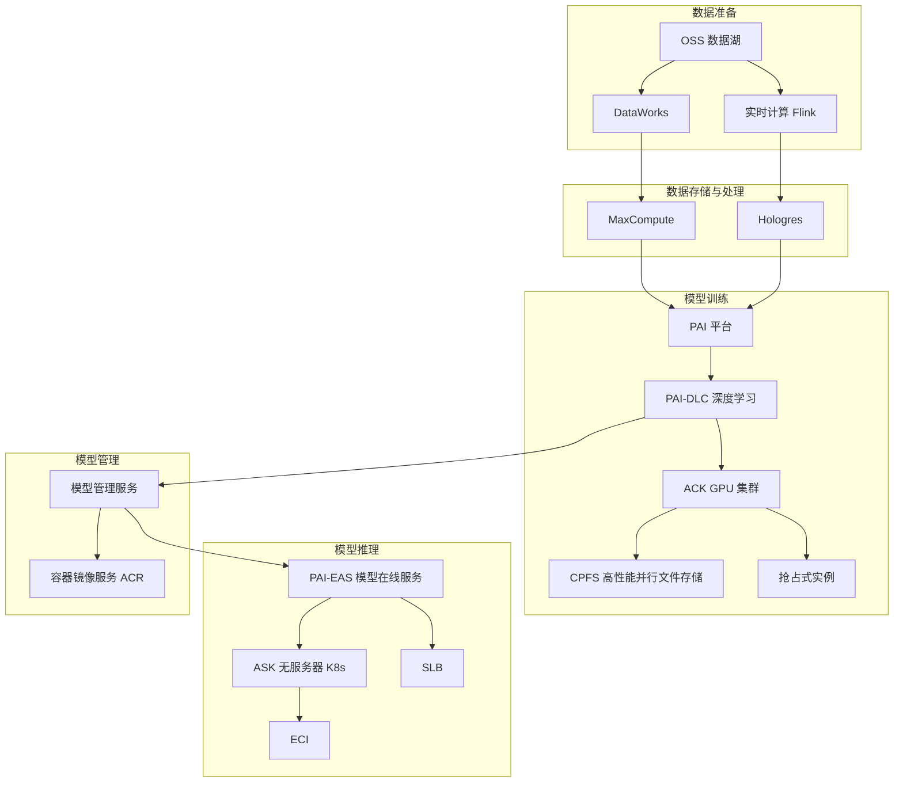

# AI/ML 平台架构方案

## 架构总览

## 数据管线

### 数据入湖
- **OSS**: 非结构化数据存储（图片、文本、音视频）
- **DataWorks**: 数据集成、开发、调度一体化，连接各类数据源
- **Flink**: 实时流处理，数据清洗、特征工程

### 数据存储与处理
- **MaxCompute**: 离线大数据处理，PB 级数据量特征计算
- **Hologres**: 实时数仓，支持特征服务在线查询

## 模型训练

### 训练集群
- **PAI-DLC**: 深度学习训练任务编排，支持 PyTorch/TensorFlow/Megatron
- **ACK GPU 集群**: 管理 GPU 节点池，支持 V100/A100/H800 等实例
- **CPFS**: 高性能并行文件系统，适用于大规模分布式训练
  - 吞吐量可达 100 GB/s，IOPS 百万级
- **NAS**: 轻量训练场景替代方案，成本更低

### 训练成本优化
- **抢占式实例**: 训练任务建议 70% 抢占式 + 30% 包年包月混合
  - 配合 PAI 的 Checkpoint 自动保存，断点续训
- **共享 GPU**: 通过 ACK GPU Share 实现多任务共享 GPU，提升利用率
- **训练调度**: 利用 ACK 的 binpack 策略将任务调度到最少节点，降低碎片

## 模型推理

### 推理部署
- **PAI-EAS**: 一键部署模型为 RESTful API，支持弹性伸缩
  - 支持模型版本管理、A/B 测试、蓝绿发布
- **ASK + ECI**: 无服务器容器，按请求量弹性伸缩，适合 Burst 推理场景
- **SLB**: 推理请求的负载分发和流量管理

### 推理优化
- **模型量化**: INT8/FP16 推理加速，降低延迟 2-4 倍
- **Blade**: PAI-Blade 推理优化工具，自动模型剪枝和融合
- **GPU 共享**: 多模型共享单卡 GPU，降低推理成本

## MLOps 与模型管理

- **模型管理服务**: 模型版本、元数据、血缘关系追踪
- **ACR**: 容器镜像存储，支持训练镜像 + 推理镜像统一管理
- **流水线**: DataWorks + PAI + EAS 实现端到端 CI/CD

## 成本估算

| 场景 | 月成本 | GPU 规模 | 说明 |
|------|--------|---------|------|
| 小规模实验 | 5,000 - 15,000 元 | 1-4 卡 | 抢占式训练 + NAS |
| 中型训练平台 | 30,000 - 80,000 元 | 8-16 卡 | 混合实例 + CPFS |
| 大规模训练 | 150,000 - 500,000 元 | 32+ 卡 | A100/H800 + CPFS |
| 生产推理 | 10,000 - 50,000 元 | 4-8 卡 | ASK 弹性 + EAS |

> 提示：训练任务强烈建议使用抢占式实例，结合自动 Checkpoint 可节省 60%-80% 成本。推理场景优先使用 ASK 无服务器方案，按调用量付费，避免空闲资源浪费。