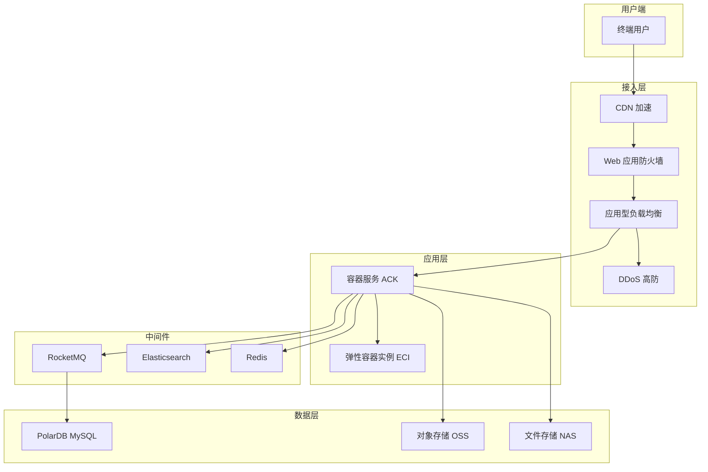

# 电商平台架构方案

## 架构总览

## 分层产品选型

### 接入层
- **CDN**: 阿里云 CDN / DCDN，加速静态资源（图片、JS/CSS），动态加速回源
- **WAF**: Web 应用防火墙，防护 SQL 注入、XSS、CC 攻击
- **DDoS 高防**: 针对大流量 DDoS 攻击防护，建议 5 Gbps 起配
- **ALB**: 应用型负载均衡，支持 HTTPS 卸载、灰度发布、WAF 集成

### 应用层
- **ACK**: 阿里云容器服务 Kubernetes 版，管理微服务集群
- **ECI**: 弹性容器实例，应对秒杀/大促瞬时弹性扩容，按量付费

### 数据层
- **PolarDB MySQL**: 一写多读集群，读写分离，支持 10 万+ QPS；建议 2 节点起步，大促自动弹性
- **Redis**: 会话管理、商品缓存、热点数据缓存；建议启用读写分离 + 集群模式
- **Elasticsearch**: 商品搜索、订单日志分析、推荐引擎的向量检索
- **RocketMQ**: 订单异步处理、库存扣减、消息解耦；支持事务消息保证最终一致性

### 存储层
- **OSS**: 商品图片、用户头像、交易凭证的对象存储，结合 CDN 分发
- **NAS**: 多 Pod 共享配置文件、静态资源、日志归档

## DAU 分级扩缩容建议

| 规模 | DAU | ACK 节点 | PolarDB 规格 | Redis 规格 |
|------|-----|----------|-------------|-----------|
| 小型 | < 1 万 | 3-5 节点 (4C8G) | 2C4G x 2 | 4G 集群 |
| 中型 | 1-10 万 | 10-20 节点 (8C16G) | 4C8G x 4 | 16G 集群 |
| 大型 | 10-100 万 | 30-100 节点 (16C32G) | 8C16G x 8 | 64G 集群 |
| 超大型 | 100 万+ | 100+ 节点 + 弹性伸缩 | PolarDB 自动弹性 | 128G+ 集群 |

## 高可用/容灾配置

- **多可用区部署**: ACK 集群跨 3 个可用区，Pod 反亲和调度
- **PolarDB 跨可用区**: 自动故障切换，RTO < 30 秒
- **Redis 双副本**: 启用数据持久化 + 自动主备切换
- **OSS 跨区域复制**: 关键图片和交易凭证异地备份
- **RocketMQ 死信队列**: 失败消息自动重试与归档

## 成本估算（月）

- **小型**: 约 3,000 - 8,000 元
- **中型**: 约 15,000 - 40,000 元
- **大型**: 约 80,000 - 200,000 元
- **超大型**: 30 万元以上（视弹性用量而定）

> 提示：大促期间建议提前 2 周完成 ACK 节点池扩容、PolarDB 弹性和 CDN 预热准备。