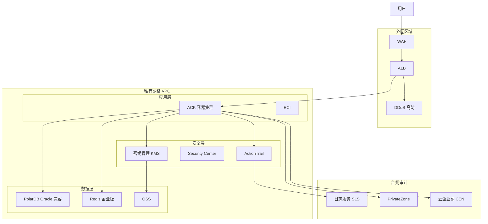

# 金融科技架构方案

## 合规要求概览

金融场景需要满足以下合规标准（根据客户实际业务需求适配）:

| 标准 | 适用范围 | 关键要求 |
|------|---------|---------|
| PCI-DSS | 支付处理 | 加密存储、访问审计、网络隔离 |
| 等级保护 2.0 | 国内金融 | 数据加密、日志留存 180+ 天、等保专用实例 |
| GDPR/个人信息保护 | 跨境/个人 | 数据脱敏、访问控制、数据本地化 |

## 架构总览

## 分层产品选型

### 接入与安全层
- **WAF**: 必选，防护 OWASP Top 10 攻击，配置自定义规则匹配金融业务特征
- **DDoS 高防**: 保底 10 Gbps，提供 HTTPS CC 防护
- **ALB**: 支持 HTTPS 双向认证、mTLS 传输加密
- **KMS**: 密钥全生命周期管理，加密存储卡号、身份证等敏感字段
- **Security Center**: 基线检查、漏洞扫描、主机安全、防篡改
- **ActionTrail**: 记录所有云资源操作，满足审计追溯要求

### 网络隔离
- **PrivateZone**: 内网 DNS 管理，避免公网暴露
- **CEN + PrivateLink**: 跨 VPC/IDC 私网互联，不经过公网
- **VPC 网络 ACL + 安全组**: 精细化四层访问控制，最小权限原则

### 数据层
- **PolarDB Oracle 兼容版**: 核心交易数据库，支持 Oracle 语法迁移，一写多读集群
- **Redis 企业版 (Tair)**: 高性能缓存、分布式锁、交易流水缓存；支持数据落盘加密
- **OSS**: 加密存储交易凭证、合同文件，默认开启服务端加密

### 审计与日志
- **SLS (日志服务)**: 统一采集 ActionTrail、应用日志、数据库审计日志
  - 日志存储 180 天以上（等保要求）
  - 配置告警规则（如异常登录、敏感操作）
- **数据库审计**: PolarDB 默认开启 SQL 审计，记录所有 DML/DDL 操作

## 多地域容灾

- **同城双活**: 主备可用区部署，Redis 跨可用区复制，PolarDB 自动切换
- **异地灾备**: 关键数据通过 DTS 实时同步至异地（如华东1 → 华南1）
- **RPO < 1 分钟**: 数据库 DTS 同步 + 消息队列双写
- **RTO < 5 分钟**: DNS 切换 + ALB 跨区域转发

## 成本区间参考

| 规模 | 月成本估算 | 说明 |
|------|-----------|------|
| 小型金融应用 | 8,000 - 20,000 元 | 单可用区 + 基础安全 |
| 中型交易平台 | 30,000 - 80,000 元 | 双可用区 + 等保合规 |
| 大型支付核心 | 100,000+ 元 | 异地容灾 + 全量审计 |

> 提示：金融场景的云资源建议全部使用包年包月 + 预留实例券以最大化折扣，避免按量付费的高成本。