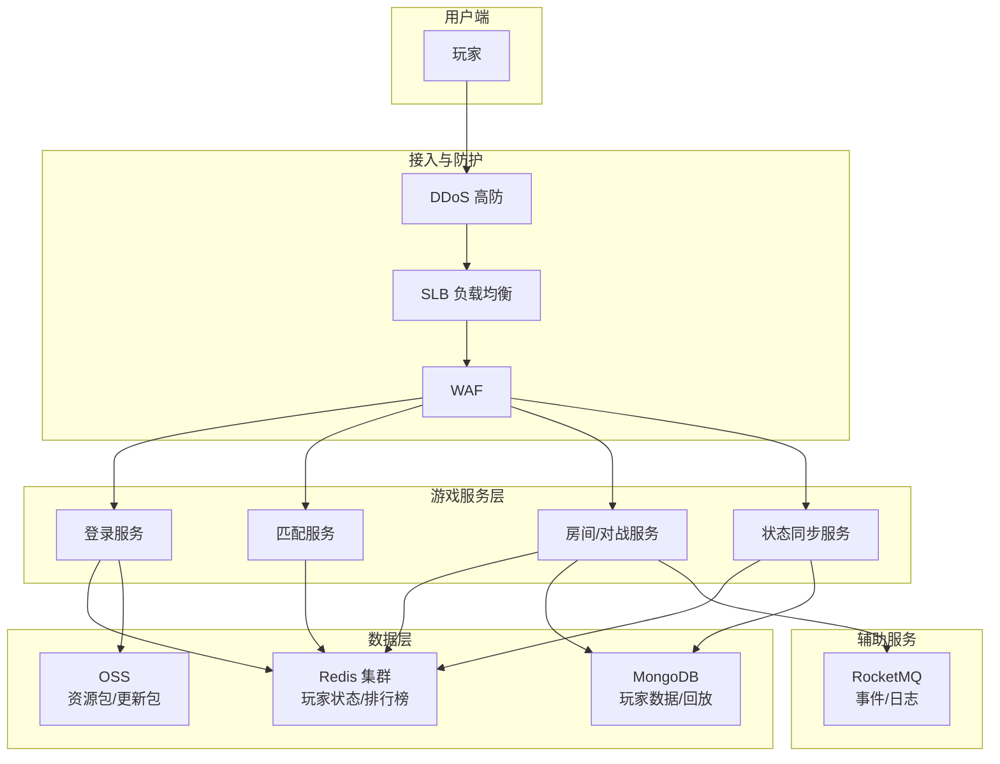

# 游戏服务架构方案

## 架构总览

## 分层产品选型

### 接入与安全
- **DDoS 高防**: 游戏是 DDoS 攻击重灾区，建议 10 Gbps 保底防护，支持弹性防护峰值
- **SLB**: 传统型/应用型负载均衡，支持 TCP/UDP 协议，适合游戏长连接
- **WAF**: 防护 Web 登录/支付接口安全

### 游戏服务层
- **ECS**: 计算型实例（c7/c8y 系列），视游戏类型可选 GPU 实例（图形渲染类）
  - 对战/匹配服务: 通用型 ecs.g7.xlarge
  - 图形渲染: GPU 型 ecs.gn7i-c32g1
- **ACK 容器化**: 推荐容器化部署游戏微服务，方便灰度升级和弹性伸缩
- **ECI**: 高峰期弹性伸缩，如新服开服、活动推广期间

### 数据层
- **Redis 集群**: 核心用途包括玩家在线状态、匹配队列、排行榜、实时计数
  - 建议启用读写分离 + 混合持久化
  - 大型游戏建议 64 GB 分片集群起步
- **MongoDB**: 玩家档案、对局回放、聊天记录等文档型数据
  - 副本集 3 节点起步，分片集群用于千万级玩家
- **OSS**: 游戏资源包、更新补丁、用户生成内容的存储和 CDN 分发

### 辅助服务
- **RocketMQ**: 游戏事件总线、日志上报、监控告警

## 分区部署策略

- **同区域就近接入**: 每个大区独立一套 SLB + ECS 集群
- **跨区域协同**: 全服匹配和排行榜使用异地多活 Redis 或全球数据库
- **推荐地域**: 华东2（上海）、华北2（北京）、华南1（深圳）覆盖国内主流玩家

## 高峰期弹性方案

- **定时弹性**: 根据历史数据设定晚 19:00-23:00 节点池扩容
- **事件弹性**: 新服开服、版本更新时自动触发 ECI 弹性伸缩
- **缩容策略**: 低谷期缩容至保底节点（保留 30%-50% 容量）

## 安全防护

- 启用 Anti-DDoS 智能防护策略，识别 CC 攻击和 UDP 反射攻击
- 游戏登录接口限流，防止撞库攻击
- Redis 启用密码 + 白名单，禁止公网直连

## 成本优化建议

- ECS 按量付费 + 包年包月混合（基础节点包年，弹性节点按量）
- 低谷期使用抢占式实例承载非关键服务
- OSS 生命周期管理，历史资源包自动转入低频/归档存储