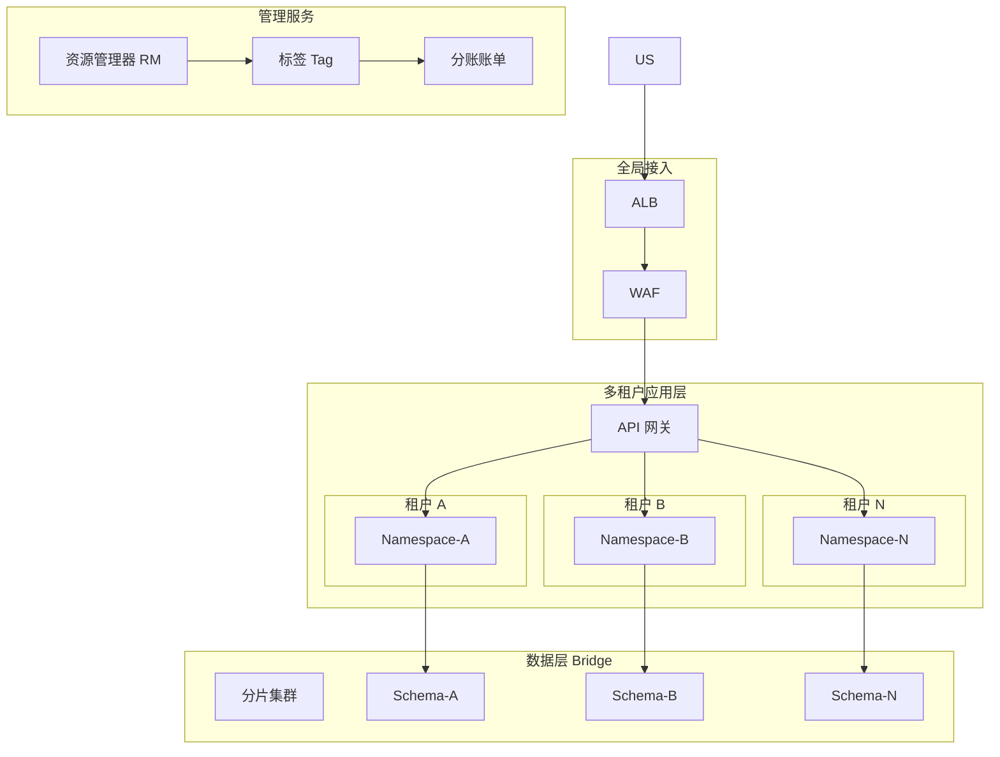

# SaaS 多租户架构方案

## 租户隔离策略

选择隔离策略需平衡安全性、成本和运维复杂度：

| 策略 | 隔离粒度 | 成本 | 复杂度 | 适用场景 |
|------|---------|------|--------|---------|
| **Silo** | 每租户独立 VPC + 独立数据库实例 | 高 | 中 | 金融、医疗等强合规行业 |
| **Bridge** | 共享 VPC，每租户独立数据库 Schema + K8s Namespace | 中 | 中 | 中型 SaaS，平衡隔离与成本 |
| **Pool** | 全共享，通过租户 ID 字段逻辑隔离 | 低 | 低 | 轻量 SaaS，成本优先 |

推荐：**默认 Bridge 模式**，支持大租户无缝升级到 Silo。

## 架构总览

## 产品选型

### 接入与路由
- **ALB**: 根据域名/Host 头路由到不同租户后端
- **API 网关**: 租户身份认证、API 限流、调用审计，支持 OAuth2/JWT
- **WAF**: 全局防护，配置针对不同租户 API 的差异化规则

### 应用层
- **ACK**: 通过 Kubernetes Namespace 实现租户隔离
  - 每个租户分配独立 Namespace + ResourceQuota
  - 使用 NetworkPolicy 禁止跨 Namespace 访问
- **ASM (服务网格)**: 为租户间流量配置限流、熔断、灰度策略

### 数据层
- **PolarDB MySQL**: Bridge 模式下租户按 Schema 隔离
  - 大租户可升级为独立实例（Silo）
  - 配置实例级 IOPS 上限防超卖
- **Redis**: 按租户 ID 分 Key，启用 Key 空间隔离
  - 大租户可分配独立 Redis 实例
- **RDS PG / AnalyticDB**: 租户报表查询，防止 OLTP 被复杂查询影响

### 计费与管理
- **资源管理器 (RM)**: 建立资源目录，每个租户一个资源夹
- **标签 Tag**: 强制所有资源打租户标签，用于成本分摊
- **分账账单**: 按标签生成分账报表，支持按量/包年包月分摊

## 弹性伸缩策略

- **全局弹性**: ACK 节点池根据所有租户总负载自动扩缩
- **单租户弹性**: 大租户可独立设置 HPA 策略
- **资源超卖**: 允许适度超卖（建议 1.2x - 1.5x），配合 LimitRange 控制 Pod 资源上限

## 租户生命周期

1. **创建**: API 网关注册 + Namespace 创建 + 数据库 Schema 初始化
2. **扩缩**: 根据租户付费等级调整 ResourceQuota
3. **迁移**: Bridge → Silo 升级流程（数据迁移 + DNS 切换 + 灰度验证）
4. **删除**: 回收所有资源（保留期 30 天后彻底清理）

## 成本估算

| 规模 | 月成本 | 租户数 | 说明 |
|------|--------|-------|------|
| 小规模 | 10,000 - 30,000 元 | 10-50 | Bridge 模式，共享集群 |
| 中规模 | 30,000 - 100,000 元 | 50-500 | 混合模式，大租户独立 |
| 大规模 | 100,000+ 元 | 500+ | Silo + Bridge 混合，多集群 |

> 提示：合理设计租户等级（免费版/专业版/企业版），不同等级对应不同的隔离级别和资源配额。