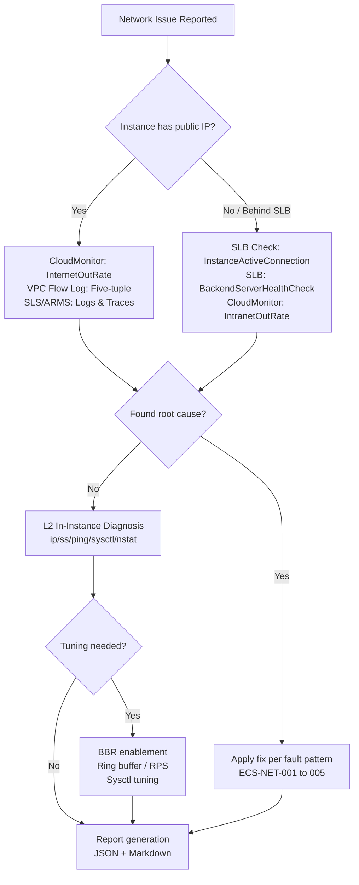

# ECS Network Troubleshooting & Tuning

> **Scope:** Network connectivity diagnosis, bandwidth bottleneck identification, and NIC/kernel-level tuning for Alibaba Cloud ECS instances. For pure VPC/SLB/networking issues, delegate to `alicloud-vpc-ops` / `alicloud-slb-ops`.
>
> **Architecture Principle:** **Cloud-side first, instance-side second.** Always exhaust Alibaba Cloud native observability (CloudMonitor, VPC Flow Log, SLS, ARMS) before installing or running in-instance diagnostic tools.

---

## ECS Network Bandwidth Model

Understanding the bandwidth ceiling is the prerequisite for any tuning or troubleshooting.

| Concept | Description | How to Check |
|---------|-------------|--------------|
| **Intranet Bandwidth** | Free internal network throughput between ECS instances within the same region. Upper limit is bound to **instance type**. | `aliyun ecs DescribeInstanceTypes --InstanceTypeFamily ecs.g7` |
| **Internet Bandwidth** | Pay-as-you-go or subscription public IP bandwidth (`InternetMaxBandwidthOut`). | `aliyun ecs DescribeInstances --InstanceIds '["i-xxx"]'` → `InternetMaxBandwidthOut` |
| **Burstable Bandwidth** | Some instance types support burst above baseline for short periods. | Check instance type specs in console or API |
| **ENI (Elastic Network Interface)** | Virtual network card. Each instance type has a max ENI count and max queues per ENI. | `aliyun ecs DescribeInstanceTypes` → `EniQuantity`, `EniTotalQuantity` |
| **Bandwidth vs PPS** | Bandwidth (Gbps) is not the only limit — **PPS (packets per second)** also has an instance-type ceiling. Small-packet workloads (e.g., DNS, gaming) hit PPS before bandwidth. | CloudMonitor `NetworkPacketsPerSecond` (if available) or instance-level `ss -tan` / `cat /proc/net/dev` |

**Key Rule:** If `InternetMaxBandwidthOut` = 0, the instance has **no public IP** (unless an EIP is attached). No amount of tuning will fix a missing public IP.

---

## Two-Layer Diagnostic Architecture

```
┌─────────────────────────────────────────────────────────────┐
│  Layer 1: Cloud-Side (No instance login required)           │
│  ─────────────────────────────────────────────────          │
│  • CloudMonitor — bandwidth, PPS, connection count trends   │
│  • VPC Flow Log — five-tuple traffic analysis               │
│  • SLS — application log correlation (observability.md)     │
│  • ARMS — distributed trace correlation (observability.md)  │
│  • ECS Console — system events, instance status, ENI health │
└─────────────────────────────────────────────────────────────┘
                            ↓  If Layer 1 cannot locate root cause
┌─────────────────────────────────────────────────────────────┐
│  Layer 2: In-Instance (via Cloud Assistant / SSH)           │
│  ─────────────────────────────────────────────────          │
│  • Built-in tools: ip, ss, ping, route, sysctl, /proc       │
│  • Cloud-native agent: CloudMonitor Agent (if installed)    │
│  • Install-on-demand: tcpdump, ethtool, mtr                 │
│  • Install-on-demand (bandwidth deep-dive): iftop, nload    │
└─────────────────────────────────────────────────────────────┘
```

**Policy:** Do not install in-instance diagnostic tools until Layer 1 has been exhausted. This reduces operational risk, blast radius, and agent sprawl.

### Diagnostic Flow



---

## Layer 1: Cloud-Side Diagnosis

### 1.1 CloudMonitor — The Primary Path

CloudMonitor already collects the most critical network metrics. Query these first.

```bash
# Internet bandwidth trend (1 hour, 300s period)
aliyun cms DescribeMetricList \
  --Namespace acs_ecs_dashboard \
  --MetricName InternetOutRate \
  --Dimensions '[{"instanceId":"i-xxx"}]' \
  --Period 300 \
  --StartTime "$(date -u -v-1H +%Y-%m-%dT%H:%M:%SZ)"

# Intranet bandwidth trend
aliyun cms DescribeMetricList \
  --Namespace acs_ecs_dashboard \
  --MetricName IntranetOutRate \
  --Dimensions '[{"instanceId":"i-xxx"}]' \
  --Period 300

# Connection count
aliyun cms DescribeMetricList \
  --Namespace acs_ecs_dashboard \
  --MetricName VPCPublicIPConnection \
  --Dimensions '[{"instanceId":"i-xxx"}]' \
  --Period 300
```

**What CloudMonitor tells you without touching the instance:**

| Observation | Interpretation | Next Step |
|-------------|----------------|-----------|
| `InternetOutRate` = 0 (should be non-zero) | No traffic leaving instance | Check security group egress, NAT Gateway, instance state |
| `InternetOutRate` ≈ `InternetMaxBandwidthOut` × 0.9+ sustained | Public bandwidth saturation | See fault pattern **ECS-NET-001** below; may need bandwidth upgrade |
| `IntranetOutRate` ≈ instance-type baseline × 0.9+ sustained | Intranet bandwidth saturation | See fault pattern **ECS-NET-002**; may need instance-type upgrade |
| `VPCPublicIPConnection` spikes with flat `InternetOutRate` | Connection leak or DDoS / Slowloris | See fault pattern **ECS-NET-004** |
| `InternetOutRate` spikes without CPU/memory spike | Likely bulk transfer or attack | Correlate with SLS access logs (observability.md) |

**Conversion reminder:** CloudMonitor reports in **bits/s**. OS tools report in **bytes/s**. `1 byte/s = 8 bits/s`.

### 1.2 VPC Flow Log (Five-Tuple Analysis)

If VPC Flow Log is enabled, use it before `tcpdump` on the instance. Flow Log captures all traffic at the hypervisor level — it does not miss packets, and it requires no instance-side installation.

```bash
# Check if Flow Log is enabled for the VPC
aliyun vpc DescribeFlowLogs \
  --RegionId cn-hangzhou \
  --ResourceId vpc-xxx

# Query flow logs via SLS (Flow Log delivers to a Logstore)
aliyun log GetLogs \
  --project "{{flowlog_project}}" \
  --logstore "{{flowlog_logstore}}" \
  --query 'srcaddr: "10.0.x.x" and action: REJECT' \
  --from "$(date -u -v-1H +%s)" \
  --to "$(date -u +%s)"
```

**What Flow Log tells you:**

- Which source/destination IPs and ports are involved
- Whether packets are accepted or rejected (helps isolate security group / NACL issues)
- Traffic volume per five-tuple
- Whether drops happen at the virtualization layer (outside the guest OS)

> **When to skip Flow Log:** If it is not already enabled, do **not** enable it reactively for a single incident — the enable + delivery delay is too long. Use it for post-incident analysis or keep it enabled proactively.

### 1.3 SLS / ARMS Correlation

See [observability.md](observability.md) for the full metrics→logs→traces linkage.

| CloudMonitor Anomaly | SLS Query Target | ARMS Trace Target |
|----------------------|------------------|-------------------|
| `InternetOutRate` spike | `access_log` — group by `remote_addr`, find top source | HTTP/RPC trace — identify large payload or retry storm |
| `VPCPublicIPConnection` high | `connection_log` — count unique source IPs | Trace — identify connection pool misconfiguration |
| Latency spike with normal bandwidth | Application error logs | Distributed trace — find slow downstream call |

### 1.4 ECS Console System Events

```bash
# Check for recent system events (maintenance, network migration, host failure)
aliyun ecs DescribeInstanceHistoryEvents \
  --RegionId cn-hangzhou \
  --InstanceId i-xxx \
  --EventPublishTime.Start "$(date -u -v-1H +%Y-%m-%dT%H:%M:%SZ)"
```

---

### 1.5 SLB-Fronted ECS Diagnosis (Intranet-Only Instances)

> **Why this section exists:** Most production ECS instances serve traffic behind an SLB (Classic Load Balancer) and have no public IP. In this topology, the effective traffic bottleneck may be at the **SLB layer**, not the ECS. CloudMonitor `InternetOutRate` on such instances is always 0 — this is **not an anomaly**. The correct metric chain is: **SLB → VPC Flow Log → ECS Intranet**.

#### Traffic Path Anatomy

```
Client (Internet)
    │
    ▼
┌─────────────────────┐
│  SLB (公网入口)      │  ← SLB InstanceActiveConnection / InstanceTrafficRX
│  bandwidth limit     │  ← SLB InstanceDropConnection / InstanceDropTrafficRX
│  connection cap      │  ← SLB InstanceMaxConnection
│  health check        │  ← SLB BackendServerHealthCheck
└─────────┬───────────┘
          │ VPC internal network (intranet)
          ▼
┌─────────────────────┐
│  VPC Flow Log        │  ← Five-tuple analysis, REJECT/ACCEPT ratio
│  Security Group      │  ← Inbound rules from SLB to ECS
└─────────┬───────────┘
          │
          ▼
┌─────────────────────┐
│  ECS Instance        │  ← ECS CloudMonitor: IntranetOutRate
│  (vtvt-erp-int)      │  ← ECS L2: ss, ethtool, /proc/net/dev
└─────────────────────┘
```

#### Diagnostic Rules for SLB-Fronted ECS

| Symptom on ECS | Check SLB First | Then Check ECS |
|----------------|----------------|----------------|
| Users report "Service Unreachable" | SLB listener status (`DescribeLoadBalancerListeners`) | ECS process listening on correct port |
| "502 Bad Gateway" | SLB backend health (`DescribeHealthStatus`) | ECS application health, port liveness |
| High latency | SLB `InstanceUpstreamRt` — backend response time | ECS CPU/mem/disk, application slow logs |
| Connection drops reported | SLB `InstanceDropConnection`, `InstanceDropTrafficRX` | ECS `ss -s` connection count, `ethtool -S` drops |
| Intermittent failures | SLB health check settings (too aggressive?) | ECS `vmstat 1` for CPU steal, `dmesg` for OOM |
| Throughput lower than expected | SLB spec (`InstanceMaxConnection`, bandwidth) | ECS intranet bandwidth baseline vs actual |

#### SLB Monitoring Check (Layer 1 Extension)

Always run this check alongside ECS Layer 1 for instances behind SLB:

```bash
# ── Step 1: Find which SLB the ECS belongs to ──
# (Requires user to provide LoadBalancerId, or look up via tag/name)
# aliyun slb DescribeLoadBalancers --RegionId cn-hangzhou

# ── Step 2: Check SLB instance spec & status ──
aliyun slb DescribeLoadBalancerAttribute \
  --LoadBalancerId "{{user.load_balancer_id}}" \
  --output cols=LoadBalancerStatus,LoadBalancerSpec,Bandwidth,AddressType \
  rows='{LoadBalancerStatus,LoadBalancerSpec,Bandwidth,AddressType}'

# ── Step 3: Check backend health ──
aliyun slb DescribeHealthStatus \
  --LoadBalancerId "{{user.load_balancer_id}}" \
  --ListenerPort "{{user.listener_port}}" \
  --output cols=ServerId,Port,HealthStatus \
  rows=BackendServers.BackendServer[].{ServerId,Port,HealthStatus}

# ── Step 4: SLB connection vs drop metrics (last 1 hour) ──
aliyun cms DescribeMetricList \
  --Namespace acs_slb \
  --MetricName InstanceDropConnection \
  --Dimensions '{"instanceId":"{{user.load_balancer_id}}"}' \
  --Period 300 \
  --StartTime "$(date -u -v-1H +%Y-%m-%dT%H:%M:%SZ)"

# ── Step 5: SLB bandwidth utilization ──
aliyun cms DescribeMetricList \
  --Namespace acs_slb \
  --MetricName InstanceTrafficTX \
  --Dimensions '{"instanceId":"{{user.load_balancer_id}}"}' \
  --Period 300 \
  --StartTime "$(date -u -v-1H +%Y-%m-%dT%H:%M:%SZ)"

# ── Step 6: Backend response time ──
aliyun cms DescribeMetricList \
  --Namespace acs_slb \
  --MetricName InstanceUpstreamRt \
  --Dimensions '{"instanceId":"{{user.load_balancer_id}}","port":"{{user.listener_port}}","protocol":"http"}' \
  --Period 300 \
  --StartTime "$(date -u -v-1H +%Y-%m-%dT%H:%M:%SZ)"
```

#### SLB-to-ECS Correlation Matrix

| SLB Metric | Interpretation | Correlated ECS Metric |
|------------|---------------|----------------------|
| `InstanceUpstreamRt` high (>5s) | Backend is slow → check ECS | ECS `IntranetOutRate`, application logs, CPU/mem |
| `InstanceDropConnection` > 0 | SLB hitting connection cap → upgrade spec | ECS `ss -s` — may see normal socket count |
| `InstanceDropTrafficTX` > 0 | SLB bandwidth exceeded → upgrade bandwidth | ECS `IntranetOutRate` is flat (not saturated) |
| `BackendServerHealthCheck` = abnormal | ECS port/service not responding | ECS `ss -tlnp` — check listening port; app logs |
| `InstanceStatusCode5xx` > 0 | ECS returning errors → check app | ECS application error logs via SLS/ARMS |
| `InstanceNewConnection` > spec limit | SLB connection cap reached | ECS `ss -tan` state distribution |

#### When to Delegate

| Finding | Delegate To |
|---------|-------------|
| SLB spec insufficient | `alicloud-slb-ops` — spec upgrade |
| SLB backend all abnormal, ECS healthy | `alicloud-slb-ops` — health check tuning |
| SLB listener missing/stopped | `alicloud-slb-ops` — listener start |
| VPC Flow Log shows REJECT | `alicloud-vpc-ops` — security group / NACL |
| ECS process not listening | This skill — ECS application diagnosis |

---

## Layer 2: In-Instance Diagnosis

Only proceed here if Layer 1 (including §1.5 SLB checks) cannot explain the symptom. All commands are designed for **Cloud Assistant** (`aliyun ecs RunCommand`) execution. No SSH required.

### 2.1 Tool Availability Matrix

| Tool | Typical Pre-installed? | Purpose | Install Required? |
|------|------------------------|---------|-------------------|
| `ip`, `ss`, `ping`, `route`, `sysctl`, `cat`, `awk` | **Yes** (all Linux) | Basic connectivity, routing, socket state, kernel params | No |
| `netstat` | Usually yes | Socket statistics (legacy, use `ss` instead) | No |
| `sar` | Often yes (sysstat) | Historical network / CPU / IO stats | Maybe |
| `tcpdump` | Usually **no** | Packet-level capture | **Yes** |
| `ethtool` | Usually **no** | NIC hardware state, ring buffer, offloads | **Yes** |
| `mtr` | Usually **no** | Path analysis with per-hop loss | **Yes** |
| `iftop`, `nload`, `nethogs` | Usually **no** | Real-time per-connection / per-process bandwidth | **Yes** |
| `iperf3` | Usually **no** | Bandwidth benchmark | **Yes** |

**Policy:** Start with the "Yes" column only. Move to "Install Required" only when the built-ins are insufficient.

### 2.2 Connectivity Checks (Built-in Only)

```bash
# ---- Routing & interface state ----
ip addr show
ip route get 223.5.5.5          # Which interface and gateway for a target
ip route get <dst_ip>         # For internal target

# ---- DNS ----
cat /etc/resolv.conf
nslookup aliyun.com 2>/dev/null || host aliyun.com 2>/dev/null || ping -c 1 -W 2 aliyun.com

# ---- Socket state summary ----
ss -s

# ---- TCP connection states ----
ss -tan | awk '{print $1}' | sort | uniq -c | sort -rn

# ---- Default route ----
ip route | grep default

# ---- OS firewall (common paths) ----
iptables -L -n 2>/dev/null || nft list ruleset 2>/dev/null || firewall-cmd --list-all 2>/dev/null || echo "No iptables/nftables/firewalld detected"
```

### 2.3 Latency & Loss (Built-in + Optional mtr)

```bash
# Built-in: ICMP latency
ping -c 20 -i 0.2 <target>

# Built-in: TCP handshake latency (if nc is present)
nc -zv -w 3 <target> <port> 2>&1

# Optional (install mtr if path loss is suspected):
# mtr --report --report-cycles 50 <target>
```

### 2.4 Bandwidth Profiling (Built-in sar + Optional iftop/nload)

```bash
# Built-in: if sysstat is installed
sar -n DEV 1 10 2>/dev/null || echo "sysstat not installed; skip or install"

# Built-in: raw interface counters (always available)
cat /proc/net/dev

# Optional deep-dive (install iftop / nload if needed):
# iftop -i eth0 -P -n -t -s 60
# nload -u M -t 60000 eth0
```

### 2.5 Packet Capture (tcpdump — Install Required)

`tcpdump` is the most common reason to install a package. VPC Flow Log is the preferred alternative; use `tcpdump` only when you need payload inspection or Flow Log is unavailable.

```bash
# Capture for 30 seconds, max 5000 packets
timeout 30 tcpdump -i eth0 -nn -c 5000 -w /tmp/cap.pcap 2>/dev/null
echo "Capture complete. Upload /tmp/cap.pcap for analysis."
```

### 2.6 Intranet-Only Instance Diagnostics (No Public IP)

> **When this applies:** If the ECS instance has `InternetMaxBandwidthOut=0` or `ss -tan | wc -l` shows only private-range sockets, public-network checks (curl to external, ping 223.5.5.5) will fail. All diagnostics must use **internal targets**.

**Intranet-only check procedure — replace §2.3/§2.4 public targets:**

```bash
# ── Step 1: Detect active interface and private addresses ──
ACTIVE_IFACE=$(ip -o addr show | awk '{print $2}' | sort -u | grep -v lo | head -1)
echo "Active interface: $ACTIVE_IFACE"
GATEWAY=$(ip route show default | awk '{print $3}')
echo "Default gateway: $GATEWAY"

# ── Step 2: DNS (internal DNS server) ──
cat /etc/resolv.conf

# ── Step 3: Ping internal target (gateway or VPC endpoint) ──
if [ -n "$GATEWAY" ]; then
  ping -c 5 -i 0.2 -W 2 "$GATEWAY" 2>/dev/null | tail -1 || echo "Gateway unreachable"
fi

# ── Step 4: Intranet-only bandwidth test ──
# Use /proc/net/dev delta (always available, no external dependencies)
RX1=$(cat /proc/net/dev | awk -v iface="$ACTIVE_IFACE" '$1 ~ iface":" {print $2}')
sleep 10
RX2=$(cat /proc/net/dev | awk -v iface="$ACTIVE_IFACE" '$1 ~ iface":" {print $2}')
echo "Intranet RX delta: $(( (RX2 - RX1) * 8 / 10 )) bps"

# ── Step 5: iperf3 test (if a test server is available in the same VPC) ──
# iperf3 -c <intranet-ip-of-test-server> -t 30 -P 4 > /tmp/iperf-intranet.txt
```

**Key difference between public-instance and intranet-only diagnosis:**

| Check | Public Instance | Intranet-Only Instance |
|-------|----------------|----------------------|
| Ping target | `223.5.5.5` (Alibaba DNS) | VPC gateway / internal endpoint |
| Workload generation | `curl https://speedtest.tele2.net/` | `iperf3` to peer in same VPC, or `/proc/net/dev` delta |
| Bandwidth ceiling | `InternetMaxBandwidthOut` | Instance-type intranet baseline |
| Entry traffic path | Public IP → ECS | SLB → VPC → ECS (§1.5) |
| CloudMonitor | `InternetOutRate` | `IntranetOutRate` |

### 2.7 Advanced Kernel Diagnostics (Built-in, No Install Required)

> **Why these matter:** Standard `ss` and `ping` miss several subtle failure modes. The following tools are built into the Linux kernel and require NO package installation — they are often overlooked.

#### 2.7.1 `nstat` — Kernel TCP Stack Statistics

`nstat -az` reads `/proc/net/netstat` and `/proc/net/snmp` directly from the kernel. It exposes dozens of TCP error counters that `ss` does not show.

```bash
# All TCP kernel counters (zero-suppressed to show only non-zero errors)
nstat -az 2>/dev/null | grep -v " 0$" | head -40 || echo "nstat not available (kernel < 2.6 or not installed)"

# Key counters to watch:
#   TcpExtTCPRenoRecovery     → Fast retransmits triggered
#   TcpExtTCPSackRecovery     → SACK-triggered recovery
#   TcpExtTCPLostRetransmit   → Retransmit was actually lost again
#   TcpExtTCPTimeouts          → RTO timer fired (congestion)
#   TcpExtTCPAbortOnTimeout   → Connection killed by timeout
#   TcpExtTCPBacklogDrop      → Socket backlog overflow (see §2.7.2)
#   TcpExtTCPMinTTLDrop       → TTL exceeded drops
#   TcpExtListenOverflows     → SYN backlog overflow
#   TcpExtListenDrops         → SYN dropped for any reason
```

**Diagnostic shortcut — top 5 critical counters:**

```bash
for c in TcpExtTCPBacklogDrop TcpExtListenOverflows TcpExtListenDrops \
         TcpExtTCPTimeouts TcpExtOfoPruned; do
  val=$(nstat -az 2>/dev/null | grep "$c" | awk '{print $2}')
  [ -n "$val" ] && [ "$val" -gt 0 ] && echo "WARN: $c = $val (check needed)" \
    || echo "OK: $c = ${val:-0}"
done
```

#### 2.7.2 Backlog Drop Diagnosis (`TcpExtListenOverflows` / `TcpExtTCPBacklogDrop`)

These are "silent drops" — the kernel drops incoming SYN or data packets because the application is too slow to `accept()` or `read()`. No packet capture will show these as lost.

| Counter | Meaning | Typical Fix |
|---------|---------|-------------|
| `TcpExtListenOverflows` | SYN arrived but accept backlog was full | Raise `net.core.somaxconn` + app's listen backlog |
| `TcpExtTCPBacklogDrop` | Data packet dropped on established socket | Raise `net.core.netdev_max_backlog` or optimize app read loop |

```bash
# Quick check
grep -E "ListenOverflows|TCPBacklogDrop|ListenDrops" /proc/net/netstat 2>/dev/null || echo "/proc/net/netstat not found"
```

#### 2.7.3 `tc -s qdisc` — Queuing Discipline Analysis

Traffic control qdisc (queueing discipline) drops reveal congestion at the **egress** side — the kernel is trying to send faster than the NIC can transmit.

```bash
tc -s qdisc show dev eth0 2>/dev/null || echo "tc not available"

# What to look for:
#   "dropped" — packets dropped due to qdisc queue full
#   "overlimits" — packet couldn't be sent due to rate limiting
#   "backlog" — current bytes waiting in queue
```

**When `dropped > 0` in `tc -s qdisc`:**

| Context | Probable Cause | Fix |
|---------|---------------|-----|
| `pfifo_fast` with drops | Simple queue overflow | Increase `txqueuelen`: `ip link set eth0 txqueuelen 10000` |
| `fq_codel` with drops | Fair-queue codel active management | Normal under load; only worry if > 1% drop rate |
| `htb` or `tbf` with drops | Traffic shaping configured | Adjust shaping parameters |

#### 2.7.4 TCP Ephemeral Port Range

Ephemeral port exhaustion is a common cause of `Cannot assign requested address` on outbound connections.

```bash
# Check current range
cat /proc/sys/net/ipv4/ip_local_port_range
# Typical output: "32768 60999" (about 28k ports)
# For high-outbound-connection workloads:
#   echo "10240 65535" > /proc/sys/net/ipv4/ip_local_port_range
```

**Quick capacity estimate:**

```bash
PORT_RANGE=$(cat /proc/sys/net/ipv4/ip_local_port_range 2>/dev/null)
if [ -n "$PORT_RANGE" ]; then
  START=$(echo "$PORT_RANGE" | awk '{print $1}')
  END=$(echo "$PORT_RANGE" | awk '{print $2}')
  TOTAL=$((END - START + 1))
  TIME_WAIT=$(ss -tan state time-wait | wc -l)
  USED=$(ss -tan | tail -n +2 | awk '{print $4}' | grep -oP '\d+$' | sort -u | wc -l)
  echo "Ephemeral port range: $START-$END ($TOTAL total, ~$USED in use, ~$TIME_WAIT time-wait)"
  if [ "$USED" -gt "$((TOTAL * 80 / 100))" ]; then
    echo "WARN: >80% ephemeral port usage — risk of EADDRNOTAVAIL"
  fi
fi
```

#### 2.7.5 ARP / Neighbor Table

ARP issues cause "Destination Host Unreachable" at Layer 2 even when IP config is correct.

```bash
# Neighbor table (ARP cache)
ip neigh show nud failed 2>/dev/null    # Stale/failed entries
ip neigh show nud reachable 2>/dev/null | head -10  # Healthy entries
cat /proc/net/arp 2>/dev/null | head -10

# GC threshold
sysctl -n net.ipv4.neigh.default.gc_thresh1 2>/dev/null  # Min entries
sysctl -n net.ipv4.neigh.default.gc_thresh3 2>/dev/null  # Max entries (force GC)
```

**When ARP is the root cause:**
- `ip neigh show nud failed` shows entries for gateway or peer IPs
- Flush: `ip neigh flush nud failed`
- If recurring, raise `gc_thresh3`: `sysctl -w net.ipv4.neigh.default.gc_thresh3=4096`

#### 2.7.6 MTU / Path MTU Discovery

MTU mismatches cause "silent black holes" — large packets are dropped, small packets pass. This typically manifests as SSH/web working but SCP/bulk-transfer failing.

```bash
# Check interface MTU
ip link show eth0 2>/dev/null | grep -oP 'mtu \K\d+' || ip link show | grep -oP 'mtu \K\d+'

# Test MTU to specific target (requires ping)
ping -M do -c 3 -s 1472 10.0.0.1 2>/dev/null && echo "MTU 1500 OK" \
  || echo "MTU 1500 FAIL — trying smaller"

# Common Alibaba Cloud MTU: 1500 (default), 8500 (entro / some high-performance)
# If ICMP unreachable (DF) messages are blocked, PMTUD silently fails
```

**Alibaba Cloud MTU Reference:**

| Network Type | Default MTU | Notes |
|-------------|-------------|-------|
| VPC (regular) | 1500 | Standard Ethernet |
| VPC (jumbo frame support) | 8500 | Some high-performance instance types |
| SLB-to-ECS | 1500 | SLB strips jumbo frames |
| CEN / VPN | 1500 (usually) | Tunnels add overhead |

#### 2.7.7 `tcp_fin_timeout` — TIME_WAIT Duration

Shorter FIN-WAIT-2 timeout can accelerate connection recycling under certain patterns:

```bash
sysctl -n net.ipv4.tcp_fin_timeout 2>/dev/null || echo "N/A"
# Default: 60s. For high-connection-rate workloads, consider 30s.
# WARNING: Too low (e.g., <15) can cause spurious FIN retransmits.
```

#### 2.7.8 `nstat` Integration — Retransmit Rate Calculation

Quick retransmit rate without needing `netstat -s`:

```bash
nstat -az 2>/dev/null | awk '
  /TcpRetransSegs/ { retrans=$2 }
  /TcpOutSegs/     { total=$2 }
  END {
    if (total > 0) {
      rate = retrans * 100 / total
      printf "Retransmit rate: %.2f%% (%d/%d)\n", rate, retrans, total
    }
  }'
```

---

## Tool Installation Scripts

> **When to run:** Only after Layer 1 (CloudMonitor, Flow Log) is exhausted and the built-in tools (including §2.7 built-in kernel diagnostics) are insufficient.

### install-network-tools.sh

```bash
#!/bin/bash
# install-network-tools.sh
# Installs network diagnostic tools based on OS family.
# Usage: Run via Cloud Assistant (RunShellScript) as root.

set -e

install_yum() {
    # CentOS / RHEL / Alibaba Cloud Linux / Anolis OS / Rocky / AlmaLinux
    yum install -y -q \
        iproute2 \
        iputils \
        ethtool \
        tcpdump \
        mtr \
        sysstat \
        libpcap 2>/dev/null || true

    # Optional deep-dive tools (uncomment if needed)
    # yum install -y -q iftop nload nethogs iperf3 2>/dev/null || true
}

install_apt() {
    # Ubuntu / Debian
    export DEBIAN_FRONTEND=noninteractive
    apt-get update -qq
    apt-get install -y -qq \
        iproute2 \
        iputils-ping \
        ethtool \
        tcpdump \
        mtr-tiny \
        sysstat \
        libpcap0.8 2>/dev/null || true

    # Optional deep-dive tools (uncomment if needed)
    # apt-get install -y -qq iftop nload nethogs iperf3 2>/dev/null || true
}

detect_and_install() {
    if [ -f /etc/os-release ]; then
        . /etc/os-release
        OS_ID="$ID"
        OS_LIKE="$ID_LIKE"
    elif [ -f /etc/redhat-release ]; then
        OS_ID="rhel"
    elif [ -f /etc/debian_version ]; then
        OS_ID="debian"
    else
        echo "ERROR: Cannot detect OS family. Aborting."
        exit 1
    fi

    echo "Detected OS: $OS_ID"

    case "$OS_ID" in
        centos|rhel|fedora|almalinux|rocky|anolis|alios)
            install_yum
            ;;
        ubuntu|debian)
            install_apt
            ;;
        *)
            if echo "$OS_LIKE" | grep -qiE "rhel|fedora|centos"; then
                install_yum
            elif echo "$OS_LIKE" | grep -qiE "debian"; then
                install_apt
            else
                echo "ERROR: Unsupported OS: $OS_ID (like: $OS_LIKE). Aborting."
                exit 1
            fi
            ;;
    esac

    echo "Installation complete."
}

detect_and_install
```

**Execution via Cloud Assistant:**

> **Critical:** `aliyun ecs RunCommand` interprets the entire `--CommandContent` value as a single shell command. Passing raw base64 causes a `command not found` error. You **must** wrap the base64 with a decoder pipe.

```bash
# Step 1: Base64-encode the script locally (no line breaks)
B64=$(base64 -i install-network-tools.sh | tr -d '\n')

# Step 2: Wrap with decoder so the instance-side shell executes the decoded script
aliyun ecs RunCommand \
  --RegionId cn-hangzhou \
  --InstanceId.1 'i-xxx' \
  --Type RunShellScript \
  --CommandContent "echo \"$B64\" | base64 -d | bash" \
  --Timeout 300 \
  --Name 'install-network-tools'
```

> **Parameter notes:**
> - Use `--InstanceId.1` (singular with numeric suffix) for single-instance execution. The deprecated `--InstanceIds` is rejected by recent CLI versions.
> - Set `--Timeout` slightly longer than the script's expected runtime.
> - The same wrapper pattern applies to the integration test script and any other long shell script delivered via Cloud Assistant.

**One-liner alternative (for ad-hoc runs):**

```bash
aliyun ecs RunCommand \
  --RegionId cn-hangzhou \
  --InstanceId.1 'i-xxx' \
  --Type RunShellScript \
  --CommandContent "echo \"$(base64 -i install-network-tools.sh | tr -d '\n')\" | base64 -d | bash" \
  --Timeout 300
```

**Post-install verification:**

```bash
# Verify core tools
for cmd in ethtool tcpdump mtr ss ip; do
    which "$cmd" >/dev/null 2>&1 && echo "OK: $cmd" || echo "MISSING: $cmd"
done
```

---

## NIC & Kernel Tuning

> **Warning:** Always test tuning changes in staging. Document before/after metrics. Revert if latency increases or throughput drops.

### 3.1 Inspect NIC Configuration

```bash
# Requires ethtool (install via script above if missing)
ethtool eth0 2>/dev/null || echo "ethtool not installed; install first"

# Statistics (drops, overruns, errors)
ethtool -S eth0 2>/dev/null | grep -iE "(drop|error|overrun|discard|miss)" || true

# Offload features
ethtool -k eth0 2>/dev/null || true

# Ring buffer sizes
ethtool -g eth0 2>/dev/null || true
```

### 3.2 Ring Buffer Tuning

When `ethtool -S` shows `rx_missed_errors`, `rx_fifo_errors`, or `rx_over_errors`:

```bash
# Increase ring buffer (values are NIC-specific)
ethtool -G eth0 rx 4096 tx 4096 2>/dev/null || echo "Cannot set ring params — virtualization limit or ethtool missing"
```

**ECS Note:** Some instance families use `virtio_net`. If `ethtool -G` fails, the limit is enforced by the virtualization layer and cannot be overridden from the guest.

### 3.3 Hardware Offloads (TSO / GSO / GRO)

```bash
# Check current offload state
ethtool -k eth0 2>/dev/null | grep -E "(tso|gso|gro|lro)" || true

# Enable (usually default-on; only change if benchmarked)
# ethtool -K eth0 tso on gso on gro on
```

| Offload | Purpose | When to Disable |
|---------|---------|-----------------|
| TSO | Kernel sends large chunks; NIC segments | Packet capture / IPS needing real frame sizes |
| GRO | NIC aggregates small RX frames | Latency-sensitive workloads (gaming, HFT) |
| LRO | Aggressive RX aggregation | Often disabled by default; can break tunnel stacks |

### 3.4 Multi-Queue & RPS

```bash
# Check queue count
ethtool -l eth0 2>/dev/null || true

# Check IRQ distribution
cat /proc/interrupts | grep eth0 || true

# Enable RPS (Receive Packet Steering)
for f in /sys/class/net/eth0/queues/rx-*/rps_cpus; do
    echo "$(nproc) CPUs available — current $f: $(cat $f)"
done
```

### 3.5 Sysctl Kernel Parameters

```bash
# ---- Core network ----
sysctl -w net.core.somaxconn=65535
sysctl -w net.core.netdev_max_backlog=65536
sysctl -w net.core.rmem_max=134217728
sysctl -w net.core.wmem_max=134217728

# ---- TCP ----
sysctl -w net.ipv4.tcp_rmem="4096 87380 134217728"
sysctl -w net.ipv4.tcp_wmem="4096 65536 134217728"
sysctl -w net.ipv4.tcp_congestion_control=bbr
sysctl -w net.ipv4.tcp_slow_start_after_idle=0

# ---- Connection tracking ----
sysctl -w net.netfilter.nf_conntrack_max=1048576

# ---- Persistence ----
cat <<'EOF' > /etc/sysctl.d/99-ecs-network-tuning.conf
net.core.somaxconn=65535
net.core.netdev_max_backlog=65536
net.core.rmem_max=134217728
net.core.wmem_max=134217728
net.ipv4.tcp_rmem=4096 87380 134217728
net.ipv4.tcp_wmem=4096 65536 134217728
net.ipv4.tcp_congestion_control=bbr
net.ipv4.tcp_slow_start_after_idle=0
EOF
sysctl --system
```

---

## Data-Driven Optimization Recommendations

> **Why this section exists:** The diagnostic suite produces a snapshot of kernel/NIC state. Each finding has a corresponding optimization action with measurable expected gain. This section maps *data → diagnosis → action → measurement*, so an operator can move from "I see cubic" to "here is the exact change to make and how to verify it worked."

### 4.1 Diagnostic-to-Action Matrix

Use this matrix when the integration test (or any monitoring snapshot) reveals a specific deviation. Each row links a finding, the recommended fix, expected impact, and rollback procedure.

| Finding (Symptom) | Probable Cause | Recommended Action | Expected Impact | Rollback |
|-------------------|----------------|-------------------|-----------------|----------|
| `tcp_congestion_control = cubic` on instance with RTT > 100ms or cross-region traffic | CUBIC's loss-based backoff is suboptimal for high-BDP paths | Switch to BBR (see §4.2) | +20-50% throughput on high-BDP links; +5-15% on intra-region | `sysctl -w net.ipv4.tcp_congestion_control=cubic` |
| High `CLOSE_WAIT` count (> 10) | Application not calling `close()` after response (leaked fd / DB pool / SDK bug) | Track via `ss -tanp \| grep CLOSE_WAIT`; fix app code; add timeout middleware | Eliminate fd leak; prevent OOM | App rollback |
| `net.core.somaxconn < 4096` | Default kernel value too low for high-concurrency services | `sysctl -w net.core.somaxconn=65535` (also raise app's listen backlog) | Reduced SYN drops under load | `sysctl -w net.core.somaxconn=128` |
| `net.ipv4.tcp_rmem` / `wmem` max < 64MB | Buffer too small for long-fat pipes (high RTT × high BW) | `sysctl -w net.ipv4.tcp_rmem="4096 87380 134217728"` | Higher single-flow throughput on high-RTT paths | `sysctl -w net.ipv4.tcp_rmem="4096 87380 6291456"` (kernel default) |
| `nf_conntrack_max < 262144` with `nf_conntrack_count` > 50% of max | Conntrack table will overflow; `nf_conntrack: table full` errors cause SYN drops | `sysctl -w net.netfilter.nf_conntrack_max=1048576` | Prevent silent SYN drops | `sysctl -w net.netfilter.nf_conntrack_max=65536` |
| `net.ipv4.tcp_slow_start_after_idle=1` (default) | Idle connections restart at cwnd=10, hurting HTTP/2 multiplexing | `sysctl -w net.ipv4.tcp_slow_start_after_idle=0` | Faster recovery after idle; better HTTP/2 perf | `sysctl -w net.ipv4.tcp_slow_start_after_idle=1` |
| `GRO` off but traffic is bulk (>100MB transfers) | Higher per-packet CPU cost | `ethtool -K eth0 gro on` | -5-15% CPU on bulk transfer workloads | `ethtool -K eth0 gro off` |
| `GRO` on but RTT-sensitive workload (gaming, HFT, voice) | Frame aggregation adds 1-5ms latency | `ethtool -K eth0 gro off` | Lower tail latency | `ethtool -K eth0 gro on` |
| `rx_drops` increasing in `ethtool -S` | Ring buffer too small or softirq imbalance | Increase ring buffer; enable RPS (see §3.4) | Eliminate NIC-level drops | `ethtool -G eth0 rx 256` (smaller buffer) |
| Many `TIME_WAIT` (> 30k) | High-rate short connections without reuse | Enable `tcp_tw_reuse=1` (client-side only); app-level connection pooling | Reduce ephemeral port pressure | `sysctl -w net.ipv4.tcp_tw_reuse=0` |

### 4.2 BBR Enablement Procedure

BBR (Bottleneck Bandwidth and Round-trip propagation time) is the most impactful single change on Alibaba Cloud ECS for high-BDP paths. Verified on `vtvt-erp-int` (2026-06-14): instance was on CUBIC; BBR is in the kernel but not active.

**Step 1 — Verify kernel support**

```bash
# BBR requires kernel 4.9+. Alibaba Cloud Linux 3 / Anolis OS 8 / Ubuntu 20.04+ all support it.
uname -r
# Confirm BBR is compiled in:
modprobe tcp_bbr 2>/dev/null && echo "BBR module OK" || echo "BBR module missing"
sysctl net.ipv4.tcp_available_congestion_control
# Expected output includes: "bbr cubic reno"
```

**Step 2 — Baseline measurement (BEFORE change)**

```bash
# 1. Capture current throughput (e.g., 30s sample of /proc/net/dev)
RX_BEFORE=$(cat /proc/net/dev | grep eth0 | awk '{print $2}')
sleep 30
RX_AFTER=$(cat /proc/net/dev | grep eth0 | awk '{print $2}')
echo "RX throughput: $(( (RX_AFTER - RX_BEFORE) * 8 / 30 )) bps"

# 2. Or use iperf3 against a known peer (install if needed)
iperf3 -c <peer_ip> -t 30 -P 4 > /tmp/iperf-before.txt
```

**Step 3 — Apply change (with rollback file)**

```bash
# Save current setting for rollback
echo "cubic" > /tmp/tcp_cc.before

# Apply BBR
cat >> /etc/sysctl.d/99-bbr.conf <<EOF
net.core.default_qdisc = fq
net.ipv4.tcp_congestion_control = bbr
EOF

sysctl --system
sysctl net.ipv4.tcp_congestion_control
# Expected: net.ipv4.tcp_congestion_control = bbr
```

**Step 4 — Post-change measurement (AFTER)**

```bash
# Same workload as Step 2
iperf3 -c <peer_ip> -t 30 -P 4 > /tmp/iperf-after.txt

# Compare:
grep -E "sender|receiver" /tmp/iperf-before.txt | tail -2
grep -E "sender|receiver" /tmp/iperf-after.txt | tail -2
```

**Step 5 — Rollback if regression**

```bash
# If throughput regresses or latency increases:
sysctl -w net.ipv4.tcp_congestion_control=cubic
sysctl -w net.core.default_qdisc=pfifo_fast
rm /etc/sysctl.d/99-bbr.conf
sysctl --system
```

**Caution:** BBRv1 can be unfair to CUBIC flows in some shared-bottleneck scenarios. For BBRv2/v3, see `references/network-troubleshooting-and-tuning.md` updates.

### 4.3 Workload-Specific Tuning Profiles

Apply only the parameters that match your workload. Stacking all profiles causes over-tuning.

#### Web Server / API Gateway (Nginx, Spring Boot, Envoy)

| Parameter | Value | Rationale |
|-----------|-------|-----------|
| `net.core.somaxconn` | 65535 | Handle burst at high concurrency |
| `net.ipv4.tcp_slow_start_after_idle` | 0 | Keep cwnd after HTTP keep-alive idle |
| `net.ipv4.tcp_rmem` | `4096 87380 134217728` | Support large response payloads |
| `net.ipv4.tcp_congestion_control` | bbr | Better tail latency on cross-AZ traffic |
| `net.ipv4.tcp_tw_reuse` | 1 | Reuse TIME_WAIT for outbound calls |

#### Database Server (MySQL, PostgreSQL, Redis)

| Parameter | Value | Rationale |
|-----------|-------|-----------|
| `net.core.somaxconn` | 65535 | Match DB's `max_connections` |
| `net.ipv4.tcp_rmem` / `wmem` | `4096 87380 268435456` | Long-lived connections; bigger buffers |
| `net.ipv4.tcp_congestion_control` | cubic (default) | BBR advantage is limited on LAN; CUBIC is well-understood |
| `net.core.rmem_default` / `wmem_default` | 262144 | Match per-socket defaults |
| `vm.swappiness` | 10 | Reduce swap to keep DB pages in memory |
| `nf_conntrack_max` | 1048576 (if NAT used) | Otherwise irrelevant |

#### Cache Layer (Redis, Memcached)

| Parameter | Value | Rationale |
|-----------|-------|-----------|
| `net.core.somaxconn` | 65535 | Many client connections |
| `net.ipv4.tcp_max_syn_backlog` | 65535 | Withstand SYN flood / burst |
| `net.ipv4.tcp_tw_reuse` | 1 | High short-connection rate |
| `net.ipv4.tcp_congestion_control` | bbr | Useful if cross-AZ |
| `net.core.netdev_max_backlog` | 262144 | Burst tolerance |

#### Batch / Big-Data (Spark, Hadoop, Logstash, Backup)

| Parameter | Value | Rationale |
|-----------|-------|-----------|
| `net.ipv4.tcp_rmem` / `wmem` | `4096 87380 536870912` | Single-flow throughput matters most |
| `net.ipv4.tcp_window_scaling` | 1 | Required for windows > 64KB |
| `net.ipv4.tcp_congestion_control` | bbr | Big benefit on long-distance replication |
| `net.core.rmem_max` | 536870912 | Match above |
| `net.ipv4.tcp_notsent_lowat` | 131072 | Reduce buffer bloat for sender |

### 4.4 Pre/Post Measurement Template

Use this template every time you apply a tuning change. Save before/after artifacts to your audit trail (e.g., `audit-results/net-tuning-<date>/`).

```bash
#!/bin/bash
# tune-measure.sh — Capture before/after metrics for a sysctl change
# Usage: ./tune-measure.sh <label>

LABEL="${1:-tuning-$(date +%Y%m%d-%H%M%S)}"
OUTDIR="/tmp/tune-measure/${LABEL}"
mkdir -p "$OUTDIR"

measure() {
    local phase="$1"
    echo "=== $phase ===" | tee -a "$OUTDIR/timeline.log"
    echo "  Timestamp: $(date -u +%FT%TZ)" | tee -a "$OUTDIR/timeline.log"

    # Throughput (30s sample)
    RX1=$(cat /proc/net/dev | grep eth0 | awk '{print $2}')
    TX1=$(cat /proc/net/dev | grep eth0 | awk '{print $10}')
    sleep 30
    RX2=$(cat /proc/net/dev | grep eth0 | awk '{print $2}')
    TX2=$(cat /proc/net/dev | grep eth0 | awk '{print $10}')

    echo "  RX throughput: $(( (RX2-RX1) * 8 / 30 )) bps" | tee -a "$OUTDIR/timeline.log"
    echo "  TX throughput: $(( (TX2-TX1) * 8 / 30 )) bps" | tee -a "$OUTDIR/timeline.log"

    # Kernel params snapshot
    {
        echo "tcp_congestion_control: $(sysctl -n net.ipv4.tcp_congestion_control)"
        echo "somaxconn: $(sysctl -n net.core.somaxconn)"
        echo "nf_conntrack_max: $(sysctl -n net.netfilter.nf_conntrack_max 2>/dev/null || echo N/A)"
        echo "tcp_rmem: $(sysctl -n net.ipv4.tcp_rmem)"
        echo "tcp_wmem: $(sysctl -n net.ipv4.tcp_wmem)"
    } | tee "$OUTDIR/sysctl-${phase}.txt"

    # Connection state
    ss -s | tee "$OUTDIR/sockets-${phase}.txt"

    # Optional: iperf3 if peer available
    if [ -n "$IPERF_PEER" ]; then
        iperf3 -c "$IPERF_PEER" -t 10 -P 4 > "$OUTDIR/iperf-${phase}.txt" 2>&1
    fi
}

# Usage:
#   measure "before"     # capture baseline
#   # ... apply sysctl change ...
#   measure "after"      # capture post-change

echo "Run: measure before / measure after, then diff the OUTDIR"
echo "Current OUTDIR: $OUTDIR"
```

**Diff before/after:**

```bash
diff -u /tmp/tune-measure/<label>/iperf-before.txt /tmp/tune-measure/<label>/iperf-after.txt
diff -u /tmp/tune-measure/<label>/sysctl-before.txt /tmp/tune-measure/<label>/sysctl-after.txt
```

### 4.5 Optimization Decision Tree

```
Apply sysctl tuning?
    │
    ├── Read-only environment (managed K8s, sandbox)? -> STOP. Use only monitoring.
    │
    ├── Production with SLAs? -> Always A/B test with §4.4 template.
    │       │
    │       └── No peer for iperf3? -> Use /proc/net/dev delta over 30s as proxy.
    │
    ├── Workload type known?
    │       ├── Web/API: §4.3 profile 1
    │       ├── Database: §4.3 profile 2
    │       ├── Cache: §4.3 profile 3
    │       └── Batch: §4.3 profile 4
    │
    └── Single most-impactful change?
            └── BBR (if kernel supports it; see §4.2)
```

---

## Common Fault Patterns

### ECS-NET-001 — Public Bandwidth Saturation

| Attribute | Content |
|-----------|---------|
| Trigger | `InternetOutRate` >= `InternetMaxBandwidthOut` × 0.9 sustained 5 min |
| Symptoms | Outgoing requests slow, uploads throttle, users report timeout |
| Root Causes | 1. Legitimate traffic growth 2. Backup/sync job 3. DDoS / unexpected burst 4. Large file serving |
| **Layer 1 Diagnosis** | 1. CloudMonitor bandwidth trend 2. SLS access log — group by source IP / URL to identify top consumer 3. ARMS trace — identify large payload or retry storm |
| **Layer 2 Diagnosis** (if Layer 1 inconclusive) | `ss -tan` for connection spread; `iftop`/`nethogs` (install if needed) to identify process |
| Fix | 1. Temporary: throttle backup job (`rsync --bwlimit`) 2. Scale: upgrade `InternetMaxBandwidthOut` or attach EIP with higher bandwidth 3. Architecture: CDN / OSS for static assets |
| Prevention | Bandwidth alert at 70% ceiling; schedule bulk transfers off-peak |

### ECS-NET-002 — Intranet Bandwidth Saturation

| Attribute | Content |
|-----------|---------|
| Trigger | `IntranetOutRate` >= instance-type intranet baseline × 0.9 |
| Symptoms | Inter-service calls slow, DB/Redis queries timeout, same-region latency spikes |
| Root Causes | 1. Microservice chatter amplification 2. Large payload RPC 3. Cross-AZ traffic without optimization |
| **Layer 1 Diagnosis** | 1. CloudMonitor `IntranetOutRate` 2. VPC Flow Log — identify top talker five-tuple 3. ARMS trace — find large payload calls |
| **Layer 2 Diagnosis** | `sar -n DEV` or `cat /proc/net/dev`; application tracing |
| Fix | 1. Enable compression on RPC 2. Use same AZ if possible 3. Upgrade instance type (e.g., `ecs.g7` → `ecs.g8`) 4. Use CEN for cross-region if applicable |
| Prevention | Service mesh with traffic shaping; AZ-aware deployment |

### ECS-NET-003 — NIC RX Drops / Overruns

| Attribute | Content |
|-----------|---------|
| Trigger | `ethtool -S eth0` shows `rx_missed_errors` or `rx_over_errors` increasing |
| Symptoms | Packet loss at NIC level before reaching kernel; TCP retransmits rise |
| Root Causes | 1. Ring buffer too small 2. Single CPU softirq bottleneck 3. PPS exceeds instance spec |
| **Layer 1 Diagnosis** | VPC Flow Log — check if drops correlate with REJECT/ACCEPT ratio; CloudMonitor for traffic spikes |
| **Layer 2 Diagnosis** | 1. `ethtool -S eth0` 2. `mpstat -P ALL 1` for CPU softirq imbalance 3. `cat /proc/net/dev` for packet rate vs instance PPS limit |
| Fix | 1. Increase ring buffer: `ethtool -G eth0 rx 4096` 2. Enable RPS/XPS 3. If PPS limit hit → upgrade to high-PPS instance family |
| Prevention | Monitor `rx_dropped` via node_exporter or Cloud Assistant cron |

### ECS-NET-004 — Connection Exhaustion

| Attribute | Content |
|-----------|---------|
| Trigger | `ss -s` shows > 30k `TIME-WAIT`; or ephemeral port exhaustion |
| Symptoms | `Cannot assign requested address`; outbound HTTP/RPC calls fail |
| Root Causes | 1. High-rate short-lived connections without reuse 2. Missing keep-alive 3. `nf_conntrack` table full |
| **Layer 1 Diagnosis** | CloudMonitor `VPCPublicIPConnection` spike; SLS access log — count unique source IPs |
| **Layer 2 Diagnosis** | `ss -s`; `cat /proc/sys/net/netfilter/nf_conntrack_count` vs `nf_conntrack_max` |
| Fix | 1. `sysctl -w net.ipv4.tcp_tw_reuse=1` (client-side outbound) 2. App-level connection pooling 3. Increase `nf_conntrack_max` |
| Prevention | App-level connection pooling; monitor `ss -s` trends |

### ECS-NET-005 — High TCP Retransmission Rate

| Attribute | Content |
|-----------|---------|
| Trigger | `netstat -s` or `ss -ti` shows retransmits > 1% of total segments |
| Symptoms | Latency spikes, throughput lower than expected |
| Root Causes | 1. Physical loss 2. NIC drops (NET-003) 3. Congestion window collapse 4. Asymmetric routing |
| **Layer 1 Diagnosis** | VPC Flow Log — check for REJECT patterns; CloudMonitor bandwidth vs baseline |
| **Layer 2 Diagnosis** | 1. `mtr --report` (install if needed) 2. `ethtool -S` for hardware drops 3. `ss -ti` for per-socket cwnd/retransmits |
| Fix | 1. Fix NIC drops (NET-003) 2. Tune `tcp_congestion_control` = `bbr` 3. If asymmetric routing: fix routing or disable RP filter |
| Prevention | Baseline retransmit rate; alert on > 0.5% deviation |

---

## Quick Reference: When to Use What

| Task | First Choice (Layer 1) | Fallback (Layer 2 Built-in) | Last Resort (Layer 2 Install) |
|------|------------------------|----------------------------|------------------------------|
| Bandwidth ceiling check | CloudMonitor `InternetOutRate` | `cat /proc/net/dev` | `nload`, `iftop` |
| Find top talker IP/port | **VPC Flow Log** | `ss -tan` | `iftop`, `nethogs` |
| RX packet loss | VPC Flow Log REJECT analysis | — | `ethtool -S`, `ethtool -G` |
| TCP throughput low | CloudMonitor trends | `ss -ti` (if available) | `iperf3` |
| Connection exhaustion | `VPCPublicIPConnection` | `ss -s` | — |
| Latency spike / path loss | — | `ping` | `mtr` |
| Payload-level analysis | — | — | `tcpdump` |
| PPS limit | CloudMonitor (if metric available) | `cat /proc/net/dev` | — |

---

## Diagnostic Report Template

Every network diagnosis should produce a structured report. Below is the standard template. Both Markdown (for humans) and JSON (for automation/audit) are generated.

### Markdown Report

```markdown
═══════════════════════════════════════════════════════════════
  [NET-DIAG] ECS Network Diagnostic Report
═══════════════════════════════════════════════════════════════
  Report ID:    net-diag-{{instance_id}}-{{YYYYMMDD-HHMMSS}}
  Instance:     {{instance_id}} ({{instance_type}})
  Region:       {{region}}
  Time Window:  {{start_time}} -> {{end_time}}
  Trigger:      {{alert_name / user_report}}
═══════════════════════════════════════════════════════════════

## [SUMMARY] Executive Summary

| Dimension | Status | Key Finding |
|-----------|--------|-------------|
| Public Bandwidth | {{PASS/WARNING/CRITICAL}} | {{InternetOutRate}} / {{InternetMaxBandwidthOut}} Mbps |
| Intranet Bandwidth | {{PASS/WARNING/CRITICAL}} | {{IntranetOutRate}} / {{instance_baseline}} Gbps |
| Connectivity | {{PASS/WARNING/CRITICAL}} | {{icmp_loss}}% loss to {{target}} |
| Latency | {{PASS/WARNING/CRITICAL}} | {{avg_rtt}}ms avg, {{p95_rtt}}ms p95 |
| NIC Health | {{PASS/WARNING/CRITICAL}} | {{rx_drops}} RX drops, {{overruns}} overruns |
| Connection State | {{PASS/WARNING/CRITICAL}} | {{total_sockets}} sockets, {{time_wait}} TIME-WAIT |
| TCP Health | {{PASS/WARNING/CRITICAL}} | {{retransmit_rate}}% retransmits |

**Overall Verdict:** {{PASS / WARNING — X items need attention / CRITICAL — immediate action required}}

## [LAYER-1] Cloud-Side Findings

| Metric | Peak Value | Threshold | Status |
|--------|------------|-----------|--------|
| InternetOutRate | {{value}} | {{limit}} | {{status}} |
| InternetInRate | {{value}} | {{limit}} | {{status}} |
| IntranetOutRate | {{value}} | {{limit}} | {{status}} |
| VPCPublicIPConnection | {{value}} | {{limit}} | {{status}} |

**VPC Flow Log:** {{Enabled / Not enabled — consider enabling proactively}}
{{If enabled: Top 3 talker five-tuples}}

## [LAYER-2] In-Instance Findings

### Interface State
```
{{ip addr show eth0}}
```

### Socket Summary
```
{{ss -s output}}
```

### NIC Statistics
```
{{ethtool -S eth0 | grep drop/error/overrun}}
```

### Bandwidth Profile (10s sample)
```
{{sar -n DEV 1 10}}
```

## [ROOT-CAUSE] Probable Root Cause(s)

| Rank | Pattern ID | Confidence | Description |
|------|------------|------------|-------------|
| 1 | {{ECS-NET-00X}} | {{High/Medium/Low}} | {{description}} |
| 2 | {{ECS-NET-00X}} | {{High/Medium/Low}} | {{description}} |

## [ACTION] Recommended Actions

| Priority | Action | Owner | ETA |
|----------|--------|-------|-----|
| P0 | {{action}} | {{owner}} | {{eta}} |
| P1 | {{action}} | {{owner}} | {{eta}} |
| P2 | {{action}} | {{owner}} | {{eta}} |

═══════════════════════════════════════════════════════════════
  Audit Trace
═══════════════════════════════════════════════════════════════
  CLI Commands Executed: {{count}}
  Cloud Assistant Invocations: {{count}}
  Report Generated At: {{timestamp}}
```

### JSON Report (for automation)

```json
{
  "report_id": "net-diag-i-xxx-20260614-120000",
  "instance_id": "i-xxx",
  "instance_type": "ecs.g7.large",
  "region": "cn-hangzhou",
  "time_window": {"start": "2026-06-14T11:00:00Z", "end": "2026-06-14T12:00:00Z"},
  "trigger": "InternetOutRate alert > 80%",
  "summary": {
    "public_bandwidth": {"status": "WARNING", "value_mbps": 95, "limit_mbps": 100},
    "intranet_bandwidth": {"status": "PASS", "value_gbps": 0.5, "limit_gbps": 2},
    "connectivity": {"status": "PASS", "loss_pct": 0},
    "latency": {"status": "PASS", "avg_ms": 12, "p95_ms": 28},
    "nic_health": {"status": "PASS", "rx_drops": 0, "overruns": 0},
    "connection_state": {"status": "PASS", "total_sockets": 1200, "time_wait": 180},
    "tcp_health": {"status": "PASS", "retransmit_rate_pct": 0.1}
  },
  "root_causes": [
    {"pattern_id": "ECS-NET-001", "confidence": "High", "description": "Public bandwidth at 95% of 100Mbps ceiling"}
  ],
  "recommendations": [
    {"priority": "P0", "action": "Upgrade InternetMaxBandwidthOut from 100 to 200 Mbps", "owner": "ops", "eta": "30min"},
    {"priority": "P1", "action": "Enable CDN for static assets to reduce origin egress", "owner": "devops", "eta": "2h"}
  ],
  "audit": {
    "cli_commands": 8,
    "cloud_assistant_invocations": 2,
    "generated_at": "2026-06-14T12:00:00Z"
  }
}
```

---

## Decision Strategy Matrix

This matrix maps observed symptoms to diagnostic path, root-cause confidence, and optimization priority.

| Observed Symptom | Primary Check | Secondary Check | Likely Pattern | Confidence | Immediate Action | Medium-term Optimization |
|------------------|---------------|-----------------|----------------|------------|------------------|--------------------------|
| `InternetOutRate` > 80% ceiling | CloudMonitor trend + SLS top source | `ss -tan` / `iftop` to find process | ECS-NET-001 | High | Throttle backup job or upgrade bandwidth | CDN / OSS offload |
| `IntranetOutRate` > 80% baseline | CloudMonitor + VPC Flow Log top 5-tuple | `cat /proc/net/dev` | ECS-NET-002 | High | Enable RPC compression | AZ-aware placement |
| High latency + ICMP loss to gateway | `ping` / `mtr` first hop | VPC Flow Log REJECT rate | VPC route issue | Medium | Delegate `alicloud-vpc-ops` | Proactive Flow Log enablement |
| High latency + loss at intermediate hops | `mtr` full path | `traceroute` from multiple sources | Carrier/internet issue | Medium | Report to support; consider GA/CEN | Multi-region deployment |
| TCP retransmits > 1% | `ss -ti` per socket | `ethtool -S` for RX drops | ECS-NET-003 / NET-005 | High | Enable BBR; fix NIC drops | High-PPS instance type |
| Connection exhaustion / `EADDRNOTAVAIL` | `ss -s` TIME-WAIT count | `nf_conntrack_count` vs `max` | ECS-NET-004 | High | Enable `tcp_tw_reuse`; increase conntrack | Connection pooling |
| NIC RX drops increasing | `ethtool -S` drops/overruns | `mpstat` softirq imbalance | ECS-NET-003 | High | Increase ring buffer; enable RPS | Upgrade instance type |
| `VPCPublicIPConnection` spikes, flat bandwidth | SLS access log source IP spread | ARMS trace for retry storm | DDoS / retry amplification | Medium | Rate limiting; WAF | Circuit breaker pattern |
| Single-connection throughput low | `iperf3` parallel streams test | `ss -ti` cwnd inspection | TCP window / congestion | Medium | Tune `tcp_rmem`/`wmem`; BBR | Application parallelism |

> **Priority Rule:** If multiple patterns match, prioritize by business impact: bandwidth saturation (NET-001/002) > connection exhaustion (NET-004) > NIC drops (NET-003) > retransmits (NET-005).

---

## Integration Test Script (Single-Host)

Use this script to validate the entire network diagnostic pipeline on a single ECS instance. It performs a self-contained end-to-end test: tool verification, baseline capture, simulated workload, post-load diagnosis, and report generation.

**v2.0 improvements:**
- Auto-detects active network interface (no longer hardcoded `eth0`)
- Single `ping` call (was double) — parses avg RTT and loss% from one run
- Handles intranet-only instances — detects no-public-IP and adapts workload
- Adds `nstat` kernel TCP statistics (backlog drops, listen overflows, retransmit)
- Adds ephemeral port range check
- Generates Jira-attachment-ready Markdown and JSON reports

### `network-diagnostic-suite.sh` (v2.0)

The full v2.0 script is maintained as a standalone file at [`assets/network-diagnostic-suite.sh`](../assets/network-diagnostic-suite.sh). Key improvements over v1.0:

- **Auto-detects** active network interface (no longer hardcoded `eth0`)
- **Single `ping` call** (was double) — parses avg RTT and loss% from one run
- **Intranet-aware** — detects no-public-IP instances, adapts workload, skips external curl
- **`nstat` kernel TCP statistics** — backlog drops, listen overflows, retransmit rate
- **Ephemeral port range check** — warns on >80% utilization
- **Jira-attachment-ready reports** — both JSON and Markdown with full detail

The script performs 7 phases: Environment Detection → Tool Pre-flight → Baseline Capture → Connectivity Test → Simulated Workload → Post-load Diagnosis + Advanced Kernel Diag → Report Generation.

**Execution:**

```bash
# Option A: Run the asset file directly (requires copying to target)
# scp assets/network-diagnostic-suite.sh user@host:/tmp/
# ssh user@host "sudo bash /tmp/network-diagnostic-suite.sh"

# Option B: Via Cloud Assistant — base64 wrapper (see install-network-tools.sh section)
B64=$(base64 -i assets/network-diagnostic-suite.sh | tr -d '\n')
aliyun ecs RunCommand \
  --RegionId cn-hangzhou \
  --InstanceId.1 'i-xxx' \
  --Type RunShellScript \
  --CommandContent "echo \"$B64\" | base64 -d | bash" \
  --Timeout 300 \
  --Name 'network-diagnostic-suite-v2'

# Option C: One-liner from repo root
B64=$(base64 -i alicloud-ecs-ops/assets/network-diagnostic-suite.sh | tr -d '\n')
aliyun ecs RunCommand \
  --RegionId cn-hangzhou \
  --InstanceId.1 'i-xxx' \
  --Type RunShellScript \
  --CommandContent "echo \"$B64\" | base64 -d | bash" \
  --Timeout 300
```

**What the suite validates:**

| Phase | Validates |
|-------|-----------|
| 0. Environment Detection | Active interface, default gateway, public/intranet detection |
| 1. Tool Pre-flight | All required built-in tools present; optional tools (eth, nstat) identified |
| 2. Baseline | Snapshot of pre-test network state, NIC driver, connection count |
| 3. Connectivity | ICMP latency and loss — adapts target based on network type |
| 4. Simulated Workload | Controlled traffic generation (curl for public, idle sampling for intranet) |
| 5. Post-load + nstat | Delta RX/TX, socket state changes, nstat kernel TCP counters |
| 6. Tuning Audit | Current sysctl values (tcp_cc, somaxconn, backlog, conntrack, fin_timeout) |
| 7. Report Generation | JSON (automation) + Markdown (Jira-attachment-ready) |

---

## See Also

- `alicloud-vpc-ops` — VPC routing, NAT Gateway, peering, ACL, Flow Log
- `alicloud-slb-ops` — Load balancer health checks, listener tuning
- [monitoring.md](monitoring.md) — CloudMonitor metric details and alert rules
- [observability.md](observability.md) — Metrics→Logs→Traces linkage (SLS, ARMS)
- [knowledge-base.md](knowledge-base.md) — Cross-product cascade failure patterns (ECS ↔ VPC)
