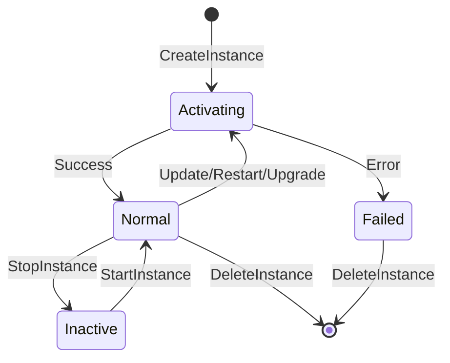
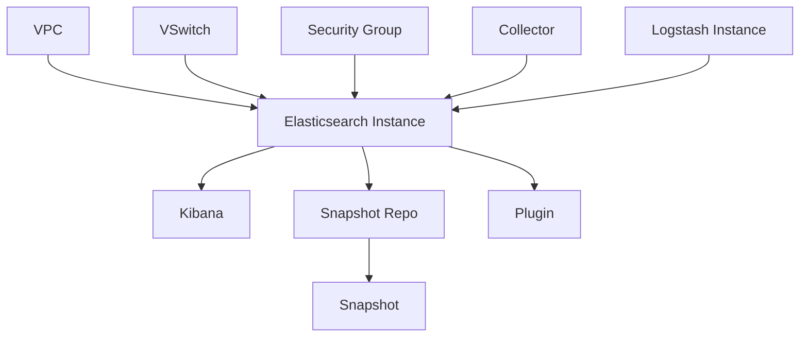

# Core Concepts — Alibaba Cloud Elasticsearch

> **Purpose:** Architecture, limits, regions, quotas, resource relationships for Elasticsearch operational skill.
> **Version:** 1.0.0
> **Last Updated:** 2026-05-17

---

## 1. Product Overview

### What is Alibaba Cloud Elasticsearch?

Alibaba Cloud Elasticsearch provides fully managed Elasticsearch clusters based on the open-source Elasticsearch. It offers:

- **Search & Analytics:** Full-text search, log analysis, vector search, semantic search
- **Cloud-Native:** Fully managed clusters with high availability, elastic orchestration, lifecycle management
- **Enterprise Features:** Security, monitoring, backup, plugin management
- **AI Integration:** LLM integration, semantic search capabilities (Elasticsearch 8.x)

### Key Components

| Component | Description | Primary Resource |
|-----------|-------------|------------------|
| **Elasticsearch Instance** | Managed ES cluster (data nodes + master nodes) | `InstanceId` |
| **Logstash Instance** | Data pipeline processor (optional) | `LogstashInstanceId` |
| **Kibana** | Visualization dashboard (included with ES) | Part of ES instance |
| **Collector** | Beats-based data collection agent | `CollectorId` |
| **Snapshot** | Backup point for data recovery | `SnapshotId` |

---

## 2. Architecture & Deployment Models

### Instance Types

| Type | Description | Use Case |
|------|-------------|----------|
| **Standard** | Single data node cluster | Development, testing |
| **High Availability** | 3+ data nodes with dedicated master | Production |
| **Enterprise Edition** | Enhanced security, AI features | Enterprise search |
| **Open Source Edition** | Pure open-source compatibility | Standard search |

### Node Configuration

| Node Type | Purpose | Minimum Count |
|-----------|---------|---------------|
| **Data Node** | Stores data, executes queries | 3 (HA) or 1 (dev) |
| **Master Node** | Cluster coordination | 3 (dedicated) |
| **Client Node** | Query routing (optional) | 0 or 2+ |
| **Warm Node** | Cold data storage (optional) | 0 or 1+ |
| **Kibana Node** | Dashboard access | 1 (included) |

### Multi-Zone Deployment

- **ZoneCount:** Number of zones for distribution (1, 2, or 3)
- **Recommended:** 3 zones for production (highest HA)
- **ZoneInfos:** Array of zone IDs and node distribution

---

## 3. Regions & Endpoints

### Supported Regions (Public Endpoint)

| Region ID | Region Name | Endpoint |
|-----------|-------------|----------|
| `cn-hangzhou` | 华东1 (杭州) | elasticsearch.cn-hangzhou.aliyuncs.com |
| `cn-shanghai` | 华东2 (上海) | elasticsearch.cn-shanghai.aliyuncs.com |
| `cn-beijing` | 华北2 (北京) | elasticsearch.cn-beijing.aliyuncs.com |
| `cn-shenzhen` | 华南1 (深圳) | elasticsearch.cn-shenzhen.aliyuncs.com |
| `cn-qingdao` | 华北1 (青岛) | elasticsearch.cn-qingdao.aliyuncs.com |
| `cn-hongkong` | 香港 | elasticsearch.cn-hongkong.aliyuncs.com |
| `ap-southeast-1` | 新加坡 | elasticsearch.ap-southeast-1.aliyuncs.com |

### VPC Endpoint

- Use VPC endpoint for secure internal access: `<region-id>.elasticsearch-vpc.aliyuncs.com`
- Requires VPC endpoint creation via CreateVpcEndpoint API

---

## 4. Instance States

### Lifecycle States

| Status | Description | Allowed Actions |
|--------|-------------|-----------------|
| `Normal` | Running and healthy | All operations |
| `Activating` | Creating or modifying | Describe only |
| `Inactive` | Stopped (billing paused) | StartInstance |
| `Initializing` | First-time setup | Describe only |
| `Failed` | Creation failed | DeleteInstance, Describe |

### State Transitions



---

## 5. Quotas & Limits

### Default Quotas (per region per account)

| Resource | Default Limit | Adjustable |
|----------|---------------|------------|
| Instance count | 20 | Yes (via quota center) |
| Data nodes per instance | 100 | Yes |
| Disk size per instance | 20TB | Yes |
| Snapshot count | 100 | Yes |

### Technical Limits

| Limit | Value | Notes |
|-------|-------|-------|
| Minimum data nodes (HA) | 3 | Required for production |
| Minimum data nodes (dev) | 1 | Not recommended for production |
| Node spec range | `elasticsearch.sn1ne.large` to `elasticsearch.sn2ne.16xlarge` | See spec table |
| Disk types | `cloud_ssd`, `cloud_efficiency`, `cloud_auto` | SSD recommended |
| Max disk per data node | 500GB (SSD), 2TB (efficiency) | Per node |

### Node Specification Reference

| Spec Code | CPU | Memory | Use Case |
|-----------|-----|--------|----------|
| `elasticsearch.sn1ne.large` | 2 | 8GB | Development |
| `elasticsearch.sn2ne.large` | 2 | 8GB | Small production |
| `elasticsearch.sn2ne.xlarge` | 4 | 16GB | Medium production |
| `elasticsearch.sn2ne.2xlarge` | 8 | 32GB | Large production |
| `elasticsearch.sn2ne.4xlarge` | 16 | 64GB | High-throughput |
| `elasticsearch.sn2ne.8xlarge` | 32 | 128GB | Enterprise |
| `elasticsearch.sn2ne.16xlarge` | 64 | 256GB | Maximum |

---

## 6. Resource Relationships

### Dependency Graph



### Creation Order

1. **VPC + VSwitch** → Create via `alicloud-vpc-ops`
2. **Security Group** → Create via `alicloud-ecs-ops` (optional)
3. **Elasticsearch Instance** → Requires VPC, VSwitch
4. **Snapshots** → Created from instance
5. **Plugins** → Installed on instance

### Cross-Product Dependencies

| Dependency | Product | Skill |
|------------|---------|-------|
| VPC | Virtual Private Cloud | `alicloud-vpc-ops` |
| VSwitch | Virtual Private Cloud | `alicloud-vpc-ops` |
| Security Group | ECS | `alicloud-ecs-ops` |
| RAM Policy | IAM | `alicloud-ram-ops` |
| Monitoring | CloudMonitor | `alicloud-cms-ops` |

---

## 7. Elasticsearch Versions

### Available Versions

| Version | Status | Notes |
|---------|--------|-------|
| `5.5.3_aliyun` | Deprecated | Migration recommended |
| `6.7.0_aliyun` | Supported | Standard use |
| `6.8.0_aliyun` | Supported | Recommended |
| `7.4.0_aliyun` | Supported | Popular |
| `7.7.0_aliyun` | Supported | |
| `7.10.0_aliyun` | Supported | Latest 7.x |
| `8.5.0_aliyun` | Supported | AI search features |
| `8.9.0_aliyun` | Supported | Latest 8.x, AI integration |

### Version Upgrade Path

- Upgrade via `UpgradeEngineVersion` API
- Version must be supported in target region (check via `GetRegionConfiguration`)
- Backup recommended before upgrade

---

## 8. Single Point of Failure (SPOF) Analysis

### Potential SPOFs

| SPOF | Risk | Mitigation |
|------|------|------------|
| Single data node | Cluster failure on node loss | Use 3+ data nodes |
| Single zone | Zone outage affects cluster | Multi-zone deployment |
| No backup | Data loss on failure | Regular snapshots |
| No dedicated master | Master overload | Dedicated master nodes |

### HA Best Practices

- **Data Nodes:** ≥ 3, distributed across zones
- **Master Nodes:** 3 dedicated master nodes
- **Zones:** 3-zone deployment for maximum resilience
- **Backups:** Daily snapshots, cross-region replication

---

## 9. Billing & Cost Optimization

### Billing Models

| Model | Description | Cost Savings |
|-------|-------------|--------------|
| **Pay-As-You-Go** | Hourly billing | Flexible, no commitment |
| **Subscription (包年包月)** | Monthly/yearly billing | Up to 85% vs pay-as-you-go |
| **Reserved Instance** | 1-3 year commitment | Additional savings |

### Cost Factors

| Factor | Impact | Optimization |
|---------|--------|--------------|
| Node spec | Higher spec = higher cost | Right-size based on workload |
| Node count | More nodes = higher cost | Scale based on data size |
| Disk size | Larger disk = higher cost | Use warm nodes for cold data |
| Version | Enterprise > Open source | Choose based on features needed |

### Idle Resource Detection

- **CPU < 10%** for 7+ days → Consider downgrade
- **Storage < 20%** used → Reduce disk size
- **No queries** for 7+ days → Consider stopping (pause billing)

---

## 10. Security Architecture

### Access Control

| Layer | Mechanism | Configuration |
|-------|-----------|---------------|
| **Network** | VPC isolation, whitelist IPs | `ModifyWhiteIps`, `UpdatePublicNetwork` |
| **Authentication** | Basic auth (username/password) | `UpdateAdminPassword` |
| **HTTPS** | TLS encryption | `OpenHttps`, `CloseHttps` |
| **RAM** | API-level permissions | RAM policy with `elasticsearch:*` actions |

### Minimum RAM Policy

```json
{
  "Statement": [
    {
      "Effect": "Allow",
      "Action": [
        "elasticsearch:DescribeInstance",
        "elasticsearch:ListInstance",
        "elasticsearch:CreateInstance",
        "elasticsearch:UpdateInstance",
        "elasticsearch:DeleteInstance",
        "elasticsearch:RestartInstance",
        "elasticsearch:CreateSnapshot",
        "elasticsearch:DescribeSnapshot"
      ],
      "Resource": "acs:elasticsearch:*:*:instance/*"
    }
  ],
  "Version": "1"
}
```

---

*This core concepts document provides the foundation for understanding Elasticsearch operations. For detailed API usage, see [api-sdk-usage.md](api-sdk-usage.md).*