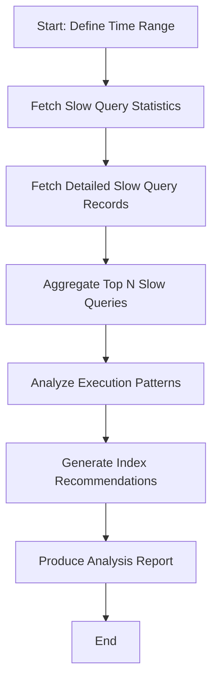

# Slow Query Analysis Workflow — PolarDB MySQL

> Version: 1.1.0 | Last Updated: 2026-06-11

## Overview

This document describes the standardized workflow for analyzing slow queries in PolarDB MySQL clusters, including automatic Top N detection, execution plan analysis, and index optimization recommendations.

## Workflow Stages



## Stage 1: Data Collection

### 1.1 Query Slow Query Statistics (DescribeSlowLogs)

**Purpose:** Get aggregate statistics about slow queries.

```bash
aliyun polardb DescribeSlowLogs \
  --DBClusterId "{{user.db_cluster_id}}" \
  --StartTime "{{user.start_time}}" \
  --EndTime "{{user.end_time}}"
```

**Key Response Fields:**
- `SlowLogCounts`: Number of slow query occurrences
- `TotalCounts`: Total query executions
- `MaxQueryTime` / `AvgQueryTime` / `MinQueryTime`: Time statistics

### 1.2 Query Detailed Records (DescribeSlowLogRecords)

**Purpose:** Get detailed slow SQL records for analysis.

```bash
# Single page
aliyun polardb DescribeSlowLogRecords \
  --DBClusterId "{{user.db_cluster_id}}" \
  --StartTime "{{user.start_time}}" \
  --EndTime "{{user.end_time}}" \
  --PageSize 100 \
  --PageNumber 1
```

**Paginated retrieval (for complete analysis):**

```bash
#!/bin/bash
CLUSTER_ID="{{user.db_cluster_id}}"
START_TIME="{{user.start_time}}"
END_TIME="{{user.end_time}}"
PAGE_NUM=1
ALL_RECORDS="[]"

while true; do
    RESPONSE=$(aliyun polardb DescribeSlowLogRecords \
        --DBClusterId "$CLUSTER_ID" \
        --StartTime "$START_TIME" \
        --EndTime "$END_TIME" \
        --PageSize 100 \
        --PageNumber $PAGE_NUM \
        --output json 2>/dev/null)
    
    ITEMS=$(echo "$RESPONSE" | jq '.Items.SQLSlowRecord // []')
    RECORD_COUNT=$(echo "$ITEMS" | jq 'length')
    
    if [ "$RECORD_COUNT" -eq 0 ]; then
        break
    fi
    
    ALL_RECORDS=$(echo "$ALL_RECORDS" "$ITEMS" | jq -s 'add')
    ((PAGE_NUM++))
done

echo "$ALL_RECORDS" > slow_query_records.json
```

## Stage 2: Top N Analysis

### 2.1 Identify Top N Slow Queries

**Algorithm:**
1. Group by SQL pattern (SQL hash or normalized SQL)
2. Calculate total execution time per pattern
3. Sort by total time (descending)
4. Select Top N patterns

**Implementation:**

```bash
# Extract Top 10 slow queries by total execution time
jq '
  group_by(.SQLText | split("WHERE")[0]) |
  map({
    sql_pattern: (.[0].SQLText | split("WHERE")[0]),
    count: length,
    total_time_ms: map(.QueryTimeMS) | add,
    avg_time_ms: (map(.QueryTimeMS) | add / length),
    max_time_ms: (map(.QueryTimeMS) | max),
    total_rows_scanned: map(.ParseRowCounts) | add,
    databases: [.[].DBName] | unique
  }) |
  sort_by(-.total_time_ms) |
  .[:10]
' slow_query_records.json > top_10_slow_queries.json
```

### 2.2 Response Format

```json
[
  {
    "sql_pattern": "SELECT * FROM orders WHERE status = ?",
    "count": 245,
    "total_time_ms": 3062500,
    "avg_time_ms": 12500,
    "max_time_ms": 45000,
    "total_rows_scanned": 1250000,
    "databases": ["ecommerce_db"]
  }
]
```

### 2.3 Scripted Aggregation Tool (Recommended)

For production-grade analysis with multi-dimensional reporting, use the bundled
`slow-sql-aggregator.py` script at `assets/scripts/slow-sql-aggregator.py`.

**Features:**

- Automatic full pagination (fetches all pages until exhausted)
- SQLHash-based dedup with count/total/max/avg time + rows scanned
- Multi-dimension reporting: by count, by total time, by node, by database, by minute
- Zero external dependencies (Python 3.7+ stdlib only)
- Structured diagnostic logging
  (`[DIAG]`/`[RESULT]`/`[WARN]`/`[ERROR]` phases)

**Usage:**

```bash
export ALIBABA_CLOUD_ACCESS_KEY_ID="..."
export ALIBABA_CLOUD_ACCESS_KEY_SECRET="****"
export ALIBABA_CLOUD_REGION_ID="cn-qingdao"

python3 assets/scripts/slow-sql-aggregator.py \
  --cluster-id "pc-m5euynyck962mwbqg" \
  --start-time "2026-06-10T08:28Z" \
  --end-time "2026-06-10T09:28Z" \
  --top-n 15 \
  --output slow_sql_report.txt
```

**Output sections:**

| Section | Description |
|---------|-------------|
| Top N by count | Most frequent slow SQL patterns |
| Top N by total time | Highest cumulative impact SQL |
| Node distribution | Per-DBNodeId breakdown |
| Database distribution | Per-DBName breakdown |
| Time distribution | Per-minute bucket breakdown |

**Integration in agent workflow:**

When the agent needs to analyze slow SQL, prefer calling this script over inline
jq/shell aggregation. The script handles edge cases (empty pages, API errors,
large datasets) consistently.

```bash
# Agent calls the script directly
python3 assets/scripts/slow-sql-aggregator.py \
  --cluster-id "{{output.db_cluster_id}}" \
  --start-time "{{user.start_time}}" \
  --end-time "{{user.end_time}}"
```

**Security note:** The script only reads credentials from environment variables
(`ALIBABA_CLOUD_ACCESS_KEY_ID`, `ALIBABA_CLOUD_ACCESS_KEY_SECRET`). It never
reads from config files, command-line flags, or hardcoded defaults.

---

## Stage 3: Execution Plan Analysis

### 3.1 Pattern Detection

| Pattern | Detection Criteria | Risk Level |
|---------|-------------------|------------|
| **Full Table Scan** | `ParseRowCounts` > 10,000 AND `ReturnRowCounts` < 100 | High |
| **Large Offset** | SQL contains `LIMIT .* OFFSET [0-9]{4,}` | Medium |
| **Complex Join** | SQL contains multiple `JOIN` clauses with high row counts | Medium |
| **Inefficient Sort** | `ORDER BY` on non-indexed columns with large datasets | Medium |
| **Lock Contention** | `LockTimeMS` > 1000 consistently | High |
| **High Scan Ratio** | `ParseRowCounts` / `ReturnRowCounts` > 100 | High |

### 3.2 Analysis Script Example

```python
#!/usr/bin/env python3
"""Analyze slow query patterns"""
import json

def analyze_patterns(records):
    patterns = []
    
    for record in records:
        sql = record.get('SQLText', '')
        rows_scanned = record.get('ParseRowCounts', 0)
        rows_returned = record.get('ReturnRowCounts', 1)
        lock_time = record.get('LockTimeMS', 0)
        
        analysis = {
            'sql': sql[:100] + '...' if len(sql) > 100 else sql,
            'patterns_detected': [],
            'risk_level': 'Low'
        }
        
        # Full table scan detection
        if rows_scanned > 10000 and record.get('ReturnRowCounts', 0) < 100:
            analysis['patterns_detected'].append('Full Table Scan')
            analysis['risk_level'] = 'High'
        
        # Large offset
        if 'OFFSET' in sql.upper():
            import re
            offset_match = re.search(r'OFFSET\s+(\d+)', sql, re.IGNORECASE)
            if offset_match and int(offset_match.group(1)) > 10000:
                analysis['patterns_detected'].append('Large Offset')
                analysis['risk_level'] = 'Medium'
        
        # Lock contention
        if lock_time > 1000:
            analysis['patterns_detected'].append('Lock Contention')
            if analysis['risk_level'] == 'Low':
                analysis['risk_level'] = 'Medium'
        
        # High scan ratio
        scan_ratio = rows_scanned / max(rows_returned, 1)
        if scan_ratio > 100:
            analysis['patterns_detected'].append(f'High Scan Ratio ({scan_ratio:.0f}:1)')
            analysis['risk_level'] = 'High'
        
        patterns.append(analysis)
    
    return patterns

# Load data
with open('slow_query_records.json', 'r') as f:
    records = json.load(f)

# Analyze
results = analyze_patterns(records)

# Output high-risk queries
high_risk = [r for r in results if r['risk_level'] == 'High']
print(f"\nHigh Risk Queries: {len(high_risk)}")
for r in high_risk[:5]:
    print(f"\nSQL: {r['sql']}")
    print(f"Patterns: {', '.join(r['patterns_detected'])}")
    print(f"Risk: {r['risk_level']}")
```

## Stage 4: Index Optimization Recommendations

### 4.1 Recommendation Rules

| Pattern | Index Recommendation | Priority |
|---------|----------------------|----------|
| **Full Table Scan on WHERE** | Composite index on WHERE clause columns | P0 |
| **Missing Index on JOIN** | Index on JOIN columns (foreign keys) | P0 |
| **Large Offset Pagination** | Covering index + key-based pagination | P1 |
| **Inefficient Sort** | Index on ORDER BY columns | P1 |
| **High Cardinality Filter** | Index on high-selectivity columns | P1 |
| **Text Search** | Full-text index or dedicated search service | P2 |

### 4.2 Index Generation Logic

```python
def generate_index_recommendations(sql_pattern, tables_involved):
    """Generate index recommendations based on SQL pattern"""
    recommendations = []
    
    # Extract WHERE clause columns
    where_columns = extract_where_columns(sql_pattern)
    if where_columns:
        recommendations.append({
            'table': tables_involved[0],
            'index_type': 'BTREE',
            'columns': where_columns,
            'reason': 'Optimize WHERE clause filtering',
            'sql': f"CREATE INDEX idx_{tables_involved[0]}_{'_'.join(where_columns[:2])} "
                   f"ON {tables_involved[0]}({', '.join(where_columns)});"
        })
    
    # Extract ORDER BY columns
    order_columns = extract_order_columns(sql_pattern)
    if order_columns and where_columns:
        # Composite index: WHERE + ORDER BY
        combined = list(dict.fromkeys(where_columns + order_columns))
        recommendations.append({
            'table': tables_involved[0],
            'index_type': 'BTREE',
            'columns': combined,
            'reason': 'Covering index for WHERE + ORDER BY',
            'sql': f"CREATE INDEX idx_{tables_involved[0]}_covering "
                   f"ON {tables_involved[0]}({', '.join(combined)});"
        })
    
    return recommendations

def extract_where_columns(sql):
    """Extract column names from WHERE clause"""
    import re
    where_match = re.search(r'WHERE\s+(.+?)(?:ORDER|GROUP|LIMIT|$)', sql, re.IGNORECASE)
    if where_match:
        where_clause = where_match.group(1)
        # Extract column names (simple pattern matching)
        columns = re.findall(r'(\w+)\s*=\s*', where_clause)
        return columns
    return []

def extract_order_columns(sql):
    """Extract column names from ORDER BY clause"""
    import re
    order_match = re.search(r'ORDER\s+BY\s+(.+?)(?:LIMIT|$)', sql, re.IGNORECASE)
    if order_match:
        order_clause = order_match.group(1)
        columns = [c.strip().split()[0] for c in order_clause.split(',')]
        return columns
    return []
```

## Stage 5: Report Generation

### 5.1 Report Template

```markdown
# PolarDB 慢查询分析报告

## 执行摘要
- **分析时段:** {{start_time}} - {{end_time}}
- **集群ID:** {{db_cluster_id}}
- **总慢查询数:** {{total_slow_queries}}
- **唯一SQL模式:** {{unique_sql_patterns}}
- **平均执行时间:** {{avg_query_time}}s
- **最大执行时间:** {{max_query_time}}s

## Top {{top_n}} 慢查询

{{#each top_queries}}
### {{@index}}. {{sql_pattern}}
- **执行次数:** {{count}}
- **总耗时:** {{total_time_ms}}ms
- **平均耗时:** {{avg_time_ms}}ms
- **最大耗时:** {{max_time_ms}}ms
- **扫描行数:** {{total_rows_scanned}}
- **涉及数据库:** {{databases}}
- **检测问题:** {{patterns_detected}}

**优化建议:**
{{#each recommendations}}
- {{reason}}
  ```sql
  {{sql}}
  ```
{{/each}}

---
{{/each}}

## 慢查询趋势分析

| 指标 | 当前时段 | 对比时段 | 变化 |
|------|---------|---------|------|
| 慢查询总数 | {{current_count}} | {{baseline_count}} | {{count_change}}% |
| 平均执行时间 | {{current_avg}}s | {{baseline_avg}}s | {{time_change}}% |
| 活跃数据库 | {{databases}} | - | - |

## 根因分析

### 热点查询模式
- {{hot_query_count}} 个高频慢SQL占总执行时间的 {{hot_query_percentage}}%
- 主要涉及表: {{affected_tables}}

### 索引缺失统计
- {{missing_index_count}} 张表缺少合适的索引
- 建议创建 {{recommended_index_count}} 个新索引

### 潜在风险
{{#each risks}}
- **{{level}}:** {{description}}
{{/each}}

## 行动计划

| 优先级 | 操作项 | 预期收益 | 负责人 |
|--------|-------|---------|-------|
| P0 | {{action_item_1}} | {{benefit_1}} | DBA |
| P1 | {{action_item_2}} | {{benefit_2}} | 开发团队 |
| P2 | {{action_item_3}} | {{benefit_3}} | 运维团队 |

## 附录

### A. 完整SQL样例
```sql
{{sample_full_sql}}
```

### B. 执行计划示例
```
{{explain_output}}
```

---
*报告生成时间: {{report_time}}*
*分析工具: alicloud-polar-mysql-ops Skill v1.1.0*
```

## Stage 6: Integration

### 6.1 Usage in Agent Skill

```yaml
# In SKILL.md execution flow
slow_query_analysis:
  steps:
    - name: collect_statistics
      tool: aliyun polardb DescribeSlowLogs
      inputs:
        DBClusterId: "{{user.db_cluster_id}}"
        StartTime: "{{user.start_time}}"
        EndTime: "{{user.end_time}}"
      
    - name: collect_details
      tool: aliyun polardb DescribeSlowLogRecords
      inputs:
        DBClusterId: "{{user.db_cluster_id}}"
        StartTime: "{{user.start_time}}"
        EndTime: "{{user.end_time}}"
        PageSize: 100
      paginate: true
      
    - name: analyze_top_n
      script: jq_aggregation
      inputs:
        top_n: "{{user.top_n}}"
        description: "Number of top slow queries to analyze (default: 10)"
        records: "{{output.collect_details}}"
        
    - name: generate_recommendations
      script: index_recommendation_engine
      inputs:
        top_queries: "{{output.analyze_top_n}}"
        
    - name: produce_report
      template: slow_query_report.md
      inputs:
        analysis_results: "{{output.generate_recommendations}}"
```

### 6.2 API Response Validation

**Success Criteria:**
- `TotalRecordCount` > 0: Data collected successfully
- `TotalRecordCount` = 0: No slow queries in time range (INFO level)
- HTTP 200: Valid response
- HTTP 4xx/5xx: Check error codes per troubleshooting.md

## References

- [CLI Usage](../cli-usage.md) — Slow query CLI commands
- [API & SDK Usage](../api-sdk-usage.md) — API parameters and response fields
- [Troubleshooting Guide](../troubleshooting.md) — Error handling
- SKILL.md — Complete execution flow with Pre-flight checks
