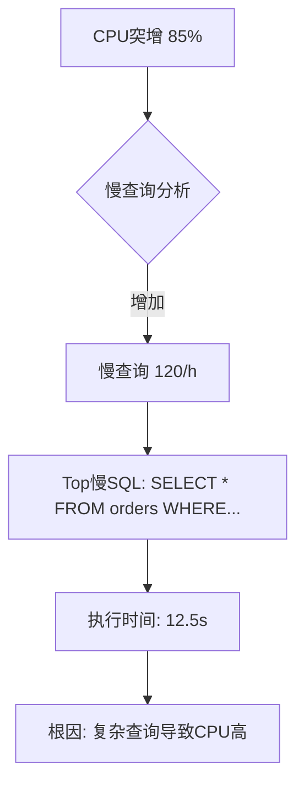

> This skill follows the [Agent Skill OpenSpec](https://agentskills.io/specification).

# Alibaba Cloud PolarDB for PostgreSQL Operations Skill

## Overview

PolarDB for PostgreSQL is Alibaba Cloud's cloud-native relational database, PostgreSQL-compatible,
featuring compute-storage separation, serverless scaling, and global database networks
(GDN). This skill is an **operational runbook** for agents: explicit scope, credential
rules, pre-flight checks, **dual-path execution** (official **SDK/API** and **CLI** flows),
response validation, and failure recovery.

### CLI applicability (repository policy)

- **`cli_applicability: dual-path`:** Official `aliyun` fully supports PolarDB PostgreSQL
  via the `polardb` product slug with `DBType=PostgreSQL`. Each execution flow documents **both** the SDK step
  and the `aliyun` step for every operation.

## Five Core Standards (Quality Gates)

| # | Standard | How This Skill Fulfills It |
|---|----------|---------------------------|
| 1 | **Clear Boundaries** | SHOULD/SHOULD NOT Use conditions with precise triggers and delegation rules |
| 2 | **Structured I/O** | Placeholders (`{{env.*}}`, `{{user.*}}`, `{{output.*}}`) with type and source |
| 3 | **Explicit Actionable Steps** | Every operation: Pre-flight → Execute → Validate → Recover |
| 4 | **Complete Failure Strategies** | Error taxonomy with ≥ 10 product-specific codes; HALT vs retry |
| 5 | **Absolute Single Responsibility** | PolarDB PostgreSQL clusters only; delegates other products |

## Trigger & Scope (Agent-Readable)

### SHOULD Use This Skill When

- User mentions "PolarDB PostgreSQL" OR "PolarDB PG" OR "PolarDB for PostgreSQL" OR "云原生数据库PolarDB PostgreSQL版"
  OR "PolarDB集群" with PostgreSQL context
- Task keywords: 集群 (cluster), 节点 (node), 读写分离 (read/write split), 弹性
  (elastic), Serverless, 全局数据库 (GDN), endpoint, DBNode, DBEndpoint
- Task involves CRUD or lifecycle on **PolarDB DBClusters** (create, describe, modify,
  delete, start, stop, pause, resume, upgrade) with PostgreSQL engine
- Task involves **cluster nodes** (add, remove, restart DBNodes)
- Task involves **cluster endpoints** (create, modify, release, configure RW splitting)
- Task involves **accounts** (create privileged/ordinary accounts, grant privileges)
- Task involves **databases** (create, delete databases within cluster)
- Task involves **backups** (create, describe, restore, configure backup policy)
- Task involves **performance monitoring** (CPU, memory, IOPS, connections, TPS/QPS)
- Task involves **security** (whitelist, SSL, TDE, data masking)
- Task involves **serverless** scaling (configure serverless, monitor RCUs)
- Task involves **SQL execution** on PolarDB cluster (run SQL, execute .sql file, query slow logs)
- User asks to "巡检", "health check", or diagnose a PolarDB PostgreSQL cluster
- User asks to "执行 SQL", "跑 SQL 文件", "导入数据" on PolarDB cluster
- User asks to "查询慢 SQL 统计" on PolarDB cluster (统计数据，不含诊断优化)
- User asks to "预测存储", "容量预测", "存储趋势" on PolarDB cluster
- User asks to "预测连接数", "连接趋势", "高峰预警" on PolarDB cluster
- User asks to "异常检测", "根因分析", "CPU突增" on PolarDB cluster
- User mentions "AIOps", "智能运维", "预测分析" with PolarDB PostgreSQL context

> **⚠️ 与 DAS skill 边界说明：**
> - **本 Skill 负责**：SQL 执行（ExecuteSQL/ExecuteSQLFile）、慢日志统计查询（DescribeSlowLogRecords）
> - **DAS Skill 负责**：慢 SQL **诊断优化**、SQL 性能分析、锁分析、自动 SQL 限流
> - 边界关键词："执行 SQL" → PolarDB；"优化 SQL"、"诊断慢 SQL" → DAS

### SHOULD NOT Use This Skill When

- Task is purely billing / account management → delegate to billing skill
- Task is RAM / permission model only → delegate to: `alicloud-ram-ops`
- Task is about **RDS PostgreSQL** → delegate to: `alicloud-rds-postgresql-ops`
- Task is about **PolarDB MySQL** → delegate to: `alicloud-polar-mysql-ops`
- Task is about **PolarDB Oracle-compatible (O)** → delegate to: `alicloud-polar-oracle-ops`
- Task is about **Redis / Tair** → delegate to: `alicloud-redis-ops`
- Task requires **DAS diagnosis** (SQL throttling, auto-scaling, deadlock analysis)
  → delegate to: `alicloud-das-ops`
- User insists on **console-only** flows with no API

### Delegation Rules

- If creating a cluster in a VPC, verify VPC and VSwitch exist (via `alicloud-vpc-ops`)
  before cluster creation.
- If DAS diagnosis needed (slow SQL, deadlock, auto-optimization), use `alicloud-das-ops`.
- If CloudMonitor alarm triggered, use `alicloud-cms-ops` for alarm rule management,
  then this skill for cluster health check.
- Multi-product requests: handle each product with its skill.

## Variable Convention (Agent-Readable)

| Placeholder | Meaning | Agent Action |
|-------------|---------|--------------|
| `{{env.ALIBABA_CLOUD_ACCESS_KEY_ID}}` | From runtime environment | NEVER ask the user |
| `{{env.ALIBABA_CLOUD_ACCESS_KEY_SECRET}}` | From runtime environment | NEVER ask the user |
| `{{env.ALIBABA_CLOUD_REGION_ID}}` | From runtime environment | Documented default if allowed |
| `{{user.region}}` | User-supplied region | Ask once; reuse |
| `{{user.db_cluster_id}}` | DBCluster ID | Ask once; reuse |
| `{{user.db_cluster_name}}` | Cluster description | Ask once; reuse |
| `{{user.engine_version}}` | PostgreSQL version (11/12/13/14/15) | Ask once; default 14 |
| `{{user.db_node_class}}` | Node specification | Ask once; reuse |
| `{{user.vpc_id}}` | VPC ID | Ask once; reuse |
| `{{user.vswitch_id}}` | VSwitch ID | Ask once; reuse |
| `{{user.account_name}}` | Account name | Ask once; reuse |
| `{{user.account_password}}` | Account password | Ask once |
| `{{user.db_name}}` | Database name | Ask once; reuse |
| `{{output.db_cluster_id}}` | From API/CLI response | Parse per OpenAPI |
| `{{output.request_id}}` | From API response | For correlation |

> **Security Warning (Credential Masking — MANDATORY):** **NEVER** log, print, or expose `ALIBABA_CLOUD_ACCESS_KEY_SECRET`, `access_key_secret`, `AccessKeySecret`, or any credential field value (including `ALIBABA_CLOUD_ACCESS_KEY_ID`) in console output, debug messages, error messages, or logs. If credential information must be displayed for debugging or troubleshooting purposes, use the masking format: show only the first 4 characters followed by `****` (e.g., `abcd****`). This masking rule applies to ALL output channels: stdout, stderr, log files, debug traces, error messages, and diagnostic reports. Verify existence only via `test -n "$ALIBABA_CLOUD_ACCESS_KEY_SECRET"`.

## API and Response Conventions (Agent-Readable)

- **OpenAPI is canonical** for all paths, fields, enums, and response shapes.
- **ClientToken:** Generate UUID v4 for write operations for idempotency.
- **Timestamps:** ISO 8601 format.

### Response Field Table

| Operation | JSON Path | Type | Description |
|-----------|-----------|------|-------------|
| CreateDBCluster | `$.DBClusterId` | string | New cluster ID |
| DescribeDBClusters | `$.Items.DBCluster[].DBClusterId` | array | Cluster IDs |
| DescribeDBClusters | `$.Items.DBCluster[].DBClusterStatus` | string | Cluster status |
| DescribeDBClusters | `$.Items.DBCluster[].DBType` | string | PostgreSQL |
| DescribeDBClusters | `$.Items.DBCluster[].DBVersion` | string | Engine version |
| DescribeDBClusters | `$.Items.DBCluster[].DBClusterClass` | string | Cluster class |
| DescribeDBClusters | `$.Items.DBCluster[].PayType` | string | Postpaid / Prepaid |
| DescribeDBClusters | `$.Items.DBCluster[].RegionId` | string | Region ID |
| DescribeDBClusters | `$.Items.DBCluster[].VPCId` | string | VPC ID |
| DescribeDBClusters | `$.Items.DBCluster[].StorageUsed` | string | Storage used (bytes) |
| DescribeDBClusterAttribute | `$.DBClusterDescription` | string | Cluster description |
| CreateAccount | `$.RequestId` | string | Request ID |
| DescribeAccounts | `$.Accounts.Account[].AccountName` | array | Account names |
| DescribeAccounts | `$.Accounts.Account[].AccountPrivilege` | string | Account privilege |
| CreateDatabase | `$.RequestId` | string | Request ID |
| DescribeDatabases | `$.Databases.Database[].DBName` | array | Database names |
| DescribeBackups | `$.Items.Backup[].BackupId` | array | Backup IDs |
| DescribeBackupPolicy | `$.PreferredBackupTime` | string | Backup window |
| DescribeBackupPolicy | `$.PreferredBackupPeriod` | string | Backup days |
| CreateBackup | `$.BackupJobId` | string | Backup job ID |

### Expected State Transitions

| Operation | Initial State | Target State | Poll Interval | Max Wait |
|-----------|---------------|--------------|---------------|----------|
| CreateDBCluster | — | `Running` | 10s | 600s |
| StartDBCluster | `Paused` / `Stopped` | `Running` | 10s | 300s |
| StopDBCluster | `Running` | `Stopped` | 10s | 300s |
| PauseDBCluster | `Running` | `Paused` | 10s | 300s |
| ResumeDBCluster | `Paused` | `Running` | 10s | 300s |
| DeleteDBCluster | any stable | absent | 10s | 300s |
| CreateAccount | — | `Available` | 5s | 120s |
| AddDBNodes | `Running` | `Running` (with new nodes) | 10s | 600s |
| UpgradeDBCluster | `Running` | `Running` | 10s | 600s |

## Changelog

| Version | Date | Changes |
|---------|------|---------|
| 1.5.0 | 2026-05-27 | Initial release with AIOps capabilities: Storage Prediction (30/60/90 days), Connection Prediction (cycle detection), Anomaly Detection (12 patterns P001-P012), Auto-remediation with safety controls (DOPS-85278, DOPS-85279) |

## Quick Start

### Prerequisites
- [ ] `aliyun` CLI installed
- [ ] Credentials: `ALIBABA_CLOUD_ACCESS_KEY_ID`, `ALIBABA_CLOUD_ACCESS_KEY_SECRET`
- [ ] Region: `ALIBABA_CLOUD_REGION_ID`

### First Command
```bash
# List all PolarDB PostgreSQL clusters in region
aliyun polardb DescribeDBClusters --DBType PostgreSQL --RegionId "{{env.ALIBABA_CLOUD_REGION_ID}}"
```

### Capabilities at a Glance

| Operation | Description | Risk | Reference |
|-----------|-------------|------|-----------|
| Create Cluster | Create new PostgreSQL cluster | High | [CLI Usage](references/cli-usage.md#create-db-cluster) |
| Describe Clusters | List all clusters | Low | [CLI Usage](references/cli-usage.md#describe-db-clusters) |
| Create Account | Create database account | Medium | [CLI Usage](references/cli-usage.md#create-account) |
| Execute SQL | Run SQL on cluster | High | [SQL Execution](references/sql-execution.md) |
| Storage Prediction | Predict storage growth | Low | [AIOps Storage](references/aiops-storage-prediction.md) |
| Connection Prediction | Predict connection peaks | Low | [AIOps Connection](references/aiops-connection-prediction.md) |
| Anomaly Detection | Detect 12 anomaly patterns | Low | [AIOps Anomaly](references/aiops-anomaly-detection.md) |
| Auto-remediation | Auto-fix with safety controls | High | [AIOps Remediation](references/aiops-auto-remediation.md) |

## Operation Flows

### Flow: Create PolarDB PostgreSQL Cluster

**Pre-flight Checks**

| Check | Command | Expected | On Failure |
|-------|---------|----------|------------|
| Credentials | `test -n "$ALIBABA_CLOUD_ACCESS_KEY_ID"` | Set | HALT; missing credentials |
| Region | `aliyun configure get region` | Valid region | Use `cn-hangzhou` default |
| VPC exists | `aliyun vpc DescribeVpcs` | VpcId found | Delegate to `alicloud-vpc-ops` |
| VSwitch exists | `aliyun vpc DescribeVSwitches` | VSwitchId found | Delegate to `alicloud-vpc-ops` |

**Execute (CLI Primary)**

```bash
# Create PostgreSQL cluster
aliyun polardb CreateDBCluster \
  --RegionId "{{user.region}}" \
  --DBType PostgreSQL \
  --DBVersion "{{user.engine_version}}" \
  --DBClusterClass "{{user.db_node_class}}" \
  --DBNodeClass "{{user.db_node_class}}" \
  --ZoneId "{{user.zone_id}}" \
  --VPCId "{{user.vpc_id}}" \
  --VSwitchId "{{user.vswitch_id}}" \
  --PayType Postpaid \
  --ClientToken "$(uuidgen)"
```

**Execute (SDK Fallback)**

```go
package main

import (
    "fmt"
    "os"
    "github.com/google/uuid"
    openapi "github.com/alibabacloud-go/darabonba-openapi/v2/client"
    polardb "github.com/alibabacloud-go/polardb-20220530/v3/client"
    "github.com/alibabacloud-go/tea/tea"
)

func main() {
    config := &openapi.Config{
        AccessKeyId:     tea.String(os.Getenv("ALIBABA_CLOUD_ACCESS_KEY_ID")),
        AccessKeySecret: tea.String(os.Getenv("ALIBABA_CLOUD_ACCESS_KEY_SECRET")),
        RegionId:        tea.String(os.Getenv("ALIBABA_CLOUD_REGION_ID")),
    }
    
    client, err := polardb.NewClient(config)
    if err != nil {
        panic(err)
    }
    
    req := &polardb.CreateDBClusterRequest{
        RegionId:      tea.String(os.Getenv("ALIBABA_CLOUD_REGION_ID")),
        DBType:        tea.String("PostgreSQL"),
        DBVersion:     tea.String(os.Getenv("DB_VERSION")),
        DBClusterClass: tea.String(os.Getenv("DB_NODE_CLASS")),
        DBNodeClass:   tea.String(os.Getenv("DB_NODE_CLASS")),
        ZoneId:        tea.String(os.Getenv("ZONE_ID")),
        VPCId:         tea.String(os.Getenv("VPC_ID")),
        VSwitchId:     tea.String(os.Getenv("VSWITCH_ID")),
        PayType:       tea.String("Postpaid"),
        ClientToken:   tea.String(uuid.New().String()),
    }
    
    resp, err := client.CreateDBCluster(req)
    if err != nil {
        panic(err)
    }
    
    fmt.Printf("Created cluster: %s\n", tea.StringValue(resp.Body.DBClusterId))
}
```

**Validate**

```bash
# Poll for cluster creation
aliyun polardb DescribeDBClusters \
  --RegionId "{{user.region}}" \
  --DBClusterId "{{output.db_cluster_id}}" \
  --output cols=DBClusterId,DBClusterStatus rows=Items.DBCluster[]

# Expected: DBClusterStatus = "Running"
```

**Recover**

| Error Code | Meaning | Action |
|------------|---------|--------|
| `InvalidRegionId.NotFound` | Invalid region | HALT; check region config |
| `InvalidVPCId.NotFound` | VPC not found | Delegate to VPC skill first |
| `InvalidVSwitchId.NotFound` | VSwitch not found | Delegate to VPC skill first |
| `InvalidDBInstanceClass.NotFound` | Invalid instance class | List available classes |
| `InsufficientBalance` | Account balance low | HALT; notify user |

### Flow: Execute SQL on Cluster

> ⚠️ **Safety Warning**: SQL execution modifies data. Always validate statements before execution.

**Pre-flight Checks**

| Check | Method | Expected | On Failure |
|-------|--------|----------|------------|
| Cluster running | DescribeDBClusterAttribute | Status = `Running` | HALT; start cluster first |
| Account exists | DescribeAccounts | Account found | Create account first |
| SQL validated | Parse/check syntax | Valid SQL | Return syntax error |

**Execute**

See [SQL Execution Reference](references/sql-execution.md) for detailed implementation.

### Flow: AIOps Storage Prediction

**Pre-flight Checks**

| Check | Method | Expected | On Failure |
|-------|--------|----------|------------|
| Cluster Status | DescribeDBClusterAttribute | `Running` | HALT; cluster not stable |
| Storage Metrics | CMS GetMetricStatisticsData | Data within 30 days | HALT; insufficient data |
| Current Storage | DescribeDBClusterAttribute | `StorageUsed`, `StorageSpace` | HALT; data unavailable |

**Execute**

See [AIOps Storage Prediction](references/aiops-storage-prediction.md) for detailed implementation.

**Output Example**

```markdown
# PolarDB PostgreSQL 存储空间趋势预测报告

> 预测时间: 2026-05-27 14:30:00 | 预测算法: Linear Regression (置信度: 0.92)

## 当前存储状态

| 指标 | 当前值 | 状态 |
|------|--------|------|
| 已用存储 | 450.5 GB | 中等 |
| 总容量 | 500 GB | - |
| 使用率 | 90.1% | ⚠️ 需关注 |

## 未来预测 (30/60/90 天)

| 预测周期 | 预计存储 | 使用率 | 状态 |
|----------|----------|--------|------|
| **30天后** | 525.5 GB | 105.1% | 🚨 超容 |
| **60天后** | 600.5 GB | 120.1% | 🚨 超容 |
| **90天后** | 675.5 GB | 135.1% | 🚨 超容 |

## 阈值到达时间预测

| 阈值 | 预计天数 | 建议行动 |
|------|----------|----------|
| **85%预警线** | 已超 | 立即扩容 |
| **95%高危线** | 已超 | 紧急扩容 |
| **100%满载** | 3 天 | 立即扩容/清理 |

## 预警级别: `critical`
```

### Flow: AIOps Anomaly Detection

**Pre-flight Checks**

| Check | Method | Expected | On Failure |
|-------|--------|----------|------------|
| Cluster Status | DescribeDBClusterAttribute | `Running` | HALT; cluster not stable |
| Metrics Available | CMS GetMetricStatisticsData | Recent data points | HALT; no metrics |
| Time Range | User input | Valid range | Use default (last 1 hour) |

**Execute**

See [AIOps Anomaly Detection](references/aiops-anomaly-detection.md) for detailed implementation.

**Output Example**

```markdown
# PolarDB PostgreSQL 异常检测报告

**检测时间**: 2026-05-27 15:30:00
**集群ID**: pg-xxxxx
**检测范围**: 最近1小时

## 异常概要

| 异常类型 | 检测算法 | 严重程度 | 当前值 | 阈值 |
|----------|----------|----------|--------|------|
| **CPU突增** | sudden_spike | critical | 85.2% | 50%突增 |
| **慢查询增加** | threshold | warning | 120/h | 50/h |
| **连接瓶颈** | threshold | warning | 92% | 80% |

## 根因链路



## 优化建议

### 立即执行 (P0)
1. **SQL限流**: 对慢查询启用SQL限流
2. **索引优化**: 为查询条件添加索引
3. **连接释放**: 检查连接池配置
```

## Error Taxonomy (Reference)

| Error Code | Severity | Meaning | Recovery Action |
|------------|----------|---------|-----------------|
| `InvalidDBClusterId.NotFound` | Critical | Cluster ID invalid | HALT; verify cluster ID |
| `InvalidAccountName.NotFound` | Warning | Account not found | Create account |
| `InvalidDBName.NotFound` | Warning | Database not found | Create database |
| `OperationDenied.ClusterStatus` | Retryable | Cluster not in valid state | Wait and retry |
| `OperationDenied.AccountStatus` | Retryable | Account locked | Unlock or recreate |
| `Throttling` | Retryable | API rate limit | Exponential backoff |
| `InvalidVPCId.NotFound` | Critical | VPC invalid | Delegate to VPC skill |
| `InsufficientBalance` | Critical | Account balance low | HALT; notify user |

## References

| Document | Purpose |
|----------|---------|
| [CLI Usage](references/cli-usage.md) | Complete CLI command reference |
| [API/SDK Usage](references/api-sdk-usage.md) | SDK patterns and examples |
| [Core Concepts](references/core-concepts.md) | Architecture and terminology |
| [Monitoring](references/monitoring.md) | Metrics and monitoring setup |
| [Troubleshooting](references/troubleshooting.md) | Common issues and solutions |
| [SQL Execution](references/sql-execution.md) | Execute SQL on cluster |
| [Slow Query Analysis](references/slow-query-analysis.md) | Analyze slow queries |
| [AIOps Storage Prediction](references/aiops-storage-prediction.md) | Storage trend prediction |
| [AIOps Connection Prediction](references/aiops-connection-prediction.md) | Connection trend prediction |
| [AIOps Anomaly Detection](references/aiops-anomaly-detection.md) | 12-pattern anomaly detection |
| [AIOps Auto-remediation](references/aiops-auto-remediation.md) | Auto-fix with safety controls |

## Implementation Checklist

When implementing this skill:

- [ ] Credentials validated (never logged)
- [ ] Region defaults handled
- [ ] VPC/VSwitch verification delegated
- [ ] State transitions polled correctly
- [ ] ClientToken used for idempotency
- [ ] All 12 anomaly patterns implemented
- [ ] Safety controls for auto-remediation
- [ ] Error taxonomy covers ≥10 codes
