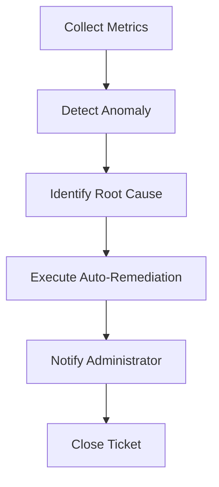

# Alibaba Cloud Voice Messaging Service AIOps Guide

## Anomaly Detection

### Key Anomaly Metrics
1. **Spike in Failed Calls**: > 2x average failure rate over 10 minutes
2. **Drop in Answer Rate**: < 10% answer rate over 5 minutes
3. **Sudden Increase in Latency**: > 2s average call setup time
4. **Quota Exhaustion**: Daily quota reached > 90% capacity

### Auto-Remediation Actions

When anomalies are detected, AIOps can automatically:
1. **Pause Tasks**: Suspend batch tasks if failure rate is too high
2. **Alert Administrators**: Send notifications via Voice/email/ DingTalk
3. **Adjust Quotas**: Temporarily increase quotas for high-priority applications
4. **Redirect Traffic**: Route calls to alternative service instances

## Predictive Scaling

### Usage Prediction
Use historical call volume data to predict future demand:
```python
# Example: Simple linear regression for call volume prediction
import pandas as pd
from sklearn.linear_model import LinearRegression

data = pd.read_csv('voice_call_volume.csv')
X = data[['day_of_week', 'hour_of_day', 'historical_volume']]
y = data['predicted_volume']

model = LinearRegression()
model.fit(X, y)
```

### Auto-Scaling
Scale service instances based on predicted volume:
1. Monitor real-time call volume metrics
2. Predict future load using ML models
3. Automatically add/remove service instances

## Intelligent Troubleshooting

### Root Cause Analysis
AIOps can automatically identify root causes of failures:
1. **Network Issues**: High latency, packet loss
2. **Configuration Errors**: Invalid template codes, expired caller IDs
3. **Quota Limits**: Reached daily send quota
4. **Recipient Issues**: Invalid phone numbers, blocked numbers

### Auto-Repair
Automatically fix common issues:
1. **Invalid Templates**: Re-push approved templates to cache
2. **Quota Limits**: Request temporary quota increase
3. **Call Failures**: Retry failed calls with backoff
4. **Configuration Errors**: Update caller ID bindings automatically

## Example AIOps Workflow



## Tools & Integrations

1. **Alibaba Cloud CloudMonitor**: Built-in anomaly detection
2. **AIOPs Suite**: ML-based prediction and remediation
3. **Slack/DingTalk**: Alerting integrations
4. **MaxCompute**: Data analysis for historical trends

## Best Practices

1. Enable CloudMonitor anomaly detection for all key metrics
2. Implement auto-remediation for common failures
3. Use ML models to predict usage spikes
4. Integrate with existing incident management systems
5. Regularly review and update anomaly thresholds
