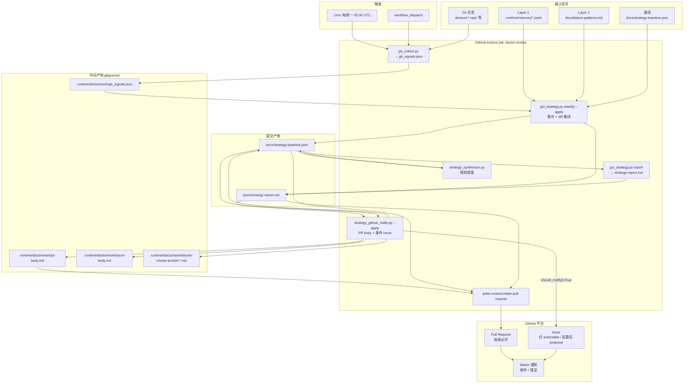
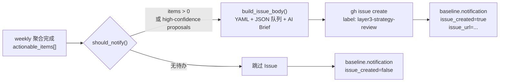

# Layer 3 Doctor Review — Setup Guide

> **Local-first**：Layer 1/2 与 runtime rollup 的主路径是本地 `make doctor-weekly-apply`（见 [`memory-strategy.md`](memory-strategy.md)）。GHA 在无 `.runtime/memory` 时只跑 **Git 信号 + git review PR**，不假装完成 runtime 扫描。

Weekly offline review runs via [`.github/workflows/doctor-weekly.yml`](../.github/workflows/doctor-weekly.yml).

### Baseline 写权限（Local-first）

| 写入方 | 命令 | 可写 committed 产物 |
|--------|------|---------------------|
| **维护者本地** | `make doctor-weekly-apply` → `gcl_strategy.py weekly --apply` | `strategy-baseline.json`, `strategy-baseline-history.jsonl`, `strategy-report.md`, `runtime-rollup.json`, `failure-patterns.md` |
| **GHA** | `gcl_strategy.py weekly --git-only --apply` | **`strategy-git-review.md` only**（+ 可选 rollup/failure-patterns PR 路径） |

GHA **永不**更新 `docs/strategy-baseline.json`。通知使用 `.runtime/doctor/work/git_weekly_snapshot.json`。

> **Milestone (2026-06-21)**: 首次维护者本地 `make doctor-weekly-apply` 已跑通（61 Layer-1 JSONL，16 skills rollup），产物已 commit：`docs/strategy-baseline.json`, `docs/strategy-report.md`, `docs/runtime-rollup.json`, `docs/failure-patterns.md`（`6415886`）。

## GitHub Actions + Issue 数据流

GHA 为 **辅路径**：Git 变更信号 + 可选 PR/Issue 通知。Runtime 趋势依赖维护者本地 weekly 后 commit 的 `docs/strategy-baseline.json` / `docs/runtime-rollup.json`。

### 总览（数据流）



### 逐步数据流

| 步骤 | 组件 | 读入 | 写出 |
|:----:|------|------|------|
| 1 | `git_collect.py` | Git log（7d） | `.runtime/doctor/work/git_signals.json` |
| 2 | `gcl_strategy.py weekly --apply` | git_signals、L1 memory、failure-patterns、旧 baseline | `docs/strategy-baseline.json`、`docs/strategy-report.md` |
| 3 | `strategy_synthesize.py` | baseline | baseline 内 `rule_proposals[]` |
| 4 | `gcl_strategy.py report` | baseline | 刷新 `docs/strategy-report.md` |
| 5 | `strategy_github_notify.py --apply` | baseline + report | `pr-body.md`、可选 `issue-body.md`、AI Brief；更新 baseline.`notification` |
| 6 | `gh issue create` | `issue-body.md` | GitHub Issue（AI-first 正文） |
| 7 | `create-pull-request` | `pr-body.md` + committed docs | Pull Request |

### Issue 分支（条件触发）



`should_notify()` 与 Issue 正文构建逻辑见 `strategy_notify.py` / `strategy_github_notify.py`。

### 通知 schema（baseline）

每周跑完后 `docs/strategy-baseline.json` 内 `notification` 示例：

```json
{
  "channel": "github",
  "reason": "actionable_items=2",
  "pr_body_path": ".runtime/doctor/work/pr-body.md",
  "ai_brief_path": ".runtime/doctor/work/doctor-review-ai-brief-2026-06-21.md",
  "issue_created": true,
  "issue_url": "https://github.com/org/repo/issues/42"
}
```

### 权限与 Token

| 项 | 值 |
|----|-----|
| Workflow 权限 | `contents: write`, `pull-requests: write`, `issues: write` |
| Issue 创建 | `GH_TOKEN: ${{ github.token }}` + 内置 `gh` CLI |
| PR 创建 | `GITHUB_TOKEN` → `create-pull-request` |

---

## Local commands

```bash
# Full weekly review (writes docs/strategy-baseline.json + docs/strategy-report.md)
python3 alicloud-gcl-runner-ops/scripts/gcl_strategy.py weekly --apply

# Preview without writing
python3 alicloud-gcl-runner-ops/scripts/gcl_strategy.py weekly

# Preview AI Brief Markdown
python3 alicloud-gcl-runner-ops/scripts/strategy_notify.py --dry-run

# Preview PR/Issue bodies (no gh calls)
python3 alicloud-gcl-runner-ops/scripts/strategy_github_notify.py --dry-run
```

## GitHub-native notification (default)

No SMTP secrets required. Delivery uses **GitHub's notification system**:

| Channel | When | Who gets notified |
|---------|------|-------------------|
| **Pull Request** | Every weekly run | Repo watchers (email/push per [GitHub notification settings](https://github.com/settings/notifications)) |
| **Issue** | Only when `actionable_items > 0` or high-confidence rule proposals | Same — watchers receive Issue emails |

### PR content

- Full `docs/strategy-report.md` embedded in PR body
- Collapsible **AI Brief** section (same structured Markdown as before)

### Issue content (AI-first)

Issues are structured for **direct AI agent consumption**:

| Section | Purpose |
|---------|---------|
| YAML frontmatter | `document_type`, `trigger`, `actionable_count` |
| `## Machine-readable queue` | JSON with full `actionable_items[]` + stable `id` fields |
| Human view tables | Same items in markdown tables |
| `## Suggested agent workflow` | Step-by-step triage instructions |
| Full AI Brief | Inline (not hidden) at bottom |

Optional label: `layer3-strategy-review`

### Watch the repo

To receive emails, enable **Watch → All activity** (or custom: Issues + Pull requests) on the repository.

## Optional LLM synthesis（规则提案）

LLM **仅用于** `strategy_synthesize.py` 生成 `rule_proposals[]`，**不参与** actionable 判定。默认使用启发式提案；启用 LLM 需同时满足 `DOCTOR_LLM_ENABLED=true` 且 API key 非空（`STRATEGY_LLM_*` 仍兼容）。

### 决策逻辑

```text
无 actionable_items → 跳过 synthesize（proposals=[]）
有 actionable_items:
  DOCTOR_LLM_ENABLED=true 且 DOCTOR_LLM_API_KEY 已设置 → 调用 LLM
  LLM 失败 / 未启用 / 无 key → 回退 _heuristic_proposals()
```

LLM 输出经 `_sanitize_proposals()` 白名单过滤，拒绝含 diff/patch 的内容；最多保留 5 条提案。

### 环境变量

| 变量 | 敏感 | 默认 | 说明 |
|------|:----:|------|------|
| `DOCTOR_LLM_ENABLED` | 否 | `false` | 必须为字符串 `true`（小写）才启用 |
| `DOCTOR_LLM_API_KEY` | **是** | 空 | Bearer token，**不得**写入代码或 baseline |
| `DOCTOR_LLM_ENDPOINT` | 否 | `https://api.openai.com/v1/chat/completions` | OpenAI 兼容 Chat Completions URL |
| `DOCTOR_LLM_MODEL` | 否 | `gpt-4o-mini` | 模型名 |

> **Legacy**：`STRATEGY_LLM_*` 在 `strategy_synthesize.py` 中仍可读（优先级低于 `DOCTOR_LLM_*`），便于迁移既有 GHA Secrets/Variables。

### 本地配置（推荐）

1. 复制模板：`cp .env.example .env`（`.env` 已在 `.gitignore`，不会提交）
2. 编辑 `.env`：

```bash
DOCTOR_LLM_ENABLED=true
DOCTOR_LLM_API_KEY=sk-...your-key...
# 可选：自建或代理 endpoint
# DOCTOR_LLM_ENDPOINT=https://your-gateway/v1/chat/completions
# DOCTOR_LLM_MODEL=gpt-4o-mini
```

3. 加载后试跑（需 baseline 中已有 actionable_items，或先跑 weekly）：

```bash
set -a && source .env && set +a
python3 alicloud-gcl-runner-ops/scripts/strategy_synthesize.py \
  --baseline docs/strategy-baseline.json
```

4. 检查日志：`event=strategy_synthesize result=success source=llm` 表示 LLM 成功；`source=heuristic` 或 `result=fallback` 表示未用或回退。

**安全要求**：勿 `echo $DOCTOR_LLM_API_KEY`、勿写入 Issue/PR/baseline/report；脚本不会把 key 写入任何 committed 文件。

### GitHub Actions 配置

在仓库 **Settings → Secrets and variables → Actions**：

| 类型 | 名称 | 值 |
|------|------|-----|
| **Secret** | `DOCTOR_LLM_API_KEY` | API key（敏感） |
| **Variable** | `DOCTOR_LLM_ENABLED` | `true` |
| **Variable**（可选） | `DOCTOR_LLM_ENDPOINT` | 自定义 endpoint |
| **Variable**（可选） | `DOCTOR_LLM_MODEL` | 如 `gpt-4o-mini` |

Workflow 在 **Synthesize rule proposals** 步骤注入 `DOCTOR_LLM_*`（并保留 `STRATEGY_LLM_*` 回退），见 `doctor-weekly.yml`。Secret 仅在该 step 的 `env` 中可见，不会出现在 PR diff 或 Actions 日志明文里（GitHub 会自动 mask secrets）。

未配置 Secret 时 weekly job **仍成功完成**，自动使用启发式提案。

### LLM 请求内容（隐私边界）

发送给 LLM 的 user 消息仅包含：

- `actionable_items`（最多 10 条）
- `git_signals_summary`

**不包含**云账号凭证、`.env`、Layer 1 trace 全文或用户个人信息。请勿在 actionable `reason` 中手工写入 secrets。

## Integration tests

```bash
cd alicloud-gcl-runner-ops/scripts
python3 -m unittest strategy_github_integration_test -v

bash alicloud-gcl-runner-ops/test-strategy-notify-integration.sh

# Full weekly pipeline E2E (git_collect → weekly → synthesize → github_notify)
bash alicloud-gcl-runner-ops/test-strategy-weekly-e2e.sh
```

## Outputs

| File | Git | Purpose |
|------|-----|---------|
| `docs/strategy-baseline.json` | committed | Machine-readable weekly snapshot + `notification.channel=github` |
| `docs/strategy-report.md` | committed | Human-readable report (≤150 lines) |
| `.runtime/doctor/work/pr-body.md` | gitignored | PR body for `create-pull-request` action |
| `.runtime/doctor/work/issue-body.md` | gitignored | Issue body when actionable |

## Pull Request output

Weekly updates are submitted via **Pull Request** (not direct push to default branch).
Review and merge the PR to apply `docs/strategy-baseline.json` and `docs/strategy-report.md`.
