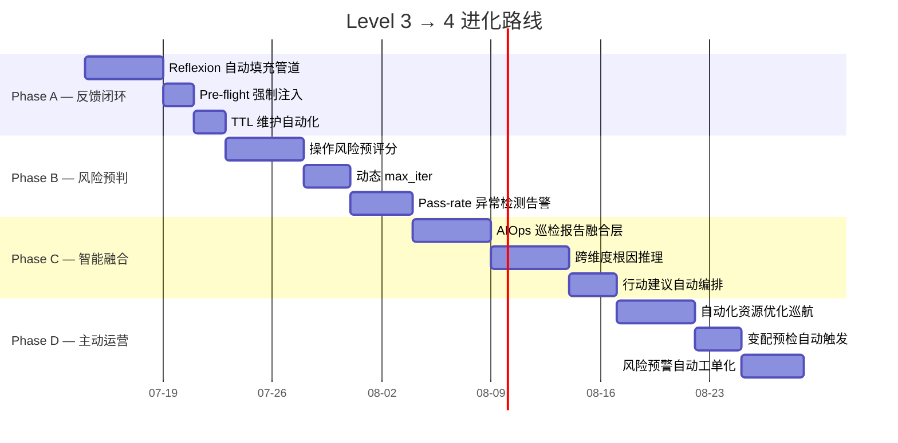

# Level 3 → Level 4 智能进化计划

> **依据**: Gartner AI Maturity Model 评估结论——当前等级 Level 3 (Advanced Automated)，目标 Level 4 (Intelligent Proactive)。
>
> **核心跨越**: 从"自动化执行+质量门禁"进化为"从历史学习→预判预防→自适应优化→主动运营"。
>
> **总览**:



---

## Phase A: 反馈闭环从"空壳"变"引擎"

### 现状

Reflexion Memory（Layer 2）架构完整：`reflexion_extract()` → `reflexion_store()` → `reflexion_retrieve()` 全链路就绪，但 `docs/failure-patterns.md` 只有 **46 行**、1 条空占位记录。没有任何真实 GCL 失败模式被自动捕获并回注到 pre-flight。

Success Memory（同 Layer 2）同样为空——`docs/success-patterns.md` 只有使用说明，零条真实成功模式。

### 目标

让反馈闭环每轮 GCL 执行后自动更新。当 Generator 写出正确但艰难的代码通过 Critic 评审时，该成功模式也能被记录——避免下次重走弯路。

### A1 — Reflexion 自动填充管道

#### 需求

| # | 需求 | 验收标准 |
|---|------|----------|
| A1.1 | GCL trace 中 `failure_pattern` 字段在 **SAFETY_FAIL** / **HALLUCINATION_ABORT** / **MAX_ITER** / **near-miss PASS**（dimension < threshold + 0.2）时自动填充 | 每个终止分支的输出 trace 包含非空 `failure_pattern` |
| A1.2 | `gcl_runner.py` 执行后自动调用 `reflexion_extract()` + `reflexion_store()` | GCL 退出前写入 `.runtime/reflexion/reflexion.json` |
| A1.3 | wrapper 失败（非 GCL 执行路径）也通过 `store-wrapper-lite` 写入失败模式 | wrapper 退出码 ≠ 0 时可选写入 |
| A1.4 | 新增 `gcl_reflexion.py success-store` 子命令：PASS 且 max_iter > 1 或 any dimension 从 < 阈值到 PASS → 提取成功模式 | 生成 `.runtime/reflexion/success.json` |
| A1.5 | `gcl_reflexion.py report` 扩展到两个输出文件：`docs/failure-patterns.md` + `docs/success-patterns.md` | 两个文件均自动更新 |
| A1.6 | 每个 pattern 添加 `git_commit` 字段记录捕获时 HEAD，便于溯源 | pattern 可追溯到 commit |

#### 涉及文件

| 文件 | 改动 |
|------|------|
| `alicloud-gcl-runner-ops/scripts/gcl_reflexion.py` | 新增 `success_store()` + `report` 双输出 + `git_commit` 字段 |
| `alicloud-gcl-runner-ops/scripts/gcl_runner.py` | `main()` 退出前自动调用 reflexion/success store |
| `alicloud-gcl-runner-ops/scripts/gcl_runner_test.py` | 新增反射/成功存储测试用例 |
| `docs/failure-patterns.md` | 从空占位变为真实数据 |
| `docs/success-patterns.md` | 从空模板变为真实数据 |
| AGENTS.md §12.6 / §16 | Memory Index 流程确认 |

#### 验证

```bash
# 手动触发 GCL → 检查 reflexion 存储
export GCL_STORE_MODE=always
python3 gcl_runner.py ...  # 触发 SAFETY_FAIL
cat .runtime/reflexion/reflexion.json  # 应有新 pattern

# 成功模式
python3 gcl_runner.py --store-success-on-pass ...
cat .runtime/reflexion/success.json

# 报告生成
python3 gcl_reflexion.py report
grep -c "^|" docs/failure-patterns.md  # > 1（非空）
grep -c "^|" docs/success-patterns.md   # > 1（非空）
```

---

### A2 — Pre-flight 强制注入

#### 需求

| # | 需求 | 验收标准 |
|---|------|----------|
| A2.1 | `memory_preflight.py`（或 `gcl_runner.py --preflight`）在 G generator prompt 中自动注入当前 skill 的已知失败/成功模式 | 每次 G 执行时 prompt 包含 `{{known_traps}}` + `{{success_patterns}}` 占位被替换为真实内容 |
| A2.2 | 注入策略：top_k 按 count 降序，max 5 条失败 + 3 条成功，单条超 200 字符截断 | 不超过 2KB 注入预算 |
| A2.3 | 新增 `--dry-run-preflight` 标志输出注入内容但不执行 G | 开发者可审查注入质量 |

#### 涉及文件

| 文件 | 改动 |
|------|------|
| `alicloud-gcl-runner-ops/scripts/gcl_runner.py` | 新增 `--preflight`/`--dry-run-preflight` 标志 + 注入逻辑 |
| `alicloud-gcl-runner-ops/scripts/gcl_runner_test.py` | 新增 pre-flight 注入测试 |
| `docs/gcl-spec.md` §4 Loop Flow | Step [0.5] 强制预检（当前为 optional） |

#### 验证

```bash
python3 gcl_runner.py ... --dry-run-preflight
# 输出应包含:
#   [PREFLIGHT] known_traps (3): ...
#   [PREFLIGHT] success_patterns (2): ...
```

---

### A3 — TTL 维护自动化

#### 需求

| # | 需求 | 验收标准 |
|---|------|----------|
| A3.1 | `make memory-maintain-apply` 正确 prune count < 3 的失败模式 + 90 天前的成功模式 | 验证删除后总行数 ≤ 200 |
| A3.2 | `git_collect.py` 新增 `--dry-run` 标志展示将被清理的 pattern | dry-run 不修改文件 |
| A3.3 | 在 `.github/workflows/` 中设置 optional weekly GHA 执行 maintain（仅 dry-run，不 commit） | PR reviewer 可见 maintain 报告 |

#### 涉及文件

| 文件 | 改动 |
|------|------|
| `Makefile` | `memory-maintain-apply` 已验证 |
| `.github/workflows/reflexion-maintain-weekly.yml` | 新增 |

---

## Phase B: 从"事后检查"到"事前预判"

### 现状

当前 GCL 对所有 write 操作一视同仁：同一个 skill 的 `DescribeInstances` 和 `DeleteInstance` 走同样的 max_iter、同样的 Critic 模板、同样的 pre-flight。

没有风险评分——系统无法在操作执行前判断"这次操作有多危险"。

### 目标

引入操作级风险预评分，让高风险操作走更多保障轮次，低风险操作快速通过。同时建立 GCL pass-rate 趋势告警，让异常自动被发现。

### B1 — 操作风险预评分

#### 需求

| # | 需求 | 验收标准 |
|---|------|----------|
| B1.1 | 每个 operation 自动计算 Risk Score（0.0–1.0）：`risk = w1*fatal + w2*irreversible + w3*fail_rate + w4*scope` | 评分公式可配置 |
| B1.2 | 因子来源：`fatal`（delete/drop/stop = 1，modify = 0.5，read = 0）、`irreversible`（是否可回滚）、`fail_rate`（反射记忆中该 operation 的历史失败率）、`scope`（影响资源数） | 因子可追踪 |
| B1.3 | Risk Score 输出到 GCL trace 的 `risk_score` 字段 | trace schema 扩展 |

#### 因子权重（默认）

| 因子 | 权重 | 示例 |
|------|------|------|
| `fatal` | 0.35 | `DeleteDBInstance` → 1.0 |
| `irreversible` | 0.25 | 有快照/备份可回滚 → 0.3，无回滚 → 1.0 |
| `fail_rate` | 0.25 | 反射记忆中该 operation 失败率 30% → 0.3 |
| `scope` | 0.15 | 影响 1 个实例 → 0.2，影响 >10 个 → 1.0 |

#### 涉及文件

| 文件 | 改动 |
|------|------|
| `alicloud-gcl-runner-ops/scripts/gcl_runner.py` | 新增 `risk_scorer()` + `risk_score` 字段 |
| `alicloud-gcl-runner-ops/scripts/gcl_runner_test.py` | 新增风险评分测试 |
| `docs/gcl-spec.md` | Risk Score 文档 |

---

### B2 — 动态 max_iter

#### 需求

| # | 需求 | 验收标准 |
|---|------|----------|
| B2.1 | Risk Score ≥ 0.7 → max_iter = 5（高保障）；0.3–0.7 → max_iter = 3；< 0.3 → max_iter = 1（快通道） | 覆盖默认的静态 per-skill 设置 |
| B2.2 | 历史该 operation 连续 3 次 PASS → 降一级 max_iter（降低冗余） | 追踪窗口 = 最近 10 次 |
| B2.3 | 历史该 operation 最近 1 次 FAIL → 升一级 max_iter（加强审查） | 同上 |

#### 涉及文件

| 文件 | 改动 |
|------|------|
| `alicloud-gcl-runner-ops/scripts/gcl_runner.py` | `max_iter_calculator()` 函数 |
| `docs/gcl-spec.md` §8 | Per-Skill Defaults 增加动态覆盖说明 |

---

### B3 — Pass-Rate 异常检测告警

#### 需求

| # | 需求 | 验收标准 |
|---|------|----------|
| B3.1 | 基于 Layer 1 的 skill-weekly pass-rate 时序，检测 3σ 下降或 50% 相对下降 | 检测阈值可配置 |
| B3.2 | 异常触发时：生成 Markdown 报告 → 输出到 `.runtime/anomaly/` | 报告包含受影响 skill + 时间段 + 可能原因 |
| B3.3 | GHA 集成：异常报告提交为 PR comment（不直接创建 issue） | 在已有 GHA 工作流中扩展 |

#### 涉及文件

| 文件 | 改动 |
|------|------|
| `alicloud-gcl-runner-ops/scripts/gcl_passrate_reporter.py` | 新增 `detect_anomaly()` |
| `alicloud-gcl-runner-ops/scripts/gcl_passrate_reporter_test.py` | 新增测试 |

---

## Phase C: 跨维度智能融合

### 现状

AIOps cruise 的 7 个感知 Agent（HealthCruise / TopoScan / ConfigDrift / CostWatch / SecurityScan / AuditTrail / AdvisorScan）各自独立运行，结果互不关联。

洞察是 "碎片化" 的——安全扫描发现端口开放，成本扫描发现闲置资源，但**两者放在一起才能推导出 "可回收的安全风险"**。

### 目标

建立统一的巡检报告融合层，将各维度洞察关联起来产生跨域根因推理和行动建议。

### C1 — AIOps 巡检报告融合层

#### 需求

| # | 需求 | 验收标准 |
|---|------|----------|
| C1.1 | 新增 `scripts/agents/fusion/fusion_report.sh`：收集 7 个感知 Agent 的输出 JSON，合并为统一格式 | 输出文件 `fusion-report-{timestamp}.json` |
| C1.2 | 融合层 schema 定义：`{findings: [{domain, severity, resource_id, description}]}` | 每个 finding 可追踪到源 Agent |
| C1.3 | 严重级别归一化：所有 Agent 的 severity 映射到统一尺度（CRITICAL / HIGH / MEDIUM / LOW / INFO） | 无"自定义级别"残留 |
| C1.4 | 重复发现去重：相同 resource_id + description 的 finding 合并计次 | 去重后 dedup_count 字段 |

#### 涉及文件

| 文件 | 改动 |
|------|------|
| `alicloud-aiops-cruise/scripts/agents/perceive/__init__.sh` | 新增 fusion 调度 |
| `alicloud-aiops-cruise/scripts/agents/fusion/fusion_report.sh` | 新建 |
| `alicloud-aiops-cruise/SKILL.md` | 新增 Fusion 层说明 |

#### 验证

```bash
./scripts/agents/perceive/__init__.sh --all
# 应在巡检完成后输出:
# [FUSION] Generated fusion-report-20260714T120000Z.json
# [FUSION] 12 findings: 1 CRITICAL, 3 HIGH, 5 MEDIUM, 2 LOW, 1 INFO
```

---

### C2 — 跨维度根因推理

#### 需求

| # | 需求 | 验收标准 |
|---|------|----------|
| C2.1 | 融合报告加载后，根因推理引擎扫描预定义的跨域关联规则 | 推理规则列表见下方 |
| C2.2 | 每条推理产出：`{root_cause, trigger_finding, correlated_findings, confidence, suggestion}` | 输出到 `root-cause-{timestamp}.json` |
| C2.3 | 支持规则热加载（修改规则文件后不重启） | `--reload-rules` 标志 |

#### 预定义关联规则（初始集）

| 规则 | 触发 (Trigger) | 关联 (Correlated) | 推理输出 |
|------|---------------|-------------------|----------|
| R1: 安全暴露闲置资源 | SecurityScan: 端口开放 | CostWatch: 闲置资源 | "闲置 ECS 同时有安全暴露风险 → 建议下线或绑定 WAF" |
| R2: 配置漂移后健康下降 | ConfigDrift: 配置漂移 | HealthCruise: 健康分下降 | "配置漂移导致健康恶化 → 建议回滚或修复配置" |
| R3: 频繁变配后审计异常 | AuditTrail: 高频 API 调用 | SecurityScan: 异常操作 | "高频 API 调用 + 安全告警 → 建议审核操作者权限" |
| R4: 大流量前容量不足 | HealthCruise: 高 CPU/内存 | CostWatch: 低预留资源 | "流量高峰期将至但预留不足 → 建议弹性策略调整" |
| R5: 安全组与 CFW 策略冲突 | SecurityScan: 安全组规则 | AuditTrail: CFW 策略变更 | "安全组和云防火墙策略不一致 → 建议统一为 CFW 管控" |

#### 涉及文件

| 文件 | 改动 |
|------|------|
| `alicloud-aiops-cruise/scripts/agents/fusion/correlation-rules.json` | 新建（热加载） |
| `alicloud-aiops-cruise/scripts/agents/fusion/root_cause_engine.sh` | 新建 |

---

### C3 — 行动建议自动编排

#### 需求

| # | 需求 | 验收标准 |
|---|------|----------|
| C3.1 | 根因推理引擎输出每条 `suggestion` 时，自动映射到对应 ops skill | 映射表见下方 |
| C3.2 | 输出格式 `{suggestion, target_skill, target_operation, estimated_risk}` | ops team 可直接复制执行 |
| C3.3 | 高风险建议（如 DeleteInstance）标记 `requires_confirmation: true` | 不会自动执行破坏性操作 |

#### ops skill 映射表

| Finding Domain | Target Skill | 示例操作 |
|---------------|-------------|----------|
| ECS 闲置 | `alicloud-ecs-ops` | `StopInstance` / `ModifyInstanceChargeType` |
| 安全组过开放 | `alicloud-vpc-ops` | `RevokeSecurityGroup` |
| SLB 健康检查失败 | `alicloud-slb-ops` | `SetHealthCheck` / `AddBackendServers` |
| RDS 连接数过高 | `alicloud-rds-ops` | `ModifyDBInstanceSpec` |
| Redis 内存超限 | `alicloud-redis-ops` | `ModifyInstanceSpec` |
| 弹性策略不足 | `alicloud-auto-scaling-orch` | 扩缩容策略调整 |
| DNS 解析异常 | `alicloud-dns-ops` | `UpdateDomainRecord` |
| WAF 规则缺失 | `alicloud-waf-ops` | `CreateProtectionModuleRule` |

#### 涉及文件

| 文件 | 改动 |
|------|------|
| `alicloud-aiops-cruise/scripts/agents/fusion/action_mapper.sh` | 新建 |

---

## Phase D: 从"被动响应"到"主动运营"

### 现状

所有操作是响应式的——用户（人/AI）触发 → 执行 → 检查 → 报告。系统不会主动扫描风险、不会在变配前自动预检、不会在发现风险时主动创建工单。

### 目标

引入巡航扫描引擎和自动预检机制，让系统在**操作前**和**无操作时**都能主动发现和预防问题。

### D1 — 自动化资源优化巡航

#### 需求

| # | 需求 | 验收标准 |
|---|------|----------|
| D1.1 | 新增 `scripts/cruise/scheduler.sh`：每周自动触发 AIOps cruise 全链路巡检 | 输出 `cruise-report-weekly-{date}.json` |
| D1.2 | 巡航报告中的 high/critical findings 自动生成 Markdown 建议摘要 | 摘要文件 ≤ 100 行 |
| D1.3 | 摘要通过 `docs/cruise-reports/` 保存，保留最近 4 周 | TTL 滚动清理 |

#### 涉及文件

| 文件 | 改动 |
|------|------|
| `alicloud-aiops-cruise/scripts/cruise/scheduler.sh` | 新建 |
| `alicloud-aiops-cruise/SKILL.md` | 新增 Cruise 模式 |

#### 验证

```bash
./scripts/cruise/scheduler.sh --dry-run
# 输出: [SCHEDULER] Dry-run: would run HealthCruise+TopoScan+CostWatch+...
```

---

### D2 — 变配预检自动触发

#### 需求

| # | 需求 | 验收标准 |
|---|------|----------|
| D2.1 | 在 GCL pre-flight step [0.5] 中，当 Risk Score ≥ 0.5 时自动触发 AIOps cruise 目标链路健康检查 | Pre-flight 日志包含 `[PREFLIGHT] Running AIOps cruise for target chain...` |
| D2.2 | 预检结果摘要注入 Generator prompt 作为 `{{preflight_health}}` | Generator 知道当前链路状态 |
| D2.3 | 预检发现 CRITICAL / HIGH 健康问题 → 建议用户先修复再操作（不强制阻止） | 日志输出 `[PREFLIGHT] WARNING: found N critical issues` |

#### 涉及文件

| 文件 | 改动 |
|------|------|
| `alicloud-gcl-runner-ops/scripts/gcl_runner.py` | Step [0.5] 扩展：Risk ≥ 0.5 时触发 AIOps |
| `alicloud-aiops-cruise/SKILL.md` | 新增 `{{preflight_health}}` 注入协议 |
| `docs/gcl-spec.md` §4 Loop Flow | Step [0.5] 预检扩展 |

---

### D3 — 风险预警自动工单化

#### 需求

| # | 需求 | 验收标准 |
|---|------|----------|
| D3.1 | Fusion 报告中 CRITICAL 发现 + GCL pass-rate 异常告警 → 自动生成标准工单 JSON | 输出到 `.runtime/tickets/` |
| D3.2 | 工单 schema：`{severity, skill, finding, suggested_action, timestamp, git_commit}` | 通用格式 |
| D3.3 | 提供 Jira 集成示例（可选）：展示如何将工单 JSON 转换为 Jira issue | 文档说明不强制集成 |

#### 涉及文件

| 文件 | 改动 |
|------|------|
| `alicloud-aiops-cruise/scripts/agents/fusion/ticket_generator.sh` | 新建 |
| `alicloud-aiops-cruise/references/ticket-integration.md` | 新建（Jira 集成示例） |

---

## 依赖关系矩阵

```
Phase A ────→ Phase B ────→ Phase C ────→ Phase D
  │              │              │              │
  │ A1 Reflexion │ B1 Risk      │ C1 Fusion    │ D1 Cruise
  │  填充管道     │   预评分     │   融合层      │   巡航
  │              │              │              │
  │ A2 Preflight │ B2 max_iter  │ C2 根因推理   │ D2 变配预检
  │  强制注入     │   动态调整   │              │
  │              │              │              │
  │ A3 TTL       │ B3 异常检测   │ C3 建议编排   │ D3 工单化
  │  维护自动化   │   告警       │              │
```

- **B 依赖 A**：B1 fail_rate 依赖 A1 Reflexion 的真实数据
- **C 依赖 B**：C3 建议的风险等级依赖 B1 Risk Score
- **D 依赖 C**：D1 巡航报告依赖 C1 融合层；D2 预检依赖 B1 风险评分
- **A/B/C 可并行开始**（B 只需 A 有数据即可，不需等 A 全部完成）
- **D 建议在 A/B/C 核心产出就绪后启动**

---

## 风险与缓解

| 风险 | 概率 | 影响 | 缓解 |
|------|------|------|------|
| Reflexion 存储爆增（每轮 GCL 写一条 pattern） | 中 | 低 | A3 TTL + 去重机制（count < 3 prune） |
| 风险评分不准确导致误报 | 中 | 中 | B1 因子权重可配置 + `.runtime/risk-tuning/` 提供手动修正 |
| AIOps 预检耗时太长（全链路巡检 3-5 分钟） | 高 | 中 | D2 只做目标链路子集巡检，非全量 |
| 工单生成过多导致噪音 | 中 | 低 | D3 只处理 CRITICAL 级别发现 |
| GHA 上无 runtime 数据（Local-first） | 高 | 低 | 所有 GHA 步骤均为 dry-run + 可选 |

---

## 验收总清单

### Phase A — 反馈闭环
- [ ] A1.1 failure_pattern 在所有终止分支自动填充
- [ ] A1.2 GCL 退出前写入 reflexion.json
- [ ] A1.3 wrapper 失败可选写入失败模式
- [ ] A1.4 success-store 子命令新增
- [ ] A1.5 success-patterns.md 自动更新
- [ ] A1.6 pattern 包含 git_commit 字段
- [ ] A2.1 Pre-flight 强制注入已知模式
- [ ] A2.2 注入预算 ≤ 2KB
- [ ] A2.3 --dry-run-preflight 标志
- [ ] A3.1 make memory-maintain-apply 正确清理
- [ ] A3.2 git_collect.py --dry-run
- [ ] A3.3 GHA weekly maintain（dry-run）

### Phase B — 风险预判
- [ ] B1.1 Risk Score 0.0–1.0 自动计算
- [ ] B1.2 四因子来源可追踪
- [ ] B1.3 risk_score 写入 trace
- [ ] B2.1 动态 max_iter 覆盖静态设置
- [ ] B2.2 连续 3 次 PASS 降级
- [ ] B2.3 最近 1 次 FAIL 升级
- [ ] B3.1 3σ / 50% 异常检测
- [ ] B3.2 异常报告输出到 .runtime/anomaly/
- [ ] B3.3 GHA 集成（PR comment）

### Phase C — 智能融合
- [ ] C1.1 融合报告脚本
- [ ] C1.2 统一 schema
- [ ] C1.3 严重级别归一化
- [ ] C1.4 重复发现去重
- [ ] C2.1 根因推理规则引擎
- [ ] C2.2 推理输出格式定义
- [ ] C2.3 规则热加载
- [ ] C3.1 ops skill 映射表
- [ ] C3.2 行动建议输出格式
- [ ] C3.3 高风险标记 requires_confirmation

### Phase D — 主动运营
- [ ] D1.1 每周巡航调度器
- [ ] D1.2 high/critical 摘要生成
- [ ] D1.3 4 周滚动 TTL
- [ ] D2.1 Risk ≥ 0.5 自动触发 AIOps 预检
- [ ] D2.2 预检注入 Generator prompt
- [ ] D2.3 预检发现不强制阻止
- [ ] D3.1 CRITICAL 发现自动生成工单 JSON
- [ ] D3.2 工单 schema 定义
- [ ] D3.3 Jira 集成示例文档

---

## 引用文档

| 文档 | 用途 |
|------|------|
| `docs/memory-strategy.md` | 三层记忆架构——Phase A 数据基础设施 |
| `docs/gcl-spec.md` | GCL 规范——Phase B 风险评分 + Phase D 预检集成 |
| `docs/failure-patterns.md` | Reflexion 失败模式——Phase A 输出目标 |
| `docs/success-patterns.md` | Reflexion 成功模式——Phase A 输出目标 |
| `docs/strategy-report.md` | Layer 3 策略报告——Phase B 输入 |
| `AGENTS.md §12 / §16` | GCL + Memory Index 规范 |
| `alicloud-aiops-cruise/SKILL.md` | AIOps 全链路巡检——Phase C/D 核心依赖 |
| `alicloud-gcl-runner-ops/SKILL.md` | GCL Runner——Phase A/B 核心改造对象 |
| `alicloud-auto-scaling-orch/SKILL.md` | 弹性伸缩编排——Phase C 输出目标 |