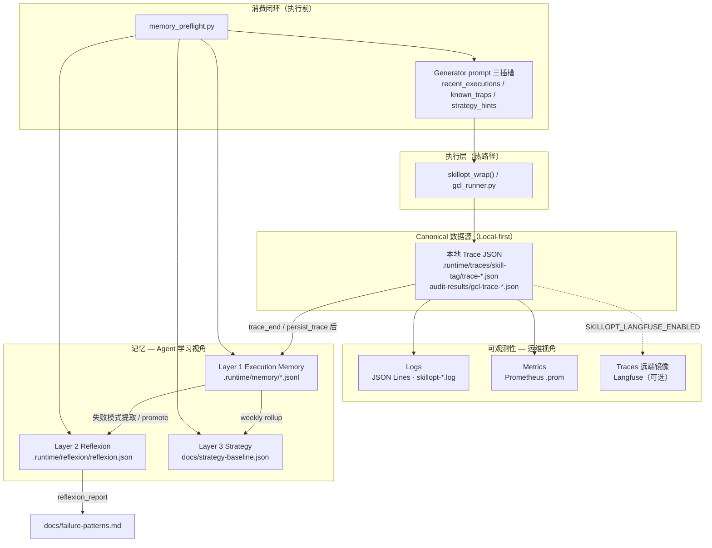

# 记忆与可观测性 — 系统架构关系

> **定位**：从系统架构层面说明 GCL 三层记忆（Memory）与 **Runtime Harness** 可观测性（Observability）的分工、数据流与消费闭环。
>
> **命名**：Runtime Harness = 运行时 wrapper 框架（legacy 代码名 `skillopt_*`）。与 [Microsoft SkillOpt](https://github.com/microsoft/SkillOpt) 及 [runtime-harness-glossary.md §1.1](./runtime-harness-glossary.md#11-与-microsoft-skillopt-的架构关系) 区分。
>
> **相关文档**：
> - [memory-strategy.md](./memory-strategy.md) — 三层记忆实现与 Local-first 原则
> - [harness-observability-architecture.md](./harness-observability-architecture.md) — Metrics / Logs / Traces 三位一体
> - [gcl-spec.md](./gcl-spec.md) — GCL trace 与 Layer 1/2 规范

---

## 1. 架构定位：同一数据源，不同抽象层级

记忆（Memory）与可观测性（Observability）不是两套平行系统，而是围绕同一次执行产生的 **Trace（执行记录）** 形成的「采集 → 存储 → 消费」双轨结构：

- **可观测性**负责**实时看清发生了什么**
- **记忆**负责**跨次、跨 session 沉淀并复用**



### 1.1 一句话对比

| 维度 | 可观测性 | 记忆 |
|------|----------|------|
| **核心问题** | 这次调用成功了吗？耗时多少？调用链在哪？ | 最近几次同类操作怎样？已知坑有哪些？整体趋势如何？ |
| **时间尺度** | 秒～分钟（实时）+ 短期留存（trace 默认 7d） | 天～周（L1 30d、L2 频率统计、L3 weekly） |
| **主要受众** | 运维、SRE、人类排障、告警 / dashboard | Agent pre-flight、Generator 注入、团队知识沉淀 |
| **存储形态** | 日志流、指标时序、Langfuse span | JSONL 索引、dedup 模式库、committed baseline |

---

## 2. 共享枢纽：本地 Trace 是「权威事实」

两者都依赖同一份 **本地 Trace**，但用途不同：

| 路径 | 行为 |
|------|------|
| **可观测性** | 把 Trace 里的字段**向外广播** — 写 JSON Lines 日志、更新 Prometheus counter/gauge、可选 HTTP 镜像到 Langfuse |
| **记忆** | 把 Trace **向内索引、抽象** — `memory_store` / `memory_store_lite` 写入 Layer 1，失败终态再提取到 Layer 2 |

### 2.1 Local-first 关键设计

```
每次 wrapper 调用 → 始终写本地 trace（与 Langfuse / Judge 开关无关）
Langfuse          → 仅是 optional mirror，不 gate 本地 trace
trace_end         → memory_store_lite（非致命）→ Layer 1
```

**可观测性的 Trace** 是「单次执行的完整快照」；**记忆** 是「从快照里抽索引和模式，供下次检索」。Trace 孤立、难 grep；记忆把 `(skill, operation)` 变成可 `memory_retrieve(top_k)` 的 JSONL。

Canonical 存储与联动细节见 [memory-strategy.md — 本地 Trace](./memory-strategy.md#本地-traceskillopt--local-first)。

---

## 3. 数据流：写入 vs 读取的不对称

### 3.1 写入（执行后，append-only）

```
skillopt_wrap() / gcl_runner
    │
    ├─► 可观测性（并行、best-effort）
    │     skillopt_log()           → JSON Lines
    │     skillopt_export_metrics  → .prom
    │     skillopt_trace_event     → Langfuse（若启用）
    │
    └─► 记忆（并行、非致命）
          memory_store(_lite)      → Layer 1 JSONL
          reflexion_*              → Layer 2（GCL 终态 / wrapper allowlist 失败）

make memory-maintain-apply（离线）
          promote-from-memory      → L1 失败 → L2 reconcile
          reflexion_report         → docs/failure-patterns.md

make doctor-weekly-apply（weekly）
          rollup + weekly          → Layer 3 baseline / runtime-rollup.json
```

### 3.2 读取（执行前，闭环消费）

记忆独有的一条 **R2 preflight 闭环**，可观测性不参与：

```
memory_preflight.py
    ├─ Layer 1 → {{recent_executions}}  「最近几次 PASS/FAIL？」
    ├─ Layer 2 → {{known_traps}}        「同类坑有没有？」
    └─ Layer 3 → {{strategy_hints}}     「该 skill 是否高风险期？」
         ↓
gcl_runner / skillopt_wrap 注入 trace + Generator prompt
```

可观测性**不回灌**到 Agent prompt；它服务的是**人类 / 平台的实时监控与排障**。记忆则**主动影响下一次执行** — 这是两者最本质的分工差异。

---

## 4. 正交开关：同一执行，多路输出

| 开关 | 控制什么 | 与记忆的关系 |
|------|----------|--------------|
| `SKILLOPT_ENABLED` | 自修复 / 优化 / 熔断 | 影响执行结果，间接影响写入 L1/L2 的内容 |
| `SKILLOPT_LANGFUSE_ENABLED` | Langfuse 远端上报 | **不**控制本地 trace、**不**控制 `memory_store` |
| `SKILLOPT_MEMORY_PREFLIGHT_ENABLED` | R2 检索注入 | 只读 L1/L2/L3，不写可观测性 |

架构上三者**正交**：可以关掉 Langfuse 仍完整跑记忆索引；也可以不开 SkillOpt 自修复，仍写 trace + Layer 1 lite 条目。

开关语义详见 [harness-observability-architecture.md §4.1](./harness-observability-architecture.md#41-环境变量)。

---

## 5. 抽象递进：可观测性 ≈ Layer 0，记忆 = Layer 1–3

```
Layer 0  可观测性（原始 telemetry）
         Metrics / Logs / Traces — 「telemetry 管道」

Layer 1  Execution Memory — 「按 (skill, op) 索引的 trace 摘要」
Layer 2  Reflexion — 「dedup 失败模式 + count」
Layer 3  Strategy — 「跨 skill 趋势 + Git 信号 → baseline」
```

| 层级 | 保留什么 | 适合做什么 |
|------|----------|------------|
| **Layer 0** | 完整、单次、高保真信号 | drill-down（Langfuse 调用链、Prometheus 错误率 spike） |
| **Layer 1–3** | 有损压缩 + 结构化 | 可检索、可注入、可 commit 的团队知识（`failure-patterns.md`、`strategy-baseline.json`） |

[gcl-spec.md §16](./gcl-spec.md#16-memory-index--execution-memory-layer) 明确：Layer 1 是「在进任何 DB 或可观测性 pipeline **之前**的第一层执行索引」 — 记忆不是可观测性的下游 dashboard，而是 **Agent 侧的本地知识层**；可观测性是 **ops 侧的外部管道**。

---

## 6. 留存策略：同一 Trace，不同 TTL

| 产物 | 默认 TTL | 是否 commit |
|------|----------|-------------|
| 本地 trace JSON | 7d | gitignore |
| Langfuse trace | 远端策略 | 外部系统 |
| SkillOpt JSON Lines 日志 | 与 `.runtime` 同级 | gitignore |
| Layer 1 JSONL | 30d | gitignore |
| Layer 2 store | count / decay 裁剪 | gitignore |
| Layer 2 报告 / L3 baseline | 长期（committed） | ✅ 人工审阅后 PR |

架构含义：**可观测性偏 ephemeral 运维数据**；**记忆偏「本地 runtime + 经审阅的衍生产物」**。GHA 不假装扫描 Layer 1（checkout 无 `.runtime/memory`），weekly 策略以本地 `doctor-weekly-apply` 为主 — 记忆和可观测性都遵循 **Local-first**（见 [memory-strategy.md §Local-first](./memory-strategy.md#local-first-原则)）。

---

## 7. 记忆自身的「可观测性」

记忆层核心操作也会输出结构化日志（`event=memory_store`、`event=reflexion_extract` 等），格式与 GCL-RUNNER 统一。这是 **记忆子系统的 introspection**，不是 SkillOpt 三位一体里的 Traces：

| 日志来源 | 语义 |
|----------|------|
| SkillOpt Traces | 描述 **API 调用链** |
| Memory logs | 描述 **索引 / 提取 / 存储是否成功** |

两者都进 `.runtime` 日志生态，但用途不同：前者是业务执行，后者是平台 side-effect。事件表见 [memory-strategy.md §观测性日志架构](./memory-strategy.md#观测性日志架构)。

---

## 8. 总结：关系模型

```
                    ┌─────────────────────────────────┐
                    │         一次云操作执行            │
                    └───────────────┬─────────────────┘
                                    │
                    ┌───────────────▼─────────────────┐
                    │     Canonical Trace（本地）     │
                    └───────────────┬─────────────────┘
                                    │
              ┌─────────────────────┼─────────────────────┐
              │                     │                     │
              ▼                     ▼                     ▼
     ┌────────────────┐   ┌────────────────┐   ┌────────────────┐
     │  可观测性       │   │  Layer 1 索引   │   │  GCL audit     │
     │  实时/外部管道   │   │  可检索摘要     │   │  完整对抗 trace │
     └────────┬───────┘   └────────┬───────┘   └────────────────┘
              │                    │
              │                    ├──► Layer 2 模式
              │                    └──► Layer 3 策略（weekly）
              │                              │
              ▼                              ▼
     人/告警/Langfuse UI              Agent pre-flight 注入
     「看清当下」                      「记住并复用」
```

**记忆 ≠ 可观测性的替代品**，而是其 **Agent 向的语义层**：

| 问题 | 由谁回答 |
|------|----------|
| **What happened?**（单次、全量、面向运维） | 可观测性 |
| **What should we remember?**（跨次、抽象、面向决策） | 记忆 |

两者在 **Trace 写入点汇合**，在 **消费侧分叉** — 可观测性向外（监控 / 排障），记忆向内（preflight 注入 + 团队知识库）。这是 aliyun-skills 平台「Harness Engineering」里 **运行时反馈** 与 **跨 session 学习** 的分界线。

**Runtime LLM Token（TEL）** 属于 Layer 0 可观测性的 **FinOps 延伸**：与记忆 **weekly 离线只读交叉**，但不写入 Layer 1–2。详见 [token-efficiency-runtime.md](./token-efficiency-runtime.md)（含 MVP 边界与 Deferred 加强方案 §6）。

---

**文档版本**: v1.0  
**最后更新**: 2026-06-21  
**维护者**: Platform / GCL + SkillOpt
