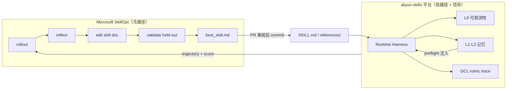

# Runtime Harness — Terminology Glossary

> **Strategy B migration** (2026-06): User-facing and architecture docs use **Runtime Harness**.
> Framework implementation lives in `alicloud-runtime-harness-ops` (PR-8); legacy `skillopt_*` paths shim there.
> See [PR-0 naming contract](../scripts/test-runtime-harness-naming-contract.sh).

---

## 1. What is Runtime Harness?

**Runtime Harness** is this repository's **execution-time wrapper framework** for Alibaba Cloud CLI operations. It is **not** the same as [Microsoft SkillOpt](https://github.com/microsoft/SkillOpt) (2026), which optimizes **skill document text** offline via rollout/reflect/edit/validate.

| Dimension | Runtime Harness (this repo) | Microsoft SkillOpt |
|-----------|----------------------------|---------------------|
| Optimizes | Single `aliyun` API call (params, retries, traces) | `SKILL.md` / runbook text |
| When | Hot path (every wrapper invocation) | Offline training epochs |
| Output | Local trace, metrics, optional Langfuse mirror | `best_skill.md` |
| Relation to GCL Memory | Writes Layer 1/2; consumes R2 preflight | Orthogonal (artifact evolution) |

### 1.1 与 Microsoft SkillOpt 的架构关系

Runtime Harness + 可观测性 + GCL 记忆（**热路径 / 运行时信号**）与 [Microsoft SkillOpt](https://github.com/microsoft/SkillOpt)（**冷路径 / 技能文档进化**）**正交、可串联**，但不应合并为同一运行时组件：



| 链路 | 职责 |
|------|------|
| **热路径（本仓库）** | 每次云操作：wrapper 自修复、本地 trace、L0 可观测性、L1–L3 记忆索引、GCL rubric |
| **冷路径（MS SkillOpt）** | 离线 epoch：rollout → reflect → edit → held-out 验收 → `best_skill.md` |
| **飞轮接点** | trace / rubric 得分 / `eval_queries.json` → SkillOpt 训练输入；`best_skill.md` → 审阅后合入 `SKILL.md` 选定章节（**非整包自动替换**） |

**Milestone A 操作入口**：[scripts/skill_evolution/README.md](../scripts/skill_evolution/README.md)（export → trainable seed → dataset）。

可观测性与记忆的分工（Trace 双轨）：[memory-observability-relationship.md](./memory-observability-relationship.md)。

---

## 2. Canonical vs legacy names

| Concept | **Canonical (docs / speech)** | **Legacy (compat)** |
|---------|------------------------------|---------------------|
| Framework skill | `alicloud-runtime-harness-ops` | `alicloud-skillopt-ops` (shim redirect, PR-8) |
| Shared core | `harness-core-lib.sh` | `skillopt-core-lib.sh` (shim, PR-8) |
| Paths resolver | `harness-paths.sh` | `skillopt-paths.sh` (shim, PR-8) |
| Runtime Python | `harness_runtime.py` | `skillopt_runtime.py` (symlink, PR-8) |
| Product overlay | `harness-lib.sh` (canonical, PR-9) | `skillopt-lib.sh` (legacy symlink, PR-9) |
| Wrapper entry | `{product}-harness-wrapper.sh` (canonical) | `{product}-skillopt-wrapper.sh` (legacy shim, PR-6) |
| Main orchestrator | `harness_wrap()` (planned) | `skillopt_wrap()` |
| Enable self-repair | `HARNESS_ENABLED=true` | `SKILLOPT_ENABLED=true` (legacy env, PR-7) |
| Langfuse mirror | `HARNESS_LANGFUSE_ENABLED=true` | `SKILLOPT_LANGFUSE_ENABLED=true` (legacy env) |
| Session ID | `HARNESS_SESSION_ID` | `SKILLOPT_SESSION_ID` (legacy env) |
| Integration guide | This glossary + integration guide | `docs/harness-integration-guide.md` |

**Rule for agents**: Prefer **Runtime Harness** in explanations to users. When executing commands, use **`*-harness-wrapper.sh`**; `*-skillopt-wrapper.sh` remains as a backward-compatible shim (PR-6).

---

## 3. Relationship to other platform layers

```
Cloud operation
    │
    ▼
Runtime Harness (wrapper) ──► Local trace (canonical)
    │                              │
    ├── Layer 0 Observability      ├── Layer 1 Execution Memory
    ├── Optional Langfuse          └── Layer 2 Reflexion (allowlist failures)
    └── Read-only auto-repair
    │
    ▼ (destructive / high-risk ops)
GCL (Generator-Critic-Loop) ──► audit trace + rubric
    │
    ▼ (weekly)
Layer 3 Strategy + failure-patterns.md
```

| Layer | Question it answers |
|-------|-------------------|
| **Runtime Harness** | Did this CLI call succeed? Was output captured? Should we retry throttling? |
| **GCL** | Was the operation correct, safe, and auditable? |
| **Memory L1–L3** | What happened recently? What traps repeat? What is the weekly risk trend? |
| **Microsoft SkillOpt** (future / separate) | How should the **skill document** change to score better on eval queries? |

Full dual-track architecture: [memory-observability-relationship.md](./memory-observability-relationship.md).

---

## 4. Wrapper filename discovery (PR-0+)

Static tools and CI accept **both** patterns during migration:

- `scripts/*-skillopt-wrapper.sh` (legacy)
- `scripts/*-harness-wrapper.sh` (new, PR-3+)

Implementation: [`scripts/lib/runtime-harness-discover.sh`](../scripts/lib/runtime-harness-discover.sh).

Acceptance tests: [`scripts/test-runtime-harness-naming-contract.sh`](../scripts/test-runtime-harness-naming-contract.sh).

---

## 5. Migration roadmap (Strategy B)

| PR | Scope | Status |
|----|-------|--------|
| **PR-0** | Naming contract tests + dual-glob discovery | ✅ |
| **PR-1** | This glossary + doc terminology | ✅ |
| **PR-2** | `HARNESS_*` env / CLI aliases (dual-read with `SKILLOPT_*`) | ✅ |
| **PR-3** | New harness filenames + legacy shims/symlinks | ✅ |
| **PR-4** | Generator + CI primary names; legacy skillopt paths retained | ✅ |
| **PR-5** | Remove dead Trace Judge config (`SKILLOPT_JUDGE_*` / `.env.example`) | ✅ |
| **PR-6** | Wrapper inversion: harness = implementation, skillopt = legacy shim | ✅ |
| **PR-7** | `HARNESS_*` env + `--harness-*` CLI single user-facing track | ✅ |
| **PR-8** | Framework path inversion: runtime-harness-ops = implementation; skillopt-ops = shim | ✅ |
| **PR-9** | Product overlay inversion: `harness-lib.sh` canonical; `skillopt-lib.sh` shim | ✅ |
| **PR-9b** | Harness wrappers `source harness-lib.sh` (fallback skillopt-lib symlink) | ✅ |
| **PR-9c** | Framework `references/` + `assets/` → `runtime-harness-ops`; legacy symlinks; validator shared-framework rules; docs harness-first | ✅ |

### 5.1 CI sync checklist (Strategy B refactors)

When landing PR-6+ wrapper or PR-8+ framework path changes, verify these GitHub CI / gate touchpoints:

| Touchpoint | File | What to update |
|------------|------|----------------|
| Naming + integration | `scripts/test-runtime-harness-naming-contract.sh` | New PR-N assertion section |
| Shared runtime | `alicloud-runtime-harness-ops/test-harness-integration.sh` | Canonical path checks |
| CI job | `.github/workflows/ci.yml` → `runtime-harness-contract` | Job name, `ALIYUN_SKILLS_ROOT`, step comment |
| Critic classify | `scripts/skill-change-critic-gate.sh` | `case` paths + default regression suites |
| Langfuse gray static | `scripts/test-langfuse-gray-skills.sh` | Framework skill references |
| AGENTS §11.1 | `AGENTS.md` regression table | Primary test command |

CI Job 8 runs `test-runtime-harness-naming-contract.sh`, which already includes harness integration + legacy shim checks — extend that script rather than adding parallel CI jobs unless a suite is intentionally split.

---

## 6. FAQ

**Q: Should I remove SkillOpt from AGENTS.md?**  
A: Section **§15** keeps the section number for link stability. Prose should say **Runtime Harness**; legacy filenames remain in tables until PR-4.

**Q: Is `HARNESS_ENABLED=false` the default?**  
A: Yes. Wrapper calls still write local traces and Layer 1 lite entries when disabled. User-facing config uses `HARNESS_*`; legacy `SKILLOPT_*` env and `--skillopt-*` CLI flags remain runtime-compatible (PR-7).

**Q: Do we integrate Microsoft SkillOpt for runtime repair?**  
A: No. Evaluate Microsoft SkillOpt only for **offline skill-document evolution** (orthogonal to Runtime Harness).

---

**Document version**: v1.1  
**Last updated**: 2026-06-26
