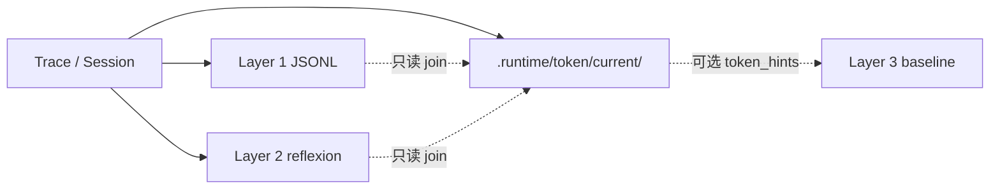
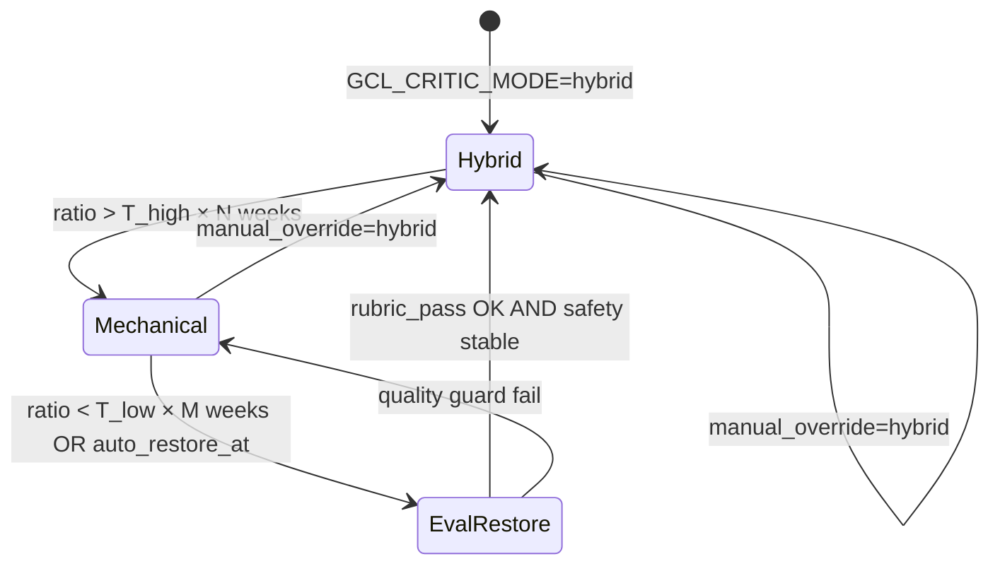

# Runtime LLM Token 可观测性与 Token Efficiency Loop（TEL）

> **定位**：Runtime Harness **执行时** LLM token 的采集、存储、weekly 运营分析与迭代闭环。与 [token-efficiency-strategy.md](./token-efficiency-strategy.md)（**静态** Skill 文档 TE-* 规则）互补，字段与管道**不混用**。
>
> **状态**：Phase 1–5 **已完成**（2026-06-22）。
>
> **相关文档**：
> - [memory-observability-relationship.md](./memory-observability-relationship.md) — Trace 双轨、Layer 0–3 分工
> - [memory-strategy.md](./memory-strategy.md) — 三层记忆 Local-first
> - [harness-session-trace-system-design.md](./harness-session-trace-system-design.md) — Session / Trace schema
> - [token-efficiency-strategy.md](./token-efficiency-strategy.md) — 静态 TE-A/B/C/TE-7

---

## 1. 设计决策摘要（已确认）

| 决策 | 内容 |
|------|------|
| **Canonical 事实** | Token 明细在 **Trace**（`llm_generations[]`）；不在 Layer 1–2 重复索引 |
| **运营分析产物** | 全部在 **`${SKILLS_DIR}/.runtime/token/`**（gitignore） |
| **必填维度** | 每条 token 记录含 **`coding_agent`** + **`model`**（缺失写 `"unknown"`，字段不可省略） |
| **Session live 汇总** | `.runtime/sessions/<skill-tag>/skillopt-session-*.json`（不进 `token/`） |
| **TEL Apply** | 默认 **Human-in-the-loop**；不在 wrapper 热路径自动改行为 |
| **与记忆交叉** | **weekly 离线只读 join**；执行前 preflight **不**强制 token 约束 |
| **开发流程** | 6 Phase × git worktree（Phase 4.5 可独立 worktree）；每 Phase 测试 GREEN → R1 复盘 → critic gate → 再提交 |
| **MCP 工具面** | Phase 4.5：`context_metadata.mcp_*`；分平台 adapter + **独立测试脚本**（fixture 必绿，live probe 可选） |

---

## 2. 与静态 TE-*、记忆层的边界

| 维度 | 静态 TE-* | Runtime Token（本文） | Layer 1–3 记忆 |
|------|-----------|------------------------|----------------|
| 对象 | Skill 文档体积、加载策略 | Agent + Harness **实际** LLM 消耗 | PASS/FAIL、陷阱、策略 |
| 存储 | 审计清单、L2 `token_efficiency`（TE 规则违反） | `.runtime/token/` | `.runtime/memory/`、`reflexion/` |
| 消费时机 | Authoring / §11 自审 | 执行后 weekly / 告警 | 执行前 preflight |
| 关联方式 | 与 runtime **关联分析**（如 TE 瘦身 ↔ `agent_skill_load_ratio`） | 读 trace 聚合 | 读 trace 索引；**不含** runtime token 字段 |

---

## 3. 本地存储布局

```
${SKILLS_DIR}/.runtime/
├── traces/<skill-tag>/              # Wrapper trace（含 llm_generations[]）
├── sessions/<skill-tag>/            # Session 级 live rollup（skillopt-session-*.json）
├── logs/<skill-tag>/                # *-skillopt-YYYYMMDD.log
├── metrics/<skill-tag>/             # *-skillopt-runtime.json
├── token/                           # Token 运营分析（≤2 层目录深度）
│   ├── current/                     # 每次 weekly 覆盖 — 「现在怎么样」
│   │   ├── rollup.json              # global / by_skill / by_op / by_agent_model
│   │   ├── baseline.json            # 7d/30d baseline
│   │   ├── coverage.json            # Agent 上报覆盖率、unknown 占比
│   │   └── incremental-state.json   # X-10：trace 文件 mtime 索引
│   ├── cache/                       # X-10：规范化 trace 缓存（gitignored）
│   │   └── normalized-records.jsonl
│   └── context/                     # IDE 侧车（gitignored）
│       ├── agent-turn-latest.json   # Phase 4 agent turn usage
│       ├── agent-turn-by-turn/      # X-15 per-turn records
│       ├── current-turn-id.txt      # X-15 active turn pointer
│       ├── traceparent-latest.txt   # X-13 W3C traceparent root
│       └── mcp-context-latest.json  # Phase 4.5 MCP 上下文
│   ├── history/                     # 周快照 — 「和上周比」（TTL ~30d）
│   │   └── rollup-YYYYMMDD.json
│   └── reports/                     # 人类可读 weekly 报告
│       └── efficiency-YYYYMMDD.md
├── audit/gcl/gcl-trace-*.json       # GCL trace（含 critic llm_usage）
└── memory/、reflexion/              # ❌ 不含 runtime token
```

Legacy `alicloud-*/.runtime/` 已废弃；测试可用 `ALIBABA_CLOUD_RUNTIME_DIR` 覆盖为扁平目录。

**内部分层原则**：按 **洞察产物角色**（current / history / reports）分目录；skill / agent / model 等多维分析在 **`rollup.json` schema 字段**内完成。MVP **不做** `by-skill/*.json` 物理分片。

**输入源**（`token_rollup.py`）：`.runtime/traces/<skill-tag>/`、legacy `alicloud-*/.runtime/traces/`（只读兼容）、repo `.runtime/audit/gcl/`（及 legacy `audit-results/` 只读兼容）。

---

## 4. 核心效率指标（TEL）

| 指标 | 含义 | 用途 |
|------|------|------|
| `tokens_per_success` | total_tokens / 成功 trace 数 | 单位产出成本 |
| `waste_ratio` | 失败/重试/MAX_ITER 相关 token / total | 无效消耗 |
| `critic_overhead_ratio` | GCL critic tokens / total | 是否降级 mechanical/hybrid |
| `agent_skill_load_ratio` | agent prompt / total prompt | 验证静态 TE-* |
| `token_per_cli_call` | total / wrapper 调用次数 | 多 Skill 编排效率 |
| `mcp_tool_utilization` | \|invoked\| / \|loaded\|（见 §7.1） | MCP schema 进 context 但未调用 |
| `mcp_schema_waste_tokens` | Σ schema_tokens(loaded \\ invoked) | 估算「白占 prompt」的 MCP 面 |

**合理运用**：有效 token（一次 PASS 完成复杂操作）可接受；优先优化浪费 token（多轮 Critic、无效 repair、未使用 skill 章节、**MCP 全量加载未用**）。

### 4.1 MCP 上下文三列表（跨平台）

| 列表 | 字段 | 采集方式 | 置信度 |
|------|------|----------|--------|
| **loaded（可用上界）** | `mcp_tools_loaded[]` | 配置 + tool descriptor（Cursor `mcps/**/tools/*.json` 等） | `estimated` |
| **invoked（调用事实）** | `mcp_tools_invoked[]` | Hook / extension 累计 `postToolUse` 等 | `observed` |
| **in-context（理想）** | — | 多数 IDE **无公开 API**；MVP 用 loaded 作上界 | 不承诺 |

写入 Phase 3 预留的 `HARNESS_AGENT_TURN_USAGE` → `context_metadata`（Phase 4.5 填充 MCP 段）。

---

## 5. 与 Trace / 记忆的交叉分析（MVP 范围）

同源 **Trace**，分轨存储，**weekly 离线 join**：



| 交叉 | MVP 做法 |
|------|----------|
| Trace ↔ Token | `token_rollup.py` 读 trace 的 `llm_usage`、`llm_efficiency` |
| Session ↔ Token | 同一 `session_id` 对齐 wrapper 多次调用 |
| Token ↔ 执行结果 | `waste_flag` × `status` / `gcl_status` |
| Token ↔ L1/L2 | **X-1 默认**：L1 `rubric_pass_rate` join 到 `by_skill`；**X-2 默认**：L2 reflexion join 到 `waste_events` / `by_trap`（同窗口） |
| Token ↔ L3 | **可选** `token_hints[]` 写入 strategy baseline（仅本地 doctor 路径） |

**刻意不做（MVP）**：token 写入 Layer 1 JSONL / Layer 2 store；R2 preflight **强制** token 预算；热路径 cross-module 分析。

---

## 6. 后续可加强方案（Deferred — 供讨论）

> 以下为 **已评估但暂不纳入 MVP** 的加强项。实现前需单独 RFC / 维护者确认，可能改变记忆边界或 Agent 行为。

### 6.1 交叉分析加强

| ID | 方案 | 描述 | 价值 | 成本 / 风险 |
|----|------|------|------|-------------|
| **X-1** | **L1 默认 join** | `token_rollup.py` **必**读 L1，产出 `by_skill` 的 `tokens_per_success` + `rubric_pass_rate` + `expensive_unstable_score` | 「贵且不稳」skill 一张表 | ✅ 2026-06-22；无 L1 时 `l1_join.degraded` |
| **X-2** | **L2 浪费归因** | `waste_events[]` 关联 L2 `(skill, op, category)`；`l2_join.by_trap` 叙述「参数坑 → Critic token」 | actionable 归因 | ✅ 2026-06-22；无 L2 时 `l2_join.degraded` |
| **X-3** | **committed token 摘要** | weekly 自动草稿 `docs/token-efficiency-snapshot.md`（≤80 行），人工 PR | 团队可见 FinOps 趋势 | 与 Local-first 审阅流程冲突需约定 |
| **X-4** | **Langfuse 统一视图** | Session 下 generation（Agent）+ span（CLI）+ 注解 L2 trap count | 远端 drill-down | 依赖 IDE 双写；覆盖率问题 |

### 6.2 消费闭环加强

| ID | 方案 | 描述 | 价值 | 成本 / 风险 |
|----|------|------|------|-------------|
| **X-5** | **R2 `{{token_hints}}` 默认开启** | preflight 注入超 baseline 的 skill token 建议 | 执行前成本意识 | 与「记忆=少踩坑」职责混合；可能增 prompt token |
| **X-6** | **Session token 预算 HALT** | `HARNESS_SESSION_TOKEN_BUDGET` 超阈值则 wrapper 拒绝（非 LLM 侧） | 硬 FinOps 护栏 | 误杀长会话；需 coverage 完整 |
| **X-7** | **GCL critic 自动降级/恢复** | `critic_overhead_ratio` 连续 N 周超阈 → 建议/自动 `mechanical`；恢复成对设计见 **§6.7 RFC** | 降 Harness LLM 成本（仅 `hybrid`/`llm` 用户） | 📋 RFC 已写；**暂不实现**（默认 `mechanical`，ROI 偏低） |
| **X-8** | **Layer 3 `token_hints` 正式字段** | `strategy-baseline.json` 一等公民字段 + GHA git-only 摘要 | 策略与 cost 统一 | baseline schema 版本迁移 |

### 6.3 存储与管道加强

| ID | 方案 | 描述 | 价值 | 成本 / 风险 |
|----|------|------|------|-------------|
| **X-9** | **`token/shards/by-skill/`** | rollup > ~500KB 或需增量刷新时按 skill 分文件 | 并行 rollup、局部刷新 | reconcile、cleanup 复杂 |
| **X-10** | **增量 rollup** | 仅扫描自上次 rollup 以来新 trace | 大 repo weekly 耗时 | ✅ 2026-06-22；`incremental-state.json` + cache；默认 incremental |
| **X-11** | **Prometheus 录制规则 join** | `harness_llm_*` × `skillopt_error_rate` 告警 | 实时「贵且错」 | 标签基数；与 weekly TEL 双轨 |
| **X-12** | **Trace 内联 L1 摘要** | trace JSON 增加只读 `memory_context_ref` 指针 | 单次 trace 上下文完整 | trace 体积；非 MVP 必要 |

### 6.4 Agent / IDE 加强

| ID | 方案 | 描述 | 价值 | 成本 / 风险 |
|----|------|------|------|-------------|
| **X-13** | **OTel traceparent 传播** | IDE → wrapper 子进程携带 W3C context | 端到端 token 无 env 注入 | ✅ 2026-06-22；`TRACEPARENT` + sidecar 关联 |
| **X-14** | **Cursor 原生 usage API** | 替代 `HARNESS_AGENT_TURN_USAGE` env | 覆盖率接近 100% | ✅ 2026-06-22；`tokenUsage` + sidecar；pre-tool 跳过 usage env |
| **X-15** | **按 turn 的 cost attribution** | 关联 `turn_id` 与每次 wrapper 调用 | 精细到「哪轮推理调了 ECS」 | ✅ 2026-06-22；`agent-turn-by-turn/` + `HARNESS_AGENT_TURN_ID` + `by_turn` |

### 6.5 MCP 上下文加强（Phase 4.5 已纳入；原 Deferred 编号保留）

| ID | 方案 | Phase 4.5 范围 | 仍 Deferred |
|----|------|----------------|-------------|
| **X-16** | `context_metadata.mcp_*` schema | ✅ Phase 4.5 | — |
| **X-17** | 分平台 adapter（Cursor / Claude Code / OpenCode / CodeBuddy / Pi） | ✅ Phase 4.5 | — |
| **X-18** | `token_rollup` 的 `mcp_tool_utilization` 维度 | ✅ `mcp_join` global/by_skill + sidecar + low_util ranking | — |
| **X-19** | IDE「真实 in-context 工具子集」API | — | ✅ 等平台 API |

### 6.6 讨论优先级建议（非承诺）

若后续开 RFC，建议优先讨论顺序：

1. **X-1 + X-2**（离线交叉，不改热路径，ROI 高）— ✅ 已完成
2. **Phase 4.5 / X-16–X-17**（MCP 浪费可见化，不改热路径）— ✅ 已完成
3. **X-7**（Harness 侧 Critic 降级/恢复）— 📋 **RFC 见 §6.7；实现暂缓**（默认已是 `mechanical`）
4. **X-5 / X-6**（触及 Agent 行为，需产品决策）
5. **X-9 / X-10**（体量驱动，按需）— X-10 ✅

### 6.7 X-7 RFC — GCL Critic 降级 / 恢复成对设计（仅文档，不实现）

> **状态**：RFC 2026-06-22；**无代码、无 runtime 策略文件、无 doctor-weekly 接线**。  
> **暂缓理由**：`GCL_CRITIC_MODE` 默认 `mechanical`（零 Critic LLM 成本）；仅显式开启 `hybrid`/`llm` 的团队受益，当前 ROI 不足以优先于 X-3/X-5 等项。  
> **观测已具备**：`token_rollup` 的 `critic_overhead_ratio` + L1 `rubric_pass_rate`（X-1）可用于未来决策，无需等新字段。

#### 6.7.1 目标与非目标

| 目标 | 非目标 |
|------|--------|
| 当 Critic LLM 开销长期偏高时，**成对**提供降级与恢复路径，避免「只降不升」或震荡 | 改变 GCL 默认 `mechanical` |
| 降级/恢复均绑定 **质量护栏**（`rubric_pass_rate`、`SAFETY_FAIL`） | 自动改 `.env` 或 git 提交策略（Phase 1 禁止） |
| 与 Smart Alert 的 `max_iter` 降级 **正交**（不同状态文件） | 替代人工 `GCL_CRITIC_MODE` / `--critic-mode` |

**作用范围**：仅 `GCL_CRITIC_MODE ∈ {hybrid, llm}` 且存在 `critic_meta.llm_usage` 的 GCL trace；wrapper 直调、纯 `mechanical` 运行不在此 RFC 内。

#### 6.7.2 信号与数据源（只读）

| 信号 | 来源 | 用途 |
|------|------|------|
| `critic_overhead_ratio` | `rollup.json` → `global` / `by_skill` | 降级主信号 |
| `rubric_pass_rate` | X-1 `by_skill.l1` | 质量护栏（降级后不得持续恶化；恢复前提） |
| `SAFETY_FAIL` 计数 / 率 | GCL trace `final.status` + L1 | 硬护栏：升高则 **禁止恢复** 并告警 |
| `MAX_ITER` 率 | GCL trace | 辅助：mechanical 后若上升，提示恢复 hybrid |

**窗口**：weekly rollup（`since_days=7`）；判定用 **history** 连续 N 周（建议 N=3，可 env 覆盖）。

#### 6.7.3 滞后阈值（hysteresis）

避免「降了又升、升了又降」：

| 转换 | 条件（均需连续 N 周） | 目标模式 |
|------|------------------------|----------|
| **降级** | `critic_overhead_ratio` > **T_high**（建议 0.25） | `mechanical` |
| **恢复** | `critic_overhead_ratio` < **T_low**（建议 0.12） **且** `rubric_pass_rate` ≥ baseline **且** `SAFETY_FAIL` 率未升 | 恢复为 **记录中的 `previous_mode`**（通常 `hybrid`） |

`T_low < T_high` 为必须。baseline 取自降级前 4 周 `rubric_pass_rate` 中位数，或 `baseline.json` 中 skill 级字段（若 X-8 落地）。

#### 6.7.4 策略状态（未来实现时的建议 schema）

路径（gitignore）：`.runtime/token/policy/gcl-critic-mode.json`

```json
{
  "version": "1.0.0",
  "updated_at": "2026-06-22T00:00:00Z",
  "skills": {
    "alicloud-ecs-ops": {
      "effective_mode": "mechanical",
      "previous_mode": "hybrid",
      "reason": "critic_overhead_ratio_above_T_high",
      "downgraded_at": "2026-06-08T00:00:00Z",
      "auto_restore_at": "2026-09-06T00:00:00Z",
      "baseline_rubric_pass_rate": 0.85,
      "manual_override": null
    }
  }
}
```

| 字段 | 含义 |
|------|------|
| `effective_mode` | runner 应使用的模式（若 `--adaptive-critic` 启用） |
| `previous_mode` | 恢复目标 |
| `auto_restore_at` | 可选 TTL（借鉴 Smart Alert `auto_restore_at`）；到期仅 **触发恢复评估**，非盲升 |
| `manual_override` | 非空时冻结自动策略，直至清除 |

**Runner 接线（未来）**：`gcl_runner.py --critic-mode` > env > policy 文件 > 默认 `mechanical`；`manual_override` 最高优先级。

#### 6.7.5 成对流程（状态机）



**降级动作（Phase 2+ 自动）**：

1. 写 policy：`effective_mode=mechanical`，保存 `previous_mode`
2. weekly 报告增加一行：`[X-7] alicloud-ecs-ops critic → mechanical (ratio=0.31, 3w)`
3. **不**修改仓库内 `.env`（Local-first；用户自行决定是否采纳）

**恢复动作（成对）**：

1. 满足 §6.7.3 恢复条件 **或** TTL 触发 `EvalRestore`
2. 试恢复 `previous_mode`；后续 1 周加强监控
3. 若 `rubric_pass_rate`  drop > ε（建议 5pp）或出现 `SAFETY_FAIL` → **回滚** `mechanical` 并延长冷却

**手动恢复（现在即可）**：`.env` 设 `GCL_CRITIC_MODE=hybrid` 或 CLI `--critic-mode hybrid`；与 Smart Alert 的 `--restore-expired` **无关**（彼处管 `max_iter`，不管 Critic mode）。

#### 6.7.6 分阶段交付（未排期）

| Phase | 内容 | 自动? |
|-------|------|-------|
| **P0** | weekly `efficiency-*.md` 增加 X-7 **建议行**（只读 rollup） | 否 |
| **P1** | policy JSON + `doctor-weekly` 写入建议状态 | 否 |
| **P2** | `gcl_runner --adaptive-critic` 读 policy 应用 `effective_mode` | 是 |
| **P3** | TTL + 恢复评估 + 质量回滚 | 是 |

**当前仓库**：停留在 **RFC**；P0 亦未实现。重新评估触发条件：某 skill 连续 4 周 `critic_overhead_ratio > T_high` **且** 团队确认已长期启用 `hybrid`/`llm`。

#### 6.7.7 与现有组件关系

| 组件 | 关系 |
|------|------|
| `token_rollup.py` | 已产出 `critic_overhead_ratio`；RFC 不增字段 |
| `gcl_smart_alarm_engine.py` | `max_iter` 降级 + `auto_restore_at` 为**参考模式**，状态文件 **不共用** |
| `GCL_CRITIC_LLM_FAIL_OPEN` | 单次 fail-open → mechanical；**不是** X-7 策略降级 |
| Skill Change Critic Gate | 不变；X-7 不替代 §11.1 回归门禁 |

---

## 7. 实施 Phase

| Phase | 分支 | Worktree | 状态 | 交付 |
|:-----:|------|----------|:----:|------|
| 1 | `feat/token-phase1-gcl-usage` | `../aliyun-skills-wt/phase1-gcl-usage` | ✅ | GCL `critique_llm` → `critic_meta.llm_usage` + `coding_agent`/`model` |
| 2 | `feat/token-phase2-harness-trace` | `../aliyun-skills-wt/phase2-harness-trace` | ✅ | trace `llm_generations[]`、Prom、Langfuse generation |
| 3 | `feat/token-phase3-session-rollup` | `../aliyun-skills-wt/phase3-session-rollup` | ✅ | Session rollup、`HARNESS_AGENT_TURN_USAGE`（**含 `context_metadata` 空壳**） |
| 4 | `feat/token-phase4-ide-hook` | `../aliyun-skills-wt/phase4-ide-hook` | ✅ | IDE Hook 模板、sidecar 桥接、模拟 e2e |
| **4.5** | `feat/token-phase4.5-mcp-context` | `../aliyun-skills-wt/phase4.5-mcp-context` | ✅ | **MCP 工具面采集 + 分平台测试**（见 §7.1） |
| 5 | `feat/token-phase5-tel-rollup` | `../aliyun-skills-wt/phase5-tel-rollup` | ✅ | `token_rollup.py`（含 MCP 维度）、doctor-weekly、runtime-clean |

**依赖**：Phase 4.5 **依赖 Phase 3**；与 Phase 4 **可并行 worktree**。合并顺序建议 **3 → 4 → 4.5 → 5**。

**门禁**（每 Phase 相同）：测试 GREEN → R1 复盘 → `skill-change-critic-gate.sh verify --run` → 提交。

### 7.0 Phase 1 进度（GCL critic llm_usage）— ✅ 完成

| # | 任务 | 状态 | 验证 |
|---|------|:----:|------|
| 1.1 | `critique_llm()` 解析 OpenAI `usage` + `latency_ms` | ✅ | `CritiqueLlmUsageTests.test_critique_llm_parses_usage` |
| 1.2 | `critic_meta` 增加 `llm_usage`、`coding_agent`、`model` | ✅ | `test_build_critic_meta_required_fields` |
| 1.3 | `_critic_trace_payload()` 持久化 `critic_meta` | ✅ | `test_critic_trace_payload_includes_critic_meta` |
| 1.4 | usage 缺失 fail-open（`llm_usage: null`） | ✅ | `test_critique_llm_missing_usage_fail_open` |
| 1.5 | 单元测试 + 全量 `gcl_runner_test` 无回归 | ✅ | 102 tests OK |

**R1 复盘**：凭证未写入 trace；Layer 1 memory 未索引 token；mechanical 模式 `llm_usage=null`。

**Deferred（非 Phase 1）**：`persist_trace()` 迁至 `.runtime/audit/gcl/` → Phase 5 或单独 PR。

### 7.2 Phase 2 进度（Harness trace llm_generations）— ✅ 完成

| # | 任务 | 状态 | 验证 |
|---|------|:----:|------|
| 2.1 | `skillopt_resolve_coding_agent()` | ✅ | `test-harness-token-usage.sh` |
| 2.2 | `skillopt_record_llm_usage()` → trace `llm_generations[]` + `llm_usage` | ✅ | 同上 |
| 2.3 | `_skillopt_langfuse_create_generation()` + `harness_runtime.py generation-create` | ✅ | integration grep + runtime CLI |
| 2.4 | Prometheus `harness_llm_*_tokens_total` | ✅ | prom 文件断言 |
| 2.5 | GCL 路径 | ⏭️ | Phase 1 `critic_meta` 已 canonical；Phase 5 rollup join |
| 2.6 | `test-harness-token-usage.sh` | ✅ | 8/8 PASS |

**R1 复盘**：CLI span 逻辑未改；Langfuse generation best-effort；Layer 1 无 token 字段。

### 7.3 Phase 3 进度（Session rollup + agent turn env）— ✅ 完成

| # | 任务 | 状态 | 验证 |
|---|------|:----:|------|
| 3.1 | Session JSON 扩展 `coding_agent`、`agent_model`、`llm_usage_total`、`llm_usage_by_agent_model`、`context_metadata` | ✅ | `skillopt_session_init` 新建 + legacy backfill |
| 3.2 | 解析 `HARNESS_AGENT_TURN_USAGE` + legacy `SKILLOPT_AGENT_TURN_USAGE` | ✅ | `test-harness-token-usage.sh` agent turn ingest |
| 3.3 | `trace_end` Session rollup + reconcile（total == Σ buckets） | ✅ | 1260 token reconcile 断言 |
| 3.4 | `docs/harness-session-trace-system-design.md` §2.4 TEL 扩展 | ✅ | Session schema 文档 |
| 3.5 | `test-multi-skill-session.sh --local` Session `llm_usage_total` | ✅ | 三 skill Session 字段断言 |
| 3.6 | 非法 JSON fail-open | ✅ | malformed env 不阻断 trace |

**R1 复盘**：Session 文件位于 `.runtime/sessions/<skill-tag>/skillopt-session-*.json`（文件名 legacy）；rollup 仅读 trace `llm_generations[]`，不重复写 Layer 1。

### 7.4 Phase 4 进度（IDE Hook 桥接）— ✅ 完成

| # | 任务 | 状态 | 验证 |
|---|------|:----:|------|
| 4.1 | Cursor hook 模板（session / afterAgentResponse / preToolUse Shell） | ✅ | `assets/hooks/cursor/` + `hooks.json.example` |
| 4.2 | Claude Code hook 模板 | ✅ | `assets/hooks/claude-code/` |
| 4.3 | 共享库 + env/sidecar 契约文档 | ✅ | `scripts/lib/agent-turn-usage.sh`、`assets/hooks/README.md` |
| 4.4 | Harness 读取 sidecar（env 优先） | ✅ | `agent-turn-latest.json` in `_skillopt_ingest_agent_turn_usage` |
| 4.5 | 模拟 e2e（无真实 IDE） | ✅ | `scripts/test-ide-agent-turn-bridge.sh` 14/14 |

**Sidecar 路径**：`${SKILLS_DIR}/.runtime/token/context/agent-turn-latest.json`（gitignore）。IDE hook 写入；wrapper `trace_start` 在 env 缺失时消费。

**安装**：见 [`assets/hooks/README.md`](../assets/hooks/README.md) — 将 `hooks.json.example` 合并到 `.cursor/hooks.json` 或 Claude Code settings。

**R1 复盘**：X-14 Cursor `tokenUsage` 原生解析（`source=cursor_native_api`）；pre-tool 对 native 侧车仅导出 `HARNESS_AGENT_TURN_ID`；X-15 按 turn 文件 + trace `agent_turn_id` + rollup `by_turn`；generic `usage.*` hook 仍走 Phase 4 env 路径。

### 7.9 X-14 / X-15 Agent turn 加强 — ✅ 完成

| # | 任务 | 状态 | 验证 |
|---|------|:----:|------|
| 14.1 | `agent_turn_parse_cursor_native_stdin` + `collect-cursor-usage.sh` | ✅ | native fixture 53800 tokens |
| 14.2 | pre-tool 跳过 `HARNESS_AGENT_TURN_USAGE`（native 侧车） | ✅ | X-14 bridge |
| 15.1 | `agent-turn-by-turn/{turn_id}.json` + `current-turn-id.txt` | ✅ | per-turn sidecar |
| 15.2 | `HARNESS_AGENT_TURN_ID` → harness 按 turn 读取 + `trace.agent_turn_id` | ✅ | 双 turn 3200/5400 |
| 15.3 | `token_rollup.by_turn` 维度 | ✅ | rollup v1.5.0 |

---

#### 交付物

| 路径 | 说明 |
|------|------|
| `scripts/lib/mcp-context-schema.json` | `context_metadata.mcp_*` JSON Schema |
| `scripts/lib/mcp-context-common.sh` | 利用率计算、schema token 估算、Session 侧车 merge |
| `scripts/mcp-context/collect-{cursor,claude-code,opencode,codebuddy,pi}.sh` | 五平台 **loaded** 枚举 + **invoked** 解析（Hook stdin / fixture） |
| `assets/hooks/mcp-context/` | 各平台 Hook 模板（写入 `.runtime/token/context/` 侧车） |
| `scripts/test-mcp-context-adapters.sh` | 编排器：五平台 **fixture 测试必跑** |
| `scripts/test-mcp-context-{platform}.sh` | **每平台独立**测试入口（见下表） |
| `scripts/fixtures/mcp-context/{platform}/` | 录制自真实环境的 golden Hook / 目录快照 |

#### 分平台可观测性与测试契约

| 平台 | loaded 来源 | invoked 来源 | 独立测试脚本 | CI 默认（L1 fixture） | Live probe（L2，`--probe`） |
|------|-------------|--------------|--------------|----------------------|---------------------------|
| **Cursor** | `~/.cursor/mcp.json` + `~/.cursor/projects/*/mcps/*/tools/*.json` | `beforeMCPExecution` / `postToolUse` fixture | `test-mcp-context-cursor.sh` | 临时目录模拟 `mcps/` + Hook JSON → 断言 `mcp_tools_loaded` 计数 | 本机存在 `mcps/` 时扫描 ≥1 server；无则 `SKIP` |
| **Claude Code** | `.mcp.json` / settings；解析 `claude mcp list` 输出 fixture | `PreToolUse` `mcp__*` fixture | `test-mcp-context-claude-code.sh` | 解析录制 stdout + Hook JSON | `command -v claude` 且 `claude mcp list` 可跑 |
| **OpenCode** | `opencode.json` 的 `mcp` 段 | `tool.execute.before/after` fixture | `test-mcp-context-opencode.sh` | 配置 JSON + Hook fixture（**不断言** MCP 必触发 plugin hook） | `command -v opencode` + 可读配置 |
| **CodeBuddy** | `.mcp.json`；`codebuddy mcp list` fixture | `PreToolUse` `mcp__*` fixture | `test-mcp-context-codebuddy.sh` | 同 Claude Code 系 fixture 路径 | `command -v codebuddy` |
| **Pi Agent** | extension：`getAllTools` / `getActiveTools` fixture | `tool_call` event fixture | `test-mcp-context-pi.sh` | extension 契约 JSON（无 MCP 时 loaded=[]） | 可选 `PI_SESSION_ID` + 扩展目录存在 |

#### 三层测试模型（回答「能否实际检测适配」）

| 层级 | 名称 | 是否阻塞 CI | 检测什么 |
|:----:|------|:-----------:|----------|
| **L0** | Schema + `bash -n` | ✅ 必跑 | JSON 合法、`mcp_tool_utilization` 算术、字段不可省略 |
| **L1** | **Fixture 契约**（每平台 **≥3 用例**：仅 loaded / 仅 invoked / loaded+invoked） | ✅ 必跑 | Adapter **解析与合并逻辑**；换平台只换 fixture，断言同一 schema |
| **L2** | **Live probe**（`test-mcp-context-*.sh --probe`） | ⚠️ 可选 | 本机是否安装、配置可读、枚举非空；**未安装则 exit 0 + SKIP**（对齐 `test-multi-skill-session.sh --local`） |
| **L3** | **Manual e2e** | 文档清单 | 真实 IDE 会话触发 Hook → 人工对比侧车 JSON；发布前 maintainer 抽检 |

**结论**：**做得到** —— 每种工具 **独立脚本 + 独立 fixture 目录**；CI **保证契约不被改坏**（L0+L1）；**真实环境适配**由 L2 probe 与 L3 清单验证，不强行要求五 IDE 同机同 CI。

#### L1 用例示例（每平台同构）

```text
fixtures/mcp-context/cursor/
  01-loaded-only/          # 仅 mcps/ 快照 → loaded≥1, invoked=[]
  02-invoked-only/         # 仅 postToolUse JSON → invoked 去重
  03-loaded-and-invoked/   # 二者合并 → utilization = |invoked|/|loaded|
  04-empty-config/         # 无 MCP → 空数组，confidence=estimated
```

编排器 `test-mcp-context-adapters.sh` 依次调用五个 `test-mcp-context-*.sh`；`skill-change-critic-gate` 在 Phase 4.5 diff 时 **机械要求** 五脚本均出现在 `regression_suites`。

#### OpenCode / Pi 诚实边界

- **OpenCode**：L1 **只测**配置解析 + fixture 合并；**不断言** stock OpenCode 一定触发 MCP plugin hook（upstream 缺口用 `capability_flags.mcp_hook_unverified` 标记）。
- **Pi**：无原生 MCP；L1 测 extension 契约；loaded 来自 `getActiveTools` fixture，非 `mcp.json`。

#### Phase 5 消费

`token_rollup.py` 读取 Session / trace 侧车中的 `context_metadata.mcp_*`，产出 `rollup.json` 的 `by_agent_model.mcp_tool_utilization` 与 `mcp_schema_waste_tokens`（`attribution_confidence` 原样保留）。

### 7.5 Phase 4.5 进度（MCP 上下文）— ✅ 完成

| # | 任务 | 状态 | 验证 |
|---|------|:----:|------|
| 4.5.1 | `mcp-context-schema.json` + `mcp-context-common.sh` | ✅ | L0 schema jq |
| 4.5.2 | 五平台 `collect-*.sh` | ✅ | `scripts/mcp-context/` |
| 4.5.3 | L1 fixture（每平台 4 用例） | ✅ | `scripts/fixtures/mcp-context/` |
| 4.5.4 | 五平台独立测试 + 编排器 | ✅ | `test-mcp-context-adapters.sh` 85/85 |
| 4.5.5 | Harness `context_metadata.mcp` sidecar 消费 | ✅ | `test-mcp-context-harness-bridge.sh` |
| 4.5.6 | Hook 模板 | ✅ | `assets/hooks/mcp-context/` |

**R1 复盘**：OpenCode/Pi 标记 `capability_flags`；L2 `--probe` 可选 SKIP；Phase 5 rollup 消费 `by_agent_model.mcp_*`。

### 7.6 Phase 5 进度（token rollup + doctor-weekly）— ✅ 完成

| # | 任务 | 状态 | 验证 |
|---|------|:----:|------|
| 5.1 | `scripts/token_rollup.py`（wrapper + GCL + session MCP join） | ✅ | `token_rollup_test.py` |
| 5.2 | `.runtime/token/{current,history,reports}/` 布局 | ✅ | `rollup --apply` 写 current + history |
| 5.3 | `make doctor-weekly-apply` 集成 | ✅ | Makefile 调用 rollup + maintain |
| 5.4 | `runtime_cleanup` token history TTL | ✅ | `run_token_layer_maintain` |
| 5.5 | MCP 维度 `mcp_join`（X-18 完整） | ✅ | global/by_skill/sidecar + report |

**R1 复盘**：rollup 只读 trace/audit + L1 JSONL（X-1）+ L2 reflexion（X-2）；不在 L1/L2 写 token；`TOKEN_HISTORY_KEEP_DAYS` 默认 30d。X-10：有 `incremental-state.json` 时默认 `--incremental`（跳过 mtime 未变 trace）；`--full` 强制全量重建 cache。

### 7.7 X-10 增量 rollup — ✅ 完成

| # | 任务 | 状态 | 验证 |
|---|------|:----:|------|
| 10.1 | `incremental-state.json` + `cache/normalized-records.jsonl` | ✅ | apply 后写入 |
| 10.2 | mtime 跳过未变 trace；新/变更 trace 重解析 | ✅ | `test_incremental_*` |
| 10.3 | `rollup.incremental` 元数据 + CLI `--full` / `--incremental` | ✅ | dry-run 可见 skipped 计数 |

### 7.8 X-13 OTel traceparent 传播 — ✅ 完成

| # | 任务 | 状态 | 验证 |
|---|------|:----:|------|
| 13.1 | `scripts/lib/otel-traceparent.sh`（W3C 校验 / child span / sidecar） | ✅ | `test-otel-traceparent-bridge.sh` |
| 13.2 | IDE hook：`sessionStart` 写 `traceparent-latest.txt`；`preToolUse` 导出 `TRACEPARENT` | ✅ | pre-tool 断言 `TRACEPARENT=00-` |
| 13.3 | Harness `w3c_trace_context` + sidecar 按 trace-id 关联 agent turn（无 env） | ✅ | 14/14 模拟 e2e |
| 13.4 | Langfuse trace metadata `w3c_trace_id` | ✅ | `_skillopt_langfuse_create_trace` 可选字段 |

**契约**：`TRACEPARENT`（W3C）优先于自定义 env；`agent-turn-latest.json` 可含 `w3c_traceparent` 字段；harness 在 `TRACEPARENT` 与 sidecar trace-id 一致时消费 usage，无需 `HARNESS_AGENT_TURN_USAGE` 注入。

---

## 8. 文档维护

| 版本 | 日期 | 变更 |
|------|------|------|
| v0.1 | 2026-06-22 | 初始设计确认；MVP 边界；§6 Deferred 加强方案 |
| v0.2 | 2026-06-22 | Phase 4.5 MCP 上下文设计；§4.1 三列表；分平台 L0–L3 测试契约（X-16–X-19） |
| v0.3 | 2026-06-22 | Phase 1 完成：`critic_meta.llm_usage` + 9 单元测试 |
| v0.4 | 2026-06-22 | Phase 2 完成：Harness `llm_generations[]` + Prom + Langfuse generation |
| v0.5 | 2026-06-22 | Phase 3 完成：Session rollup + `HARNESS_AGENT_TURN_USAGE` + multi-skill 断言 |
| v0.6 | 2026-06-22 | Phase 4 完成：IDE hook 模板 + sidecar 桥接 + `test-ide-agent-turn-bridge.sh` |
| v0.7 | 2026-06-22 | Phase 4.5 完成：MCP `context_metadata.mcp_*` + 五平台 adapter L1 |
| v0.8 | 2026-06-22 | Phase 5 完成：`token_rollup.py` + doctor-weekly + token maintain |
| v0.9 | 2026-06-22 | X-1：L1 默认 join → `by_skill.l1` + `expensive_unstable_ranking` |
| v1.0 | 2026-06-22 | X-2：L2 浪费归因 → `waste_events[]` + `l2_join.by_trap` |
| v1.1 | 2026-06-22 | X-18：`mcp_join` global/by_skill + sidecar + `low_utilization_ranking` |
| v1.2 | 2026-06-22 | X-10：增量 rollup — `incremental-state.json`、`cache/normalized-records.jsonl`、`rollup.incremental` |
| v1.3 | 2026-06-22 | X-13：W3C `TRACEPARENT` IDE→wrapper；`w3c_trace_context` + sidecar 关联 agent turn |
| v1.4 | 2026-06-22 | X-14/X-15：Cursor `tokenUsage` native + `by_turn` rollup + `HARNESS_AGENT_TURN_ID` |
| v1.5 | 2026-06-22 | X-7 RFC：GCL Critic 降级/恢复成对设计（§6.7）；**暂不实现** |

**维护者**: Platform / Runtime Harness + GCL
